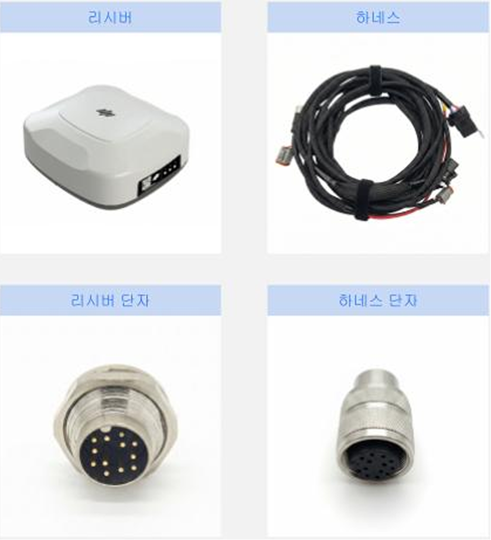
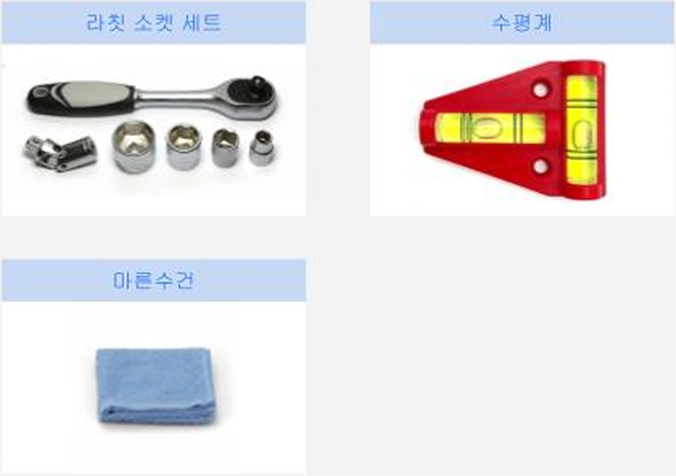
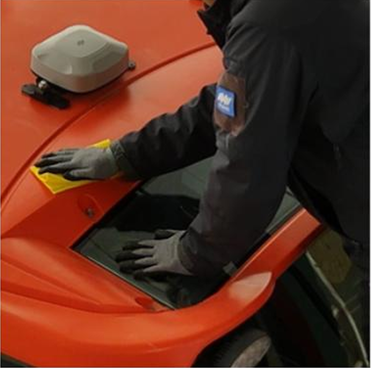
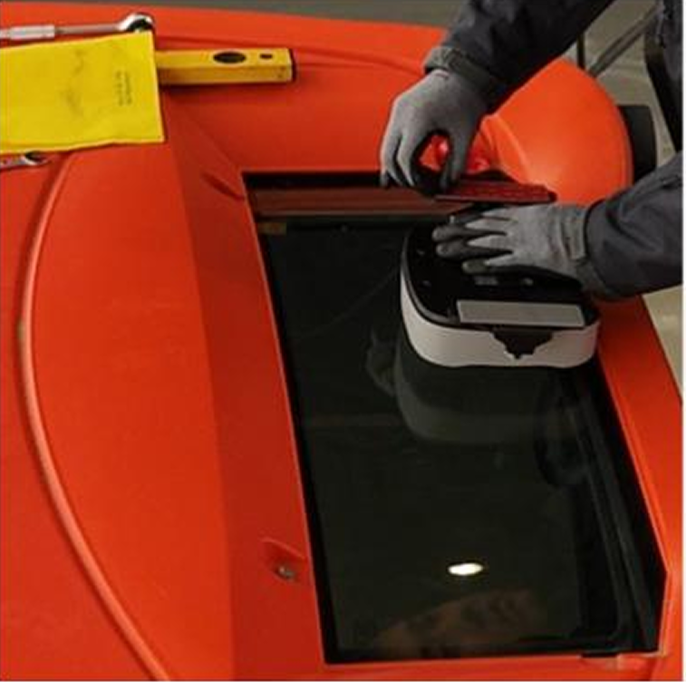
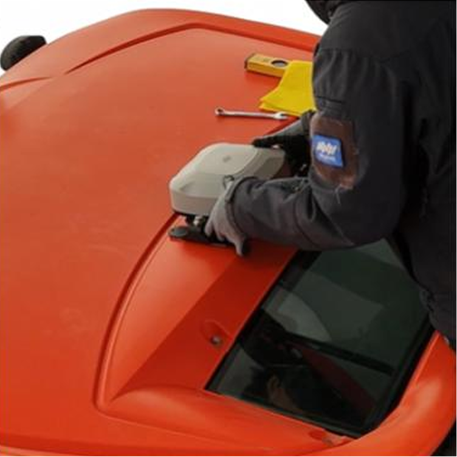
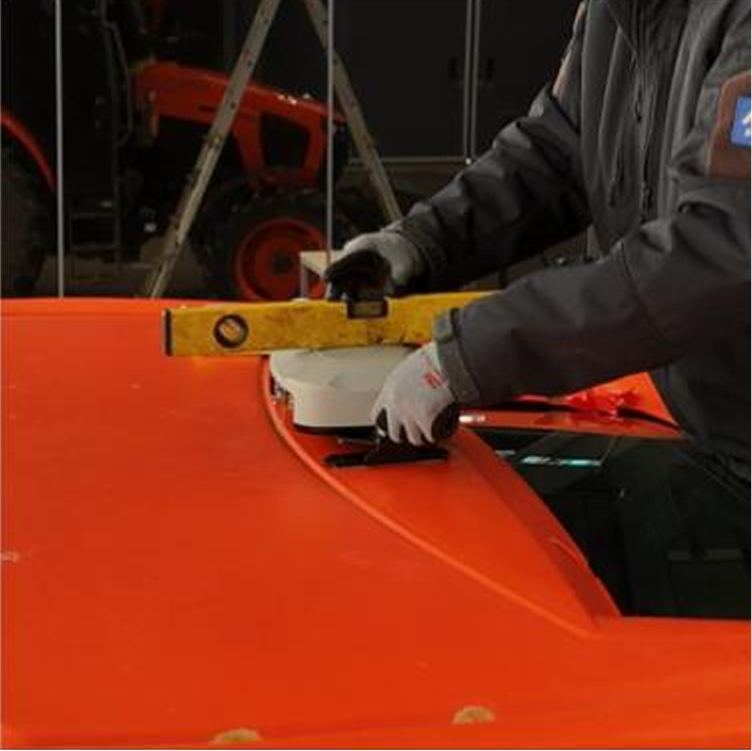

---
layout:
  width: default
  title:
    visible: true
  description:
    visible: false
  tableOfContents:
    visible: true
  outline:
    visible: true
  pagination:
    visible: true
  metadata:
    visible: true
  tags:
    visible: true
  actions:
    visible: true
---

# GNSS 수신기

플루바 아이온 자율주행에 필요한 GNSS 수신기를 설치합니다.

***

### 필요 공구 및 준비물

#### 🔩 준비물

<figure><figcaption></figcaption></figure>

<table><thead><tr><th width="161.1815185546875">이름</th><th>규격</th><th>수량</th></tr></thead><tbody><tr><td>GNSS 수신기</td><td>-</td><td>1</td></tr><tr><td>하네스</td><td>-</td><td>1</td></tr></tbody></table>

#### 🛠️ 필요 공구

<figure><figcaption></figcaption></figure>

<table><thead><tr><th width="130.5">이름</th><th>규격</th><th>수량</th></tr></thead><tbody><tr><td>소켓 렌치</td><td>13mm</td><td>1</td></tr><tr><td>수평계</td><td>-</td><td>1</td></tr><tr><td>마른수건</td><td>-</td><td>1</td></tr></tbody></table>

***

### 설치 방법


{% column width="83.33333333333334%" %}
**1. 부착 위치 확인 후 이물질을 제거합니다.**

<figure><figcaption></figcaption></figure>


{% column width="16.666666666666657%" %}





{% column width="83.33333333333334%" %}
**2. 브라켓에 붙어 있는 스티커를 제거합니다.**

<figure><figcaption></figcaption></figure>


{% column width="16.666666666666657%" %}





{% column width="83.33333333333334%" %}
**3. 트랙터 중앙이나 뒤쪽에 GNSS 수신기를 부착합니다.**

<figure><figcaption></figcaption></figure>


{% column width="16.666666666666657%" %}





{% column width="83.33333333333334%" %}
**4. 육각머리볼트(M8x25)를 조정 후 수평을 확인 후 볼트를 조입니다.**

<figure><figcaption></figcaption></figure>


{% column width="16.666666666666657%" %}




***

### 주의 사항

* GNSS 수신기를 교체한 경우에는 신규 차량을 추가해야 합니다.\
  자세한 내용은 [차량 추가](https://servicemanual.pluva.io/ion/korea/kr/order-installation/quick-setup/add-vehicle)를 참고해주세요.
* 차량 치수와 GNSS 수신기 위치를 다시 입력한 뒤 차량 보정을 완료해 주세요..\
  자세한 내용은 [차량 보정](https://servicemanual.pluva.io/ion/korea/kr/order-installation/quick-setup/vehicle-calibration)을 참고해주세요.
* GNSS 수신기는 차량 단위로 연동되므로, 기존 차량 설정을 그대로 사용하면 정상적으로 제어되지 않을 수 있습니다.
