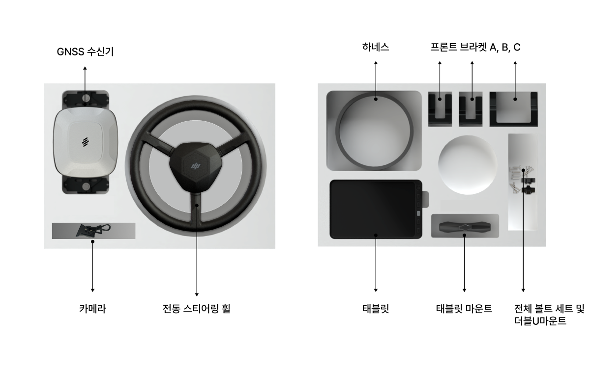
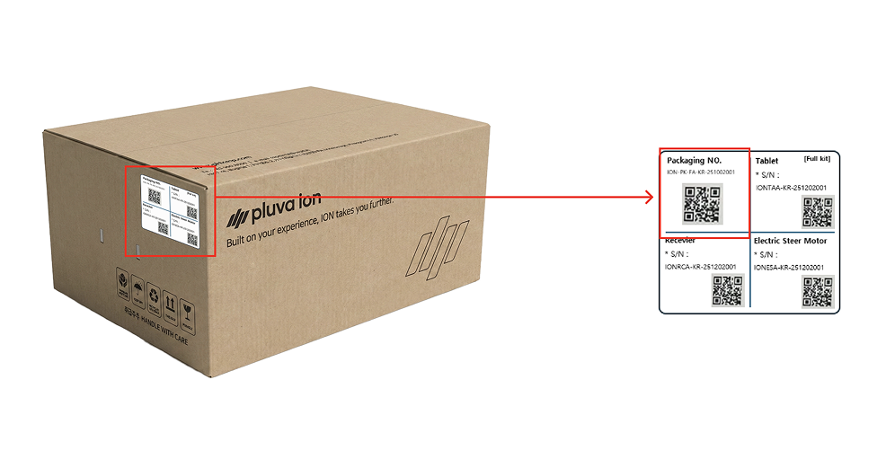
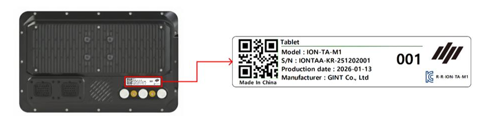
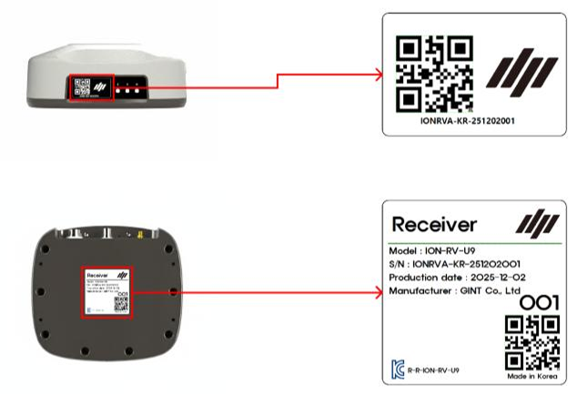
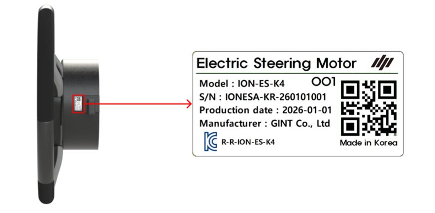
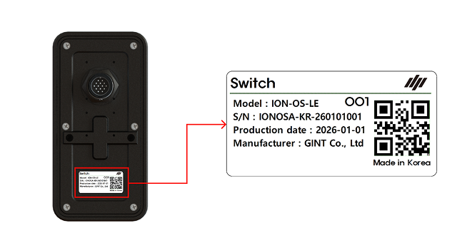
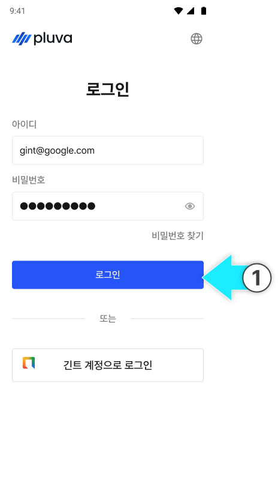

---
layout:
  width: default
  title:
    visible: true
  description:
    visible: false
  tableOfContents:
    visible: true
  outline:
    visible: true
  pagination:
    visible: true
  metadata:
    visible: true
  tags:
    visible: true
  actions:
    visible: true
  anchors:
    visible: true
tags:
  - tag: kr-jp
    primary: true
---

# 설치티켓으로 제품 개통 - New

설치 티켓에 제품과 구성품을 등록해 설치를 시작합니다. 퀵셋업 전에 등록을 완료해 주세요.


**설치 티켓이 무엇인가요?**

설치할 제품과 구성품을 등록하고 설치 진행 상태를 관리하는 티켓입니다.


***

#### 주문 제품별 개통 구성품 

설치할 제품에 맞는 구성품을 준비해 주세요.

**1. 플루바 아이온**

모든 주요 구성품을 등록합니다.

* 태블릿
* GNSS 수신기
* 전동 스티어링 휠

<figure><figcaption></figcaption></figure>

**2. 플루바 아이온 Expansion Kit (확장키트)**

태블릿을 제외한 구성품들을 등록합니다.

* GNSS 수신기
* 전동 스티어링 휠

<figure><figcaption></figcaption></figure>

**3. 추가 옵션**

* 스위치

<figure><figcaption></figcaption></figure>

***

#### 시리얼 넘버 등록 (패키징 넘버) 

제품 등록은 제품에 부착된 QR 코드(시리얼 넘버 혹은 패키징 넘버)를 스캔해 진행합니다.

* 패키징 넘버(패키지 박스 QR)를 등록하면, 구성품을 **한 번에 등록**할 수 있습니다.

#### QR 코드 위치 안내

#### 패키지 시리얼 넘버


{% column width="58.333333333333336%" %}
박스 측면의 QR코드를 확인합니다.

<figure><figcaption></figcaption></figure>


{% column width="41.666666666666664%" %}




#### 개별 시리얼 넘버



**태블릿**

후면의 QR코드를 확인합니다.

<figure><figcaption></figcaption></figure>



**GNSS 수신기**

우측면 또는 하단의 QR 코드를 확인합니다.

<figure><figcaption></figcaption></figure>





**전동 스티어링 휠**

모터 측면에 QR 코드를 확인합니다.

<figure><figcaption></figcaption></figure>



**스위치**

후면의 QR코드를 확인합니다.

<figure><figcaption></figcaption></figure>



***

#### 설치 티켓 목록 진입 방법



[어드민 페이지](https://gint-admin.pluva.kr/auth/operators/login)에 로그인합니다.

<figure><figcaption></figcaption></figure>




설치 관리 → 설치 티켓 목록에 진입하고 \[설치 등록]을 누릅니다.

<figure><figcaption></figcaption></figure>


왼쪽 상단 더보기 버튼을 누르고 설치 관리 > 설치 목록에 접속할 수 있습니다.

.png>)




***

#### 제품 개통 방법 

제품 개통 방법은 아래의 세가지 방법을 확인할 수 있습니다.

1. **플루바 아이온**: 자율 주행 키트 본품
2. **Expension Kit**: 자율 주행 확장 키트
3. **스위치**: 옵션 품목

<strong>플루바 아이온 개통 방법</strong> 클릭하면 설명이 열립니다.



담당 조직과 설치 제품을 선택합니다.

<figure><figcaption></figcaption></figure>


설치 제품 선택 시 플루바 아이온을 선택합니다.

.png>)




설치할 제품을 선택하면 제품 목록이 자동으로 생성됩니다. 확인 후 \[등록 시작]을 누릅니다.

<figure><figcaption></figcaption></figure>




\[패키지로 한번에 개통]을 눌러 주요 제품을 개통합니다.

<figure><figcaption></figcaption></figure>




패키지 넘버 QR 코드를 스캔합니다.

<figure><figcaption></figcaption></figure>


카메라 스캔으로 올바른 코드가 입력되지 않을 경우, \[시리얼 번호 직접 입력]을 눌러 직접 입력합니다.

.png>)




패키지 넘버를 확인한 뒤 \[확인 완료]를 누릅니다.

<figure><figcaption></figcaption></figure>

&#x20;



스캔이 완료되면 \[다음]을 누릅니다

<figure><figcaption></figcaption></figure>


추가 옵션을 주문할 경우 주요 제품 개통 이후 추가 옵션 개통을 진행해야 개통이 완료됩니다.

.png>)




유심을 등록한 뒤 \[다음]을 누릅니다.


유심 등록은 선택 사항이며, 추후 등록할 수 있습니다.


<figure><figcaption></figcaption></figure>


**유심 등록 방법**

1.  \[등록] 버튼을 누릅니다.

    
<figure><figcaption></figcaption></figure>

2.  \[직접 입력] 하거나 \[촬영하기]를 통해 유심 바코드를 등록합니다.

    
<figure><figcaption></figcaption></figure>

3.  유심 번호를 확인하고 \[확인 완료]를 누릅니다.

    
<figure><figcaption></figcaption></figure>

4.  유심 등록이 완료됩니다.

    
<figure><figcaption></figcaption></figure>





설치 등록 정보를 확인한 뒤 \[등록]을 누릅니다.

<figure><figcaption></figcaption></figure>




설치 등록을 확인하는 모달창에서 \[등록 완료]를 누릅니다.

<figure><figcaption></figcaption></figure>




해당 티켓이 설치중으로 등록이 완료 됩니다.


제품 설치 후 차량 태블릿으로 로그인 하면 티켓이 자동 완료 처리 됩니다.


<figure><figcaption></figcaption></figure>


설치 완료 후 태블릿 로그인 전까지 \[설치 취소] 버튼을 통하여 취소가 가능합니다.




<strong>Expension Kit 개통 방법</strong> 클릭하면 설명이 열립니다.



담당 조직과 설치 제품을 선택합니다.

<figure><figcaption></figcaption></figure>


설치 제품 선택 시 Expension Kit를 선택합니다.

.png>)




설치할 제품을 선택하면 제품 목록이 자동으로 생성됩니다. 확인 후 \[등록 시작]을 누릅니다.

<figure><figcaption></figcaption></figure>




\[패키지로 한번에 개통]을 눌러 주요 제품을 개통합니다.

<figure><figcaption></figcaption></figure>




패키지 넘버 QR 코드를 스캔합니다.

<figure><figcaption></figcaption></figure>


카메라 스캔으로 올바른 코드가 입력되지 않을 경우, \[시리얼 번호 직접 입력]을 눌러 직접 입력합니다.

.png>)




패키지 넘버를 확인한 뒤 \[확인 완료]를 누릅니다.

<figure><figcaption></figcaption></figure>

&#x20;



스캔이 완료되면 \[다음]을 누릅니다

<figure><figcaption></figcaption></figure>


추가 옵션을 주문할 경우 주요 제품 개통 이후 추가 옵션 개통을 진행해야 개통이 완료됩니다.

.png>)




설치 등록 정보를 확인한 뒤 \[등록]을 누릅니다.

<figure><figcaption></figcaption></figure>




설치 등록을 확인하는 모달창에서 \[등록 완료]를 누릅니다.

<figure><figcaption></figcaption></figure>




해당 티켓이 설치중으로 등록이 완료 됩니다.


제품 설치 후 차량 태블릿으로 로그인 하면 티켓이 자동 완료 처리 됩니다.


<figure><figcaption></figcaption></figure>


고객이 로그인하기 전까지는 \[설치 취소] 버튼을 통하여 취소가 가능합니다.




<strong>스위치 개통 방법</strong> 클릭하면 설명이 열립니다.



담당 조직과 설치 제품을 선택합니다.

<figure><figcaption></figcaption></figure>


설치 제품 선택 시 Expension Kit를 선택합니다.

.png>)




설치할 제품을 선택하면 제품 목록이 자동으로 생성됩니다. 확인 후 \[등록 시작]을 누릅니다.

<figure><figcaption></figcaption></figure>




\[스위치]를 누릅니다.

<figure><figcaption></figcaption></figure>




스위치 넘버 QR 코드를 스캔합니다.

<figure><figcaption></figcaption></figure>


카메라 스캔으로 올바른 코드가 입력되지 않을 경우, \[시리얼 번호 직접 입력]을 눌러 직접 입력합니다.

.png>)




스위치 넘버를 확인한 뒤 \[확인 완료]를 누릅니다.

<figure><figcaption></figcaption></figure>

&#x20;



스캔이 완료되면 \[다음]을 누 릅니다.

<figure><figcaption></figcaption></figure>




이후 사용자 계정 선택 화면에서 설치 사용자 이름을 검색합니다.

<figure><figcaption></figcaption></figure>




설치 사용자 카드를 선택한 뒤 \[다음]을 누릅니다.

<figure><figcaption></figcaption></figure>




설치 등록 정보를 확인한 뒤 \[등록]을 누릅니다.

<figure><figcaption></figcaption></figure>




설치 등록을 확인하는 모달창에서 \[등록 완료]를 누릅니다.

<figure><figcaption></figcaption></figure>




등록이 완료 됩니다.



***

#### 제품 개통 방법

기본 키트와 확장 키트는 같은 방법으로 등록합니다. 설치할 제품과 옵션을 선택한 후 패키지 또는 구성품을 등록해 주세요.



담당 조직과 설치할 제품을 선택합니다.

<figure><figcaption></figcaption></figure>




등록할 옵션을 선택한 후 \[등록 시작]을 누릅니다.

<figure><figcaption></figcaption></figure>


**스위치도 함께 설치하는 경우 참고 사항**

기본 키트 또는 확장 키트와 함께 선택하여 개통해 주세요.



**만약 스위치 등록을 잊었다면**

설치 등록을 통해 스위치를 추가로 개통해 주세요.

.png>)




확인 후 \[등록 시작]을 누릅니다.

<figure><figcaption></figcaption></figure>




\[패키지로 한번에 개통]을 눌러 주요 제품을 개통합니다.

<figure><figcaption></figcaption></figure>




패키지 QR 코드를 카메라로 스캔합니다.

<figure><figcaption></figcaption></figure>


**카메라 스캔으로 올바른 코드가 입력되지 않을 경우**

\[패키지번호 직접 입력]을 눌러 직접 입력합니다.

.png>)



**구성품을 개별 등록하는 경우**

필요한 경우 각 구성품의 시리얼 번호를 입력해 개별 등록할 수도 있습니다.

.png>)




패키지 번호를 확인한 뒤 \[확인 완료]를 누릅니다.

<figure><figcaption></figcaption></figure>




스캔이 완료되면 \[다음]을 누릅니다.

<figure><figcaption></figcaption></figure>


추가 옵션을 주문할 경우 주요 제품 개통 이후 추가 옵션 개통을 진행해야 개통이 완료됩니다.

.png>)




유심 등록 단계에서 \[등록] 버튼을 누릅니다.

<figure><figcaption></figcaption></figure>




\[직접 입력] 하거나 \[촬영하기]를 통해 유심 바코드를 등록합니다.

<figure><figcaption></figcaption></figure>




유심 번호를 확인하고 \[확인 완료]를 누릅니다.

<figure><figcaption></figcaption></figure>




유심 등록 완료를 확인 후, \[다음]을 누릅니다.

<figure><figcaption></figcaption></figure>




개통할제품의 시리얼이 제짐없이 등록 되었는지 확인후 \[등록]을 누릅니다.

<figure><figcaption></figcaption></figure>




확인 창에서 \[등록 완료]를 누릅니다.

<figure><figcaption></figcaption></figure>




설치 티켓이 \[설치 중] 상태로 변경되며 제품 등록이 완료됩니다.

<figure><figcaption></figcaption></figure>


**설치 티켓 완료 시점**

* **기본 키트**: 태블릿에서 고객 계정 로그인을 완료하면 티켓이 자동으로 완료됩니다.
* **확장 키트**: 등록한 장비가 기존 차량에 연결되면 티켓이 자동으로 완료됩니다. 반영까지 최대 10분 정도 걸릴 수 있습니다.



티켓이 완료되기 전에는 설치 등록을 취소할 수 있습니다.




***

#### 이후 단계

[제품 설치](product-installation/)를 완료해 주세요.
