# 작업 이력

고객이 수행한 작업 이력을 조회하고, 작업 경로와 데이터를 지도에서 분석·재생합니다. 작업 데이터로 상황을 재구성해 고객 문의·클레임의 원인을 파악하는 데 활용합니다.

***

### 진입 방법



목록에서 조회할 계정을 선택해 계정 상세로 이동합니다.

<figure><figcaption></figcaption></figure>



계정 상세에서 작업 탭을 선택후 원하는 작업을 선택해 작업 이력 상세에 진입합니다.

<figure><figcaption></figcaption></figure>




작업 이력은 기준 시각까지 어드민에 동기화된 작업만 표시됩니다. 현장 작업 직후에는 아직 동기화 전이라 보이지 않을 수 있습니다.



각 작업의 \[경로 보기]를 누르면 해당 경로를 미리 볼 수 있습니다.

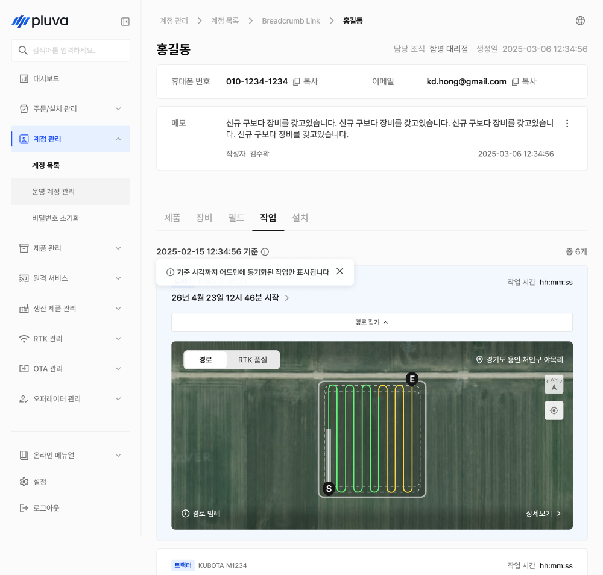


***

### 작업 이력 상세

작업 항목의 \[경로 보기]를 누르면 해당 작업의 경로와 데이터를 지도에서 확인하고, 시간 순서대로 재생할 수 있습니다.

#### PC 환경

<figure>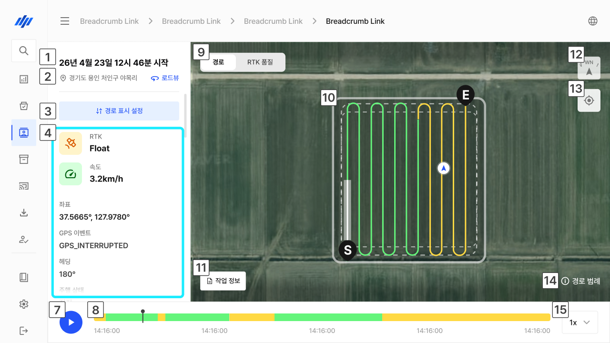<figcaption></figcaption></figure>

 **작업 시작 일시**

* 선택한 작업의 시작 날짜·시각이 표시됩니다.

 **위치 / 로드뷰**

* 작업 위치가 표시됩니다.
* \[로드뷰]를 누르면 해당 위치의 구글 로드뷰를 확인할 수 있습니다.

 **경로 표시 설정**

* \[경로 표시 설정]에서 지도에 표시할 정보를 조정합니다.
* \[조건 필터]와 \[이벤트] 두 가지로 나뉩니다.


**조건 필터**

* 설정한 조건에 맞는 구간만 지도·타임라인에서 강조합니다.
* 여러 조건을 조합할 수 있고, 조건 없이 전체 경로를 볼 수도 있습니다.
*

```
<div align="left"><figure>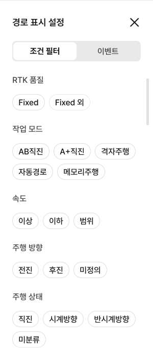<figcaption></figcaption></figure></div>
```



**이벤트**

* 지도 위에 표시할 이벤트를 켜고 끕니다.
* 주행, 에러 등을 이벤트 아이콘으로 표시합니다.
*

```
<div align="left"><figure>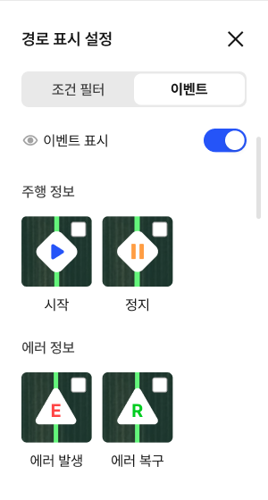<figcaption></figcaption></figure></div>
```

* \[이벤트 표시]를 OFF하면 설정했던 표시값이 지도에서 사라집니다.
*

```
<div align="left"><figure>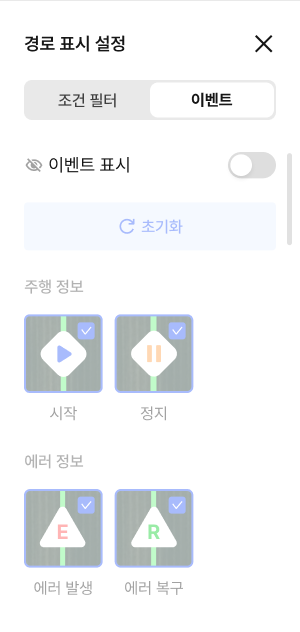<figcaption></figcaption></figure></div>
```


 **실시간 데이터**

* 재생 시점을 기준으로 RTK 품질, 속도, 좌표, GPS 이벤트, 헤딩, 주행 상태 등 작업에 필요한 상세 수치를 표시합니다.

<div align="left"><figure>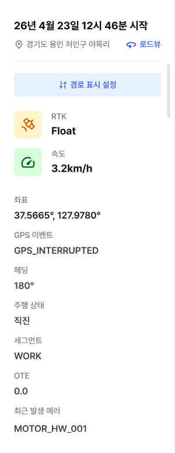<figcaption></figcaption></figure></div>

 **재생 / 일시정지**

* \[▶]를 누르면 작업을 시간 순서대로 재생하고, 다시 누르면 일시정지합니다.

 **재생 타임라인**

* 전체 작업 구간이 표시됩니다. 특정 시점을 선택하면 해당 시점으로 이동하며, 지도의 차량 위치와 실시간 데이터가 함께 바뀝니다.

 **지도 보기 전환**

* \[경로] / \[RTK 품질] 보기를 전환합니다.
* RTK 품질 모드에서는 경로 표시를 설정할 수 없으며, 히트맵으로 표시됩니다.

<figure>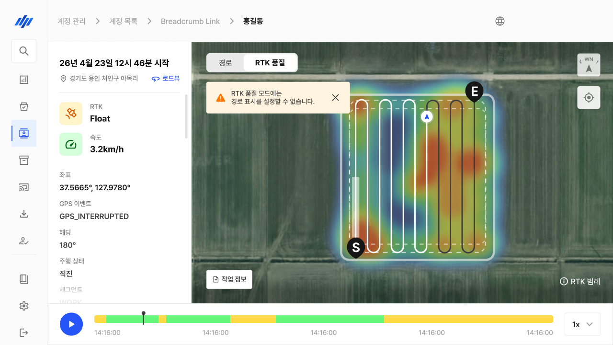<figcaption></figcaption></figure>

 **지도 경로**

* 지도에 해당 작업의 주행 궤적이 표시됩니다.
* 자동/수동 주행, 조건 필터 구간, 이벤트가 색상과 아이콘으로 나타납니다.
* 각 색상·아이콘의 의미는 \[경로 범례]에서 확인합니다.

 **종료 지점(E)**

* 지도에서 작업이 종료된 지점입니다.

 **시작 지점(S)**

* 지도에서 작업이 시작된 지점입니다.

 **작업 정보**

* 해당 작업의 요약 정보를 표시합니다.

<div align="left"><figure>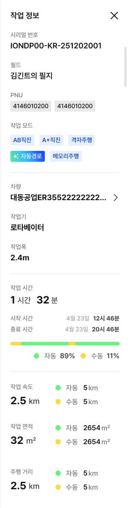<figcaption></figcaption></figure></div>

 **방향**

* 지도의 방향을 표시합니다.

 **현재 위치**

* 지도를 작업 위치로 이동합니다.

 **경로 범례**

* 지도의 경로 색상과 아이콘 의미를 표시합니다.

<div align="left"><figure>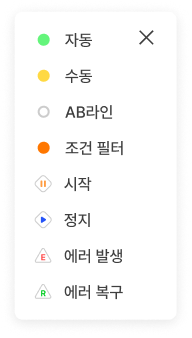<figcaption></figcaption></figure></div>

* **자동 / 수동** : 자율주행 구간과 수동 주행 구간을 색으로 구분해 표시합니다.
* **AB라인** : 작업 기준선을 표시합니다.
* **조건 필터** : 조건 필터를 설정한 경우에만, 조건에 맞는 구간을 표시합니다.
* **시작 · 정지 · 에러 발생 · 에러 복구** : \[이벤트]에서 설정한 항목만 지도에 나타납니다.

**재생 속도**

* 재생 배속(예: 1x)을 선택합니다.

#### 모바일 환경

<div align="left"><figure>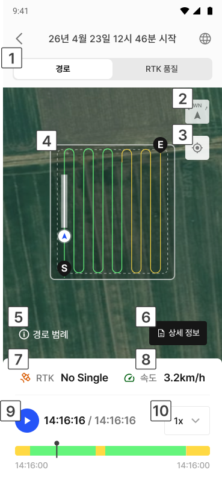<figcaption></figcaption></figure></div>

 **지도 보기 전환**

* \[경로] / \[RTK 품질] 보기를 전환합니다.
* RTK 품질 모드에서는 경로 표시를 설정할 수 없으며, 히트맵으로 표시됩니다.

<div align="left"><figure>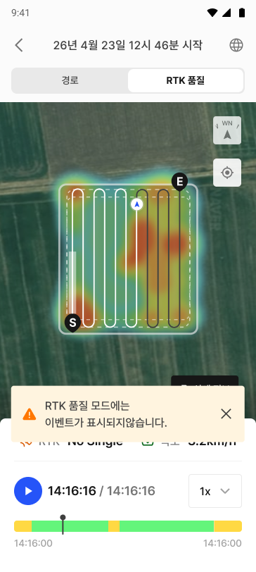<figcaption></figcaption></figure></div>

 **방향**

* 지도의 북쪽 방향을 표시합니다.

 **현재 위치**

* 지도를 작업 위치로 이동합니다.

 **지도 경로**

* 지도에 해당 작업의 주행 궤적이 표시됩니다.
* 자동/수동 주행, 조건 필터 구간, 이벤트가 색상과 아이콘으로 나타납니다.
* 각 색상·아이콘의 의미는 \[경로 범례]에서 확인합니다.

 **경로 범례**

* 지도의 경로 색상과 아이콘 의미를 표시합니다.

<div align="left"><figure>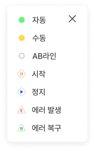<figcaption></figcaption></figure></div>

 **상세 정보**

* 해당 작업의 상세 정보를 표시합니다.
* 전체 이벤트 표시/숨김을 설정합니다.


**참고**

모바일에서는 이벤트의 전체 표시/숨김만 설정할 수 있습니다.

조건 필터 등 세부 표시 설정은 PC에서 진행해 주세요.

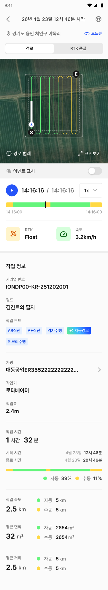


 **RTK 품질**

* 재생 시점 기준 RTK 측위 품질을 표시합니다.

 **속도**

* 재생 시점 기준 주행 속도를 표시합니다.

 **재생 / 타임라인**

* \[▶]로 작업을 시간 순서대로 재생하고, 타임라인에서 특정 시점을 선택해 이동합니다.

 **재생 속도**

* 재생 배속(예: 1x)을 선택합니다.
