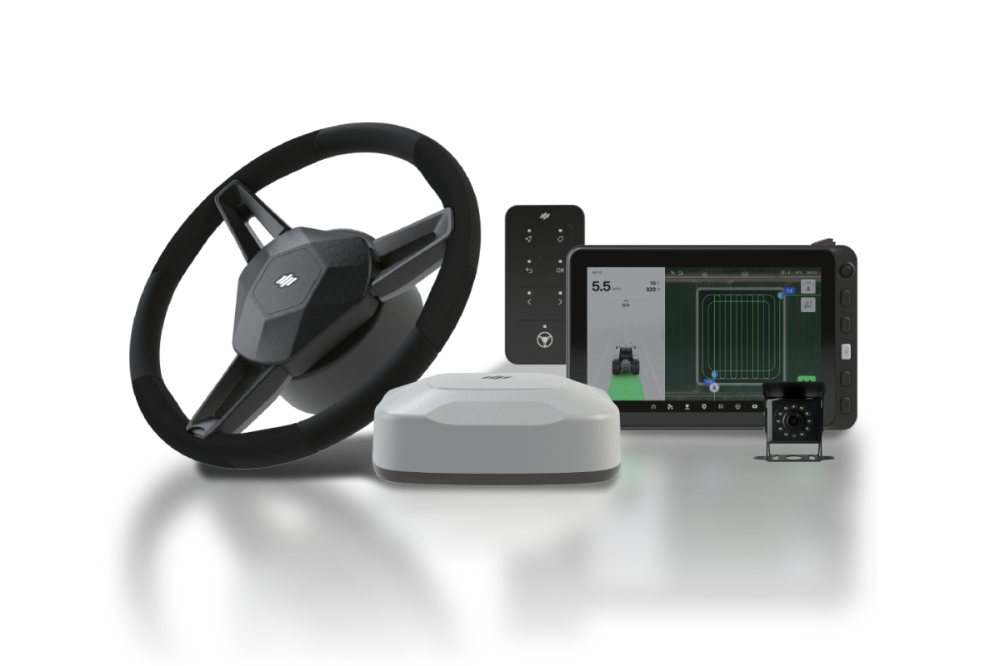

---
layout:
  width: default
  title:
    visible: true
  description:
    visible: false
  tableOfContents:
    visible: true
  outline:
    visible: true
  pagination:
    visible: true
  metadata:
    visible: true
  tags:
    visible: true
  actions:
    visible: true
---

# pluva ion User Manual

<figure><figcaption></figcaption></figure>


**ご参考**\
自動操舵キットのモデルによって、提供される製品マニュアルの種類や内容は一部異なる場合があります。マニュアル内容の一部の装置及びソフトウェアは、メーカーのポリシーによって変更される可能性があり、バージョンが異なる場合があります。



**ご注意**\
ご使用の前に必ず本製品マニュアルをお読みいただき、自動操舵キットを安全かつ正しくご使用ください。


#### 映像ガイド 

マニュアルの内容を簡潔にまとめた動画ガイドをご用意しました。以下の動画から内容を素早くご確認いただけます。




[他の案内動画を確認する](https://youtube.com/playlist?list=PLH3vv0_FUaJ21A3gjvc_jYkS6jjd_cba8\&si=YHqsuPgg3SQ20XKZ)


### 概要

pluva ionの装置構成、初期設定、走行機能、管理機能、お客様サポートの情報をご提供します。

<a href="user-manual-info.md">取扱説明書の情報</a>

<table data-card-size="large" data-view="cards" data-full-width="true"><thead><tr><th></th><th data-hidden data-card-target data-type="content-ref"></th></tr></thead><tbody><tr><td>取扱説明書の情報</td><td><a href="user-manual-info.md">user-manual-info.md</a></td></tr></tbody></table>

<a href="overview/">概要</a>

<table data-card-size="large" data-view="cards" data-full-width="true"><thead><tr><th></th><th data-hidden data-card-target data-type="content-ref"></th></tr></thead><tbody><tr><td>PLUVA iONのご紹介</td><td><a href="overview/pluva-ion-introduction.md">pluva-ion-introduction.md</a></td></tr><tr><td>電動ステアリングホイール</td><td><a href="overview/electric-steering-wheel.md">electric-steering-wheel.md</a></td></tr><tr><td>GNSS受信機</td><td><a href="overview/gnss-receiver.md">gnss-receiver.md</a></td></tr><tr><td>タブレット</td><td><a href="overview/tablet.md">tablet.md</a></td></tr><tr><td>ワンタッチスイッチ</td><td><a href="overview/switch.md">switch.md</a></td></tr><tr><td>カメラ</td><td><a href="overview/camera.md">camera.md</a></td></tr></tbody></table>

<a href="usage/initial-setup/">初期設定方法</a>

<table data-card-size="large" data-view="cards" data-full-width="true"><thead><tr><th></th><th data-hidden data-card-target data-type="content-ref"></th></tr></thead><tbody><tr><td>ソフトウェアアップデート（OTA）</td><td><a href="usage/initial-setup/ota.md">ota.md</a></td></tr></tbody></table>

<a href="usage/driving/">走行モード(経路のプランニング)</a>

<table data-card-size="large" data-view="cards" data-full-width="true"><thead><tr><th></th><th data-hidden data-card-target data-type="content-ref"></th></tr></thead><tbody><tr><td>経路のプランニングの設定方法</td><td><a href="usage/driving/route-planning-settings.md">route-planning-settings.md</a></td></tr><tr><td>AB直進</td><td><a href="usage/driving/ab-straight.md">ab-straight.md</a></td></tr><tr><td>A+直進</td><td><a href="usage/driving/a-plus-straight.md">a-plus-straight.md</a></td></tr><tr><td>格子走行</td><td><a href="usage/driving/cross-path.md">cross-path.md</a></td></tr><tr><td>自動経路（Pluva AI）</td><td><a href="usage/driving/auto-route-generation.md">auto-route-generation.md</a></td></tr></tbody></table>

<a href="usage/uturn-mode/">ターンモード</a>

<table data-card-size="large" data-view="cards" data-full-width="true"><thead><tr><th></th><th data-hidden data-card-target data-type="content-ref"></th></tr></thead><tbody><tr><td>ターンの設定方法</td><td><a href="usage/uturn-mode/uturn-mode-setting.md">uturn-mode-setting.md</a></td></tr><tr><td>Kターン</td><td><a href="usage/uturn-mode/kturn.md">kturn.md</a></td></tr></tbody></table>

<a href="usage/driving-convenience-function/">走行の利便性を向上するための機能</a>

<table data-card-size="large" data-view="cards" data-full-width="true"><thead><tr><th></th><th data-hidden data-card-target data-type="content-ref"></th></tr></thead><tbody><tr><td>経路の保存</td><td><a href="usage/driving-convenience-function/save-path.md">save-path.md</a></td></tr><tr><td>経路の取り込み</td><td><a href="usage/driving-convenience-function/bringing-up-path.md">bringing-up-path.md</a></td></tr><tr><td>経路のリセット及び削除</td><td><a href="usage/driving-convenience-function/delete-path.md">delete-path.md</a></td></tr><tr><td>等間隔に関する便利な機能</td><td><a href="usage/driving-convenience-function/equal-interval.md">equal-interval.md</a></td></tr><tr><td>走行画面の調整</td><td><a href="usage/driving-convenience-function/adjusting-driving-screen.md">adjusting-driving-screen.md</a></td></tr></tbody></table>

<a href="usage/my-farm/">My農場管理</a>

<table data-card-size="large" data-view="cards" data-full-width="true"><thead><tr><th></th><th data-hidden data-card-target data-type="content-ref"></th></tr></thead><tbody><tr><td>農場管理</td><td><a href="usage/my-farm/farm-management.md">farm-management.md</a></td></tr><tr><td>農場主の管理</td><td><a href="usage/my-farm/farm-owner-management.md">farm-owner-management.md</a></td></tr><tr><td>圃場の登録</td><td><a href="usage/my-farm/field-add.md">field-add.md</a></td></tr><tr><td>圃場情報の修正/削除</td><td><a href="usage/my-farm/managing-field-information.md">managing-field-information.md</a></td></tr><tr><td>枕地の登録</td><td><a href="usage/my-farm/headland-add.md">headland-add.md</a></td></tr><tr><td>枕地情報の修正/削除</td><td><a href="usage/my-farm/managing-headland-information.md">managing-headland-information.md</a></td></tr></tbody></table>

<a href="usage/vehicle-settings/">車両管理</a>

<table data-card-size="large" data-view="cards" data-full-width="true"><thead><tr><th></th><th data-hidden data-card-target data-type="content-ref"></th></tr></thead><tbody><tr><td>My車両へのアクセスおよび画面のご案内</td><td><a href="usage/vehicle-settings/entering-my-vehicle.md">entering-my-vehicle.md</a></td></tr><tr><td>オートステア補正</td><td><a href="usage/vehicle-settings/autostere-calibration.md">autostere-calibration.md</a></td></tr><tr><td>ロール／ピッチ／ヨー補正</td><td><a href="usage/vehicle-settings/imu-calibration.md">imu-calibration.md</a></td></tr><tr><td>車両の制御設定</td><td><a href="usage/vehicle-settings/vehicle-control-settings.md">vehicle-control-settings.md</a></td></tr><tr><td>GNSS受信機の設定</td><td><a href="usage/vehicle-settings/gnss-receiver-setting.md">gnss-receiver-setting.md</a></td></tr></tbody></table>

<a href="usage/workstation-management/">作業機の管理</a>

<table data-card-size="large" data-view="cards" data-full-width="true"><thead><tr><th></th><th data-hidden data-card-target data-type="content-ref"></th></tr></thead><tbody><tr><td>作業機リストへのアクセス及び画面のご案内</td><td><a href="usage/workstation-management/worker-entry.md">worker-entry.md</a></td></tr><tr><td>作業機の追加</td><td><a href="usage/workstation-management/add-worker.md">add-worker.md</a></td></tr></tbody></table>

<a href="usage/network-settings/">ネットワーク設定</a>

<table data-card-size="large" data-view="cards" data-full-width="true"><thead><tr><th></th><th data-hidden data-card-target data-type="content-ref"></th></tr></thead><tbody><tr><td>ネットワーク設定へのアクセスおよび画面のご案内</td><td><a href="usage/network-settings/enter-network.md">enter-network.md</a></td></tr><tr><td>位置補正の設定</td><td><a href="usage/network-settings/rtk-setting.md">rtk-setting.md</a></td></tr><tr><td>ネットワーク設定</td><td><a href="usage/network-settings/">network-settings</a></td></tr></tbody></table>

<a href="usage/report.md">作業レポート</a>

<table data-card-size="large" data-view="cards" data-full-width="true"><thead><tr><th></th><th data-hidden data-card-target data-type="content-ref"></th></tr></thead><tbody><tr><td>作業レポート</td><td><a href="usage/report.md">report.md</a></td></tr></tbody></table>

<a href="usage/entertainment.md">エンターテインメント</a>

<table data-card-size="large" data-view="cards" data-full-width="true"><thead><tr><th></th><th data-hidden data-card-target data-type="content-ref"></th></tr></thead><tbody><tr><td>エンターテインメント</td><td><a href="usage/entertainment.md">entertainment.md</a></td></tr></tbody></table>

<a href="usage/settings/">その他の設定</a>

<table data-card-size="large" data-view="cards" data-full-width="true"><thead><tr><th></th><th data-hidden data-card-target data-type="content-ref"></th></tr></thead><tbody><tr><td>システム設定</td><td><a href="usage/settings/system.md">system.md</a></td></tr><tr><td>機器の設定</td><td><a href="usage/settings/device-settings.md">device-settings.md</a></td></tr></tbody></table>

<a href="consumer-info/problem-solving.md">お客様サポート</a>

<table data-card-size="large" data-view="cards" data-full-width="true"><thead><tr><th></th><th data-hidden data-card-target data-type="content-ref"></th></tr></thead><tbody><tr><td>トラブルシューティング</td><td><a href="consumer-info/problem-solving.md">problem-solving.md</a></td></tr><tr><td>リモートサポート</td><td><a href="consumer-info/remote-support.md">remote-support.md</a></td></tr><tr><td>整備</td><td><a href="consumer-info/maintenance.md">maintenance.md</a></td></tr><tr><td>個人情報処理方針</td><td><a href="consumer-info/privacy-policy.md">privacy-policy.md</a></td></tr><tr><td>仕様情報</td><td><a href="consumer-info/specification-information.md">specification-information.md</a></td></tr></tbody></table>

