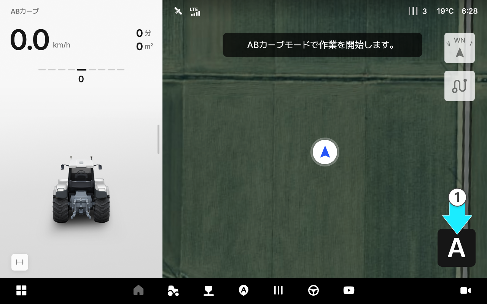
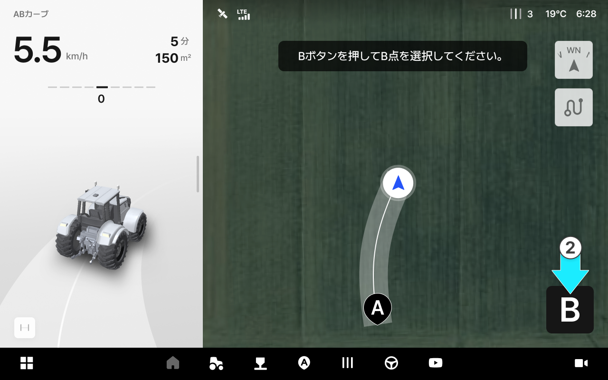
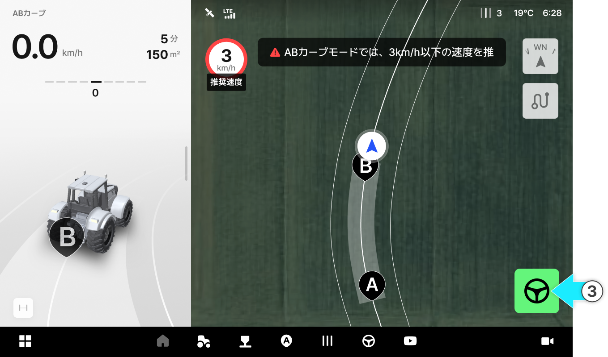
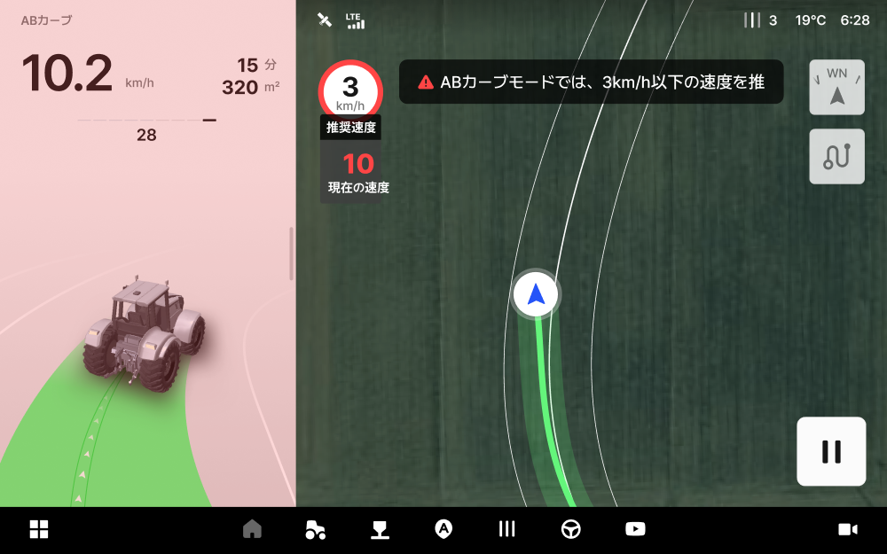
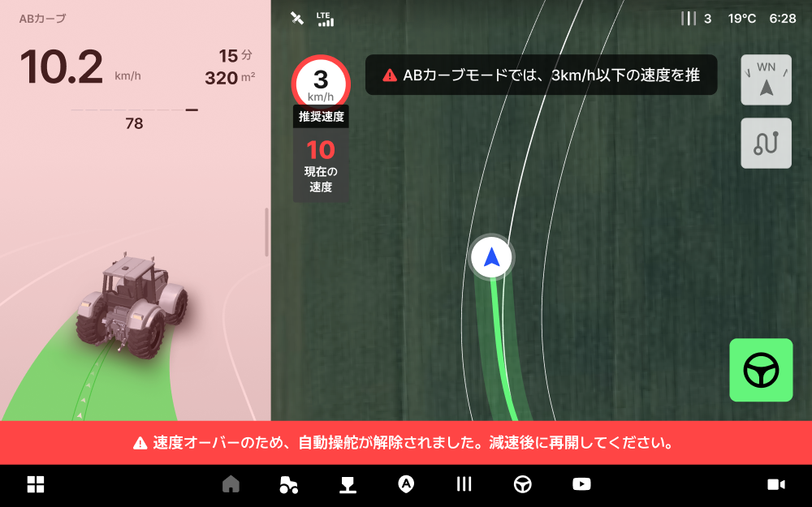
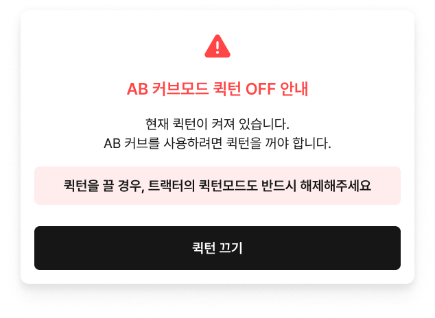

# ABカーブ

カーブ形状の作業経路を作成する際に使用するモードです。真っ直ぐな直線ではなく、湾曲な畝や境界線に合わせて作業する際に便利です。

ABカーブ

* A点からスタートし、ご希望のカーブ形状を描きながらB地点まで走行すると、その曲線を基準に自動操舵の経路が生成されます。

<figure><figcaption></figcaption></figure>



 をタップし、A地点を生成します。

<figure><figcaption></figcaption></figure>



ご希望の曲線を描きながら走行し、\[B]をタップしてB地点を生成します。

<figure><figcaption></figcaption></figure>



\[自動操舵の開始]をタップし、走行を開始します。

<figure><figcaption></figcaption></figure>




**ご注意**: 推奨する速度を超過し、或いは経路から離れると次のように動作します。

**警告表示**

* 推奨するスピードを超過すると、現在の速度が**赤色**で表示されます。
* 設定した経路から**30cm以上**外れると、画面に警告が表示されます。

**自動操舵の解除**

* 推奨する速度を超過して走行し続けると、設定した経路から外れる恐れがあります。設定した経路から80cm以上外れると自動操舵が解除され、**「スピード超過により、自動操舵が解除されました」**&#x3068;いう案内が表示されます。
* この画面を閉じるには、自動操舵を再度開始するか、他のモードに変更してください。




**ご参考:** 田植え機は、ABカーブモードでは後進走行できません。




**ABカーブモード進入時に倍速ターンをOFFにする**

ABカーブモードは、倍速ターンがOFFになっている場合のみご利用できます。倍速ターンがONの状態でABカーブモードにアクセスすると、「ABカーブモード時の倍速ターンOFFに関するご案内」が表示されます。


