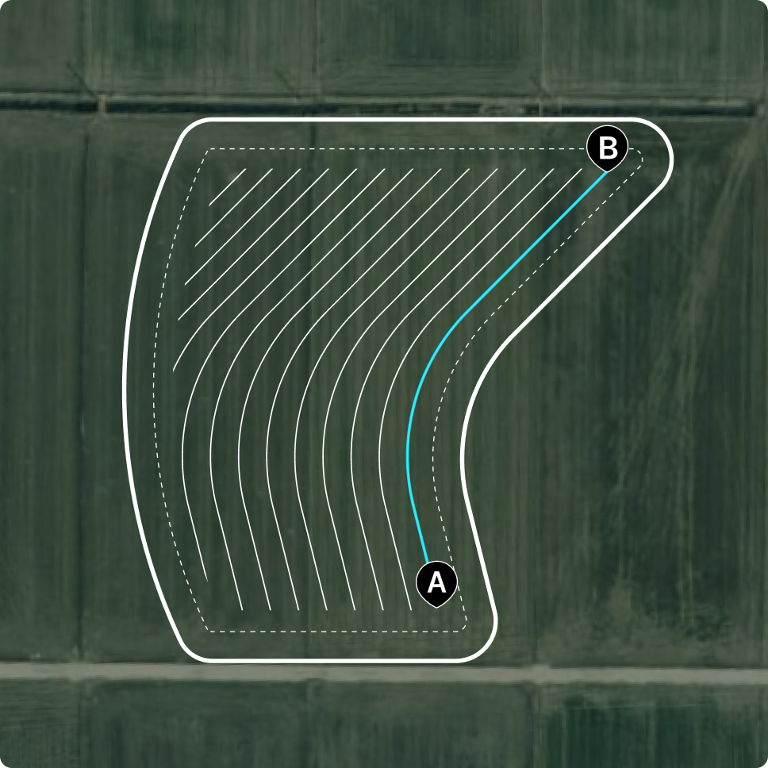
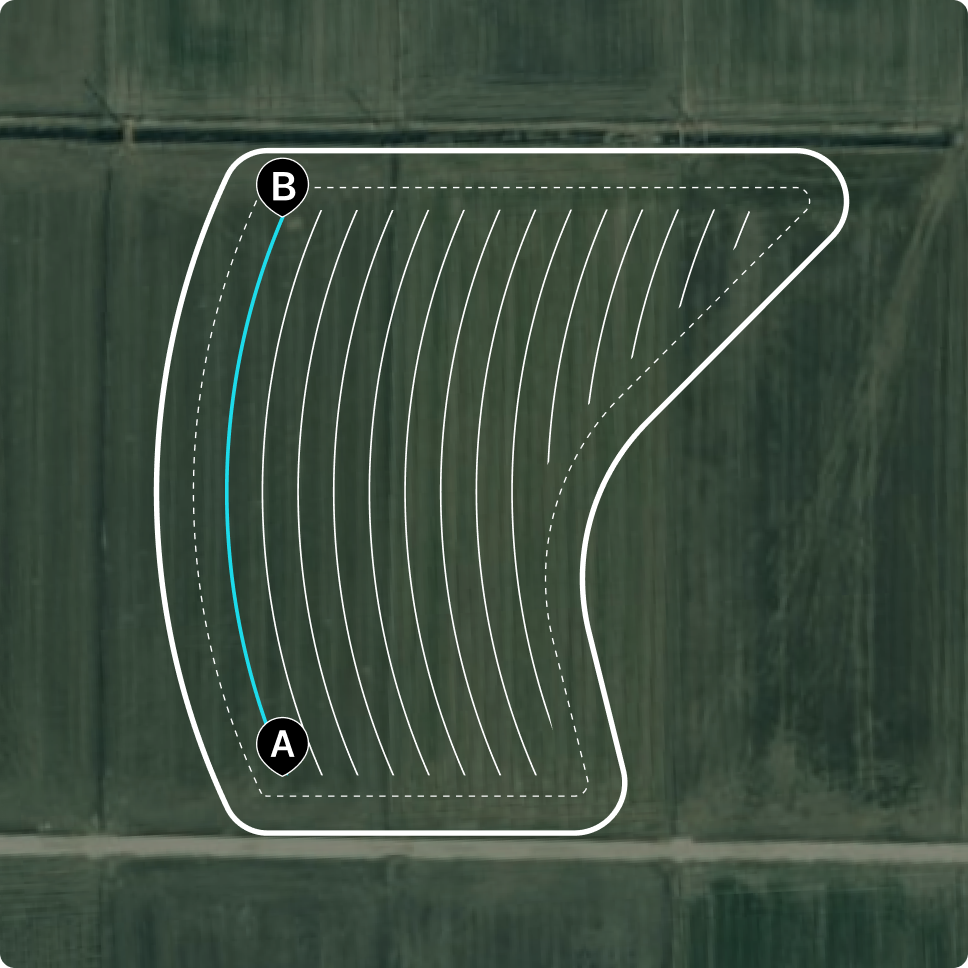

# ABカーブ

曲線経路を生成する際に使用するモードです。作業ラインが直線ではなく、曲がった畝や境界に合わせる際に有効です。

ABカーブ

* A点からスタートし、曲線を描きながらB点まで走行すると、その曲線を基準に自動操舵の経路が生成されます。

<figure><figcaption></figcaption></figure>



 をタップし、A点を生成します。

<figure><figcaption></figcaption></figure>



お好みの曲線を描きながら25m以上走行し、\[B]をタップしてB点を生成します。

<figure><figcaption></figcaption></figure>



\[自動操舵の開始]をタップし、走行を開始します。

<figure><figcaption></figcaption></figure>



***

### **ABカーブモードの利用ガイド**

#### **1. ABカーブ生成時の注意事項**

* **ABカーブの基準ラインは、なるべく長く設定してください。**
  * 走行ラインは、基準となるABカーブから一定の間隔で並行に生成されます。そのため、カーブを長く設定するほど、より多くの走行ラインが確保され、広いエリアを一度で作業できます。
* **基準となるABカーブは、曲がりがより大きい辺に沿って生成してください。**
  * ABカーブの基準ラインは、左右どちらの辺を基準にしても作成可能ですが、曲がりの大きい辺を基準にする方が、より多くの並行走行ラインを確保できます。


カーブの曲率による走行ラインの生成例

* **長いカーブ・曲がりの大きい辺：走行ラインが多く生成されます**

* **短いカーブ・曲がりの小さい辺：走行ラインの生成数が少なくなります**



#### **2. ABカーブ進入時の倍速ターンOFF**

* ABカーブモードは、<mark style="color:$primary;">倍速ターンがOFFの状態のみ</mark>ご利用できます。
* 倍速ターンがONのままABカーブモードに入ると、「ABカーブモード時の倍速ターンOFFに関するご案内」が表示されます。

#### **3. 走行速度**

* ABカーブモードでは、<mark style="color:$primary;">3km/h以下</mark>での走行を推奨いたします。

#### **4. 田植え機の後進不可**

* 田植え機の場合、カーブモードでの後進自動操舵はできません。後進すると、案内のメッセージとともに自動操舵が解除されます。


**ABカーブでの速度超過および経路離脱の場合**

1. **速度超過に関する警告**

* 推奨する速度を超過した場合、現在の速度が**赤色**で表示されます。
* 速度超過により、設定された経路から**30cm以上**離れると、画面上に警告メッセージが表示されます。

2. **自動操舵の解除**

* 設定された経路から**80cm以上**離れると、自動操舵が自動的に解除さ&#x308C;**「スピード超過により、自動操舵が解除されました」**&#x3068;いう案内メッセージが表示されます。
* 案内メッセージを閉じるには、走行を再開するか、別のモードに変更してください。


