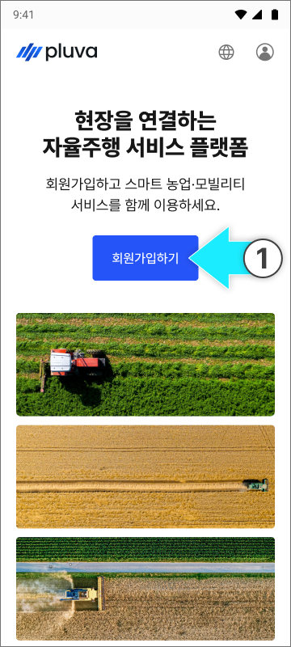
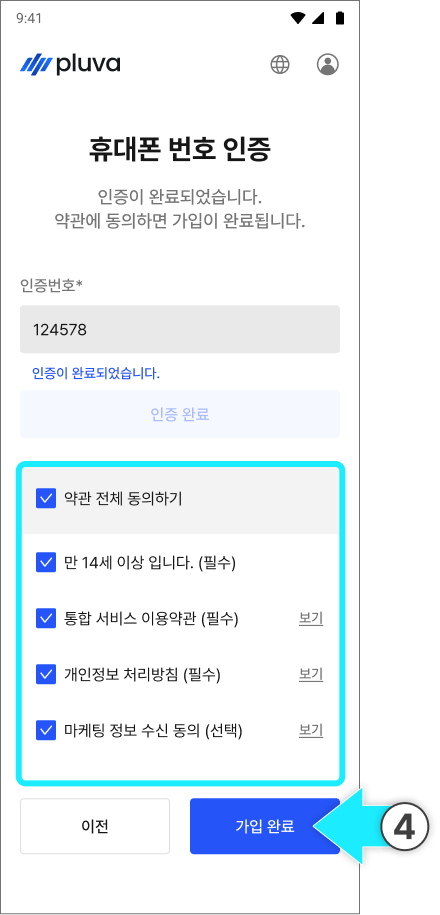
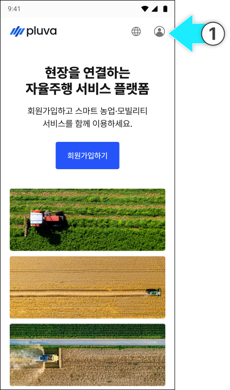
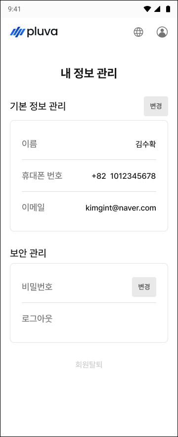
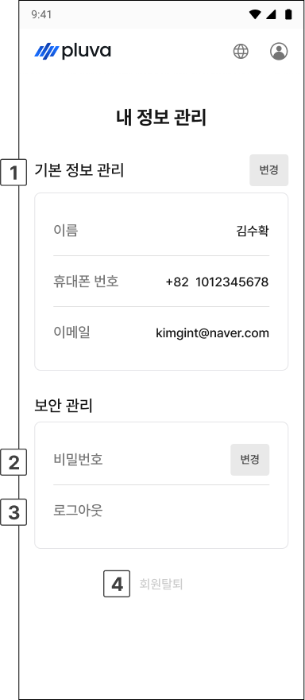

# アカウントの作成及び管理

pluva ionをご利用いただくには、まず統合会員登録サイトでアカウントを作成する必要があります。以下の手順に従って会員登録を行ってください。 


[pluva ionのホームページへ](https://gint.pluva.jp/)




[pluva ionの会員登録サイト](https://gint.pluva.jp/)の会員登録サイトへアクセスし、\[会員登録]をタップします。

<figure><figcaption></figcaption></figure>



お名前、携帯電話番号、パスワードを入力してから\[携帯電話番号から認証する]をタップします。

<figure><figcaption></figcaption></figure>


メールアドレスの入力は任意です。入力しなくても会員登録を進めることができます。




携帯電話番号に送信された6桁の認証コードを入力し、\[認証完了]をタップします。

<figure><figcaption></figcaption></figure>



携帯電話番号の認証が完了したら、利用規約に同意の上\[登録完了]をタップします。

<figure><figcaption></figcaption></figure>



会員登録が完了されます。

<figure><figcaption></figcaption></figure>



***

### アカウント情報の修正



ログイン後、ホームページ右上のプロフィール（アカウント）アイコンをタップします。

<figure><figcaption></figcaption></figure>



\[My情報管理]画面にアクセスし、情報を修正します。

<figure><figcaption></figcaption></figure>



***

### My情報管理画面

<figure><figcaption></figcaption></figure>

.svg>) **基本情報の管理**

* お名前、携帯電話番号、メールアドレスを確認し\[変更]をタップして修正します。

.svg>) パスワード

* \[変更]をタップし、パスワードを修正します。

.svg>) ログアウト

* 現在のアカウントからログアウトします。

.svg>) 退会

* アカウントを削除（退会）します。


退会すると、アカウントおよび保存された情報がすべて削除され、削除された情報は復元できません。退会前に必要な情報を予めご確認ください。

