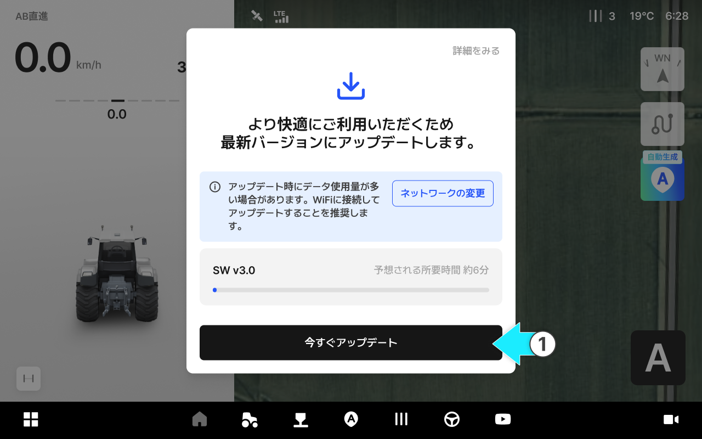
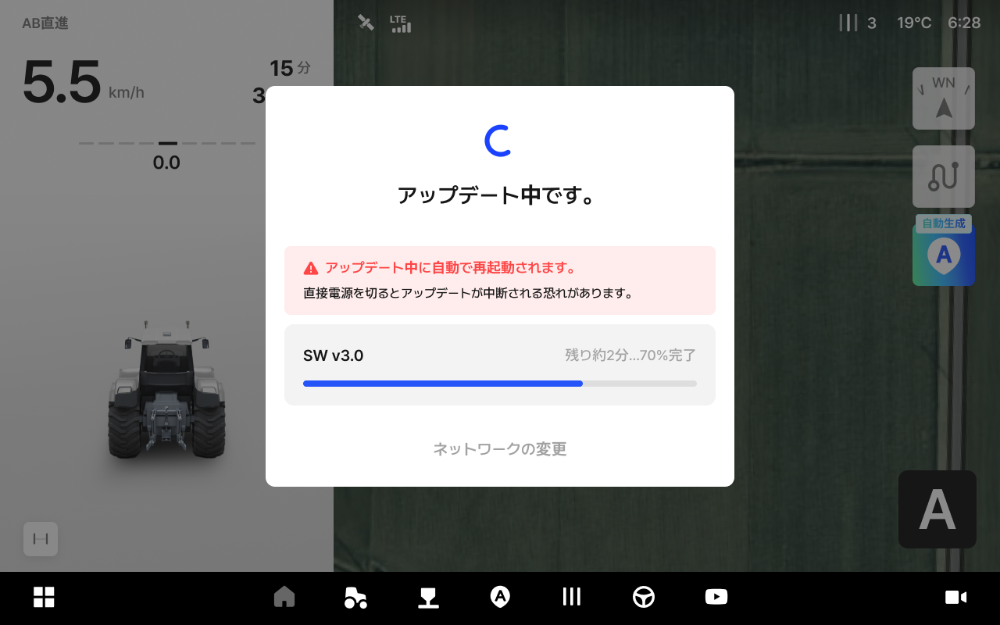
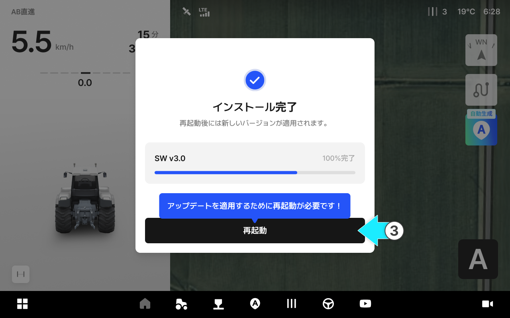
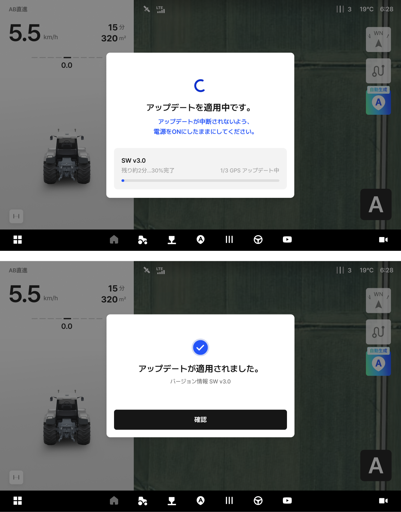
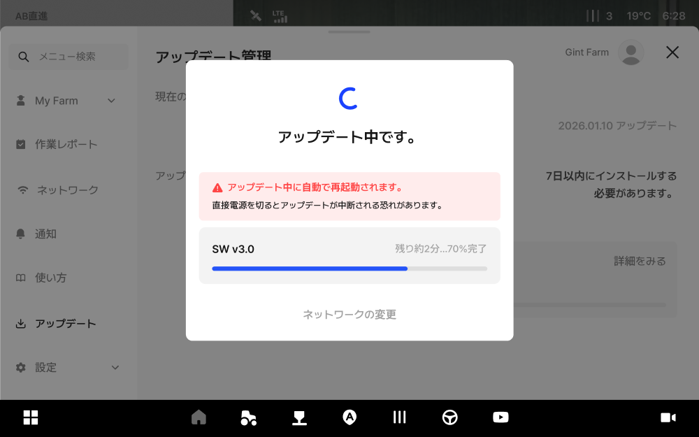

---
layout:
  width: default
  title:
    visible: true
  description:
    visible: false
  tableOfContents:
    visible: true
  outline:
    visible: true
  pagination:
    visible: true
  metadata:
    visible: true
  tags:
    visible: true
  actions:
    visible: true
---

# ソフトウェアアップデート（OTA）

機器が自動でアップデートの必要性を確認し、必要な場合は案内通知が表示されます。


必ずLTEの受信状態が良好である、上空に遮るものがない場所でアップデートを行ってください。



アップデートには、新機能の追加、安定性の向上、エラー修正などが含まれます。



一部のアップデートは、直ちに行っていただく場合があります。



アップデート完了後、再起動が必要な場合があります。


***

#### アップデートのタイプに関するご案内

pluva ionのアップデートは、内容と重要度に応じて、次のように案内されます。

 **必須アップデート**

* 安全性、および安定性に影響を及びす可能性があるため、必ずアップデートする必要があります。

 **任意アップデート**

* 利便性向上及び細かな変更のためのアップデートとして、ご希望のタイミングでできます。
  * アップデートしなくても、現在のバージョンのまま引き続きご利用いただけます。

 **緊急アップデート**

* 重要なトラブルを迅速に解決する場合であり、直ちにアップデートが必要です。

***

#### アップデート方法に関するご案内

タブレットの電源を入れると、アップデートの案内通知が表示されます。案内に従って進めます。



**アップデートに関するご案内通知の確認**

* \[今すぐアップデート]をタップすると、アップデートが始まります。

<figure><figcaption></figcaption></figure>



**アップデート中**

* アップデート中の作業は、状況に応じて「作業可能」と「作業不可」に分かれます。
  * 一般的なアップデート（作業可能）
\
    ダウンロードやインストール中でも、現在のバージョンのまま、そのまま作業を続けられます。
  * 強制アップデート（作業不可）\
    アップデートが完了するまで、製品の使用が制限されます。

<figure><figcaption></figcaption></figure>



**アップデート完了、および再起動に関するご案内**

* アップデートが完了すると、新バージョンを反映するため、再起動の案内が表示されます。
* 再起動が2回必要な場合もあります。画面の案内に従って進めてください。

<figure><figcaption></figcaption></figure>



**再起動してからアップデートが反映されると、アップデートが完了します。**

<figure><figcaption></figcaption></figure>




#### 自動的に案内される場合以外にも、設定メニューより現在のバージョンを確認してから、手動でアップデートを行うこともできます。

1. **\[設定]**&#x3078;アクセスします。

2. **\[アップデート（ソフトウェア）]**&#x3092;タップします。

3. 現在のソフトウェアバージョンを確認します。

4. 新しいバージョンがある場合はアップデートを進めます。「アップデート中」、「アップデート完了」のステータスが画面に表示され、完了したら再起動の案内が表示されます。

