---
layout:
  width: default
  title:
    visible: true
  description:
    visible: false
  tableOfContents:
    visible: true
  outline:
    visible: true
  pagination:
    visible: true
  metadata:
    visible: true
  tags:
    visible: true
  actions:
    visible: true
---

# 圃場の登録

一度圃場を登録すれば、各作業で同一の基準を適用できるため、作業準備時間を短縮し、繰り返しの設定を最小限に抑えることができます。また、作業履歴が圃場単位で蓄積・照会されるため、圃場ごとの作業記録を簡単に確認でき、農作業の体系的な管理が可能です。

***

#### 圃場登録機能へアクセス



 \[メニュー一覧のアイコン]をクリックします。

<figure>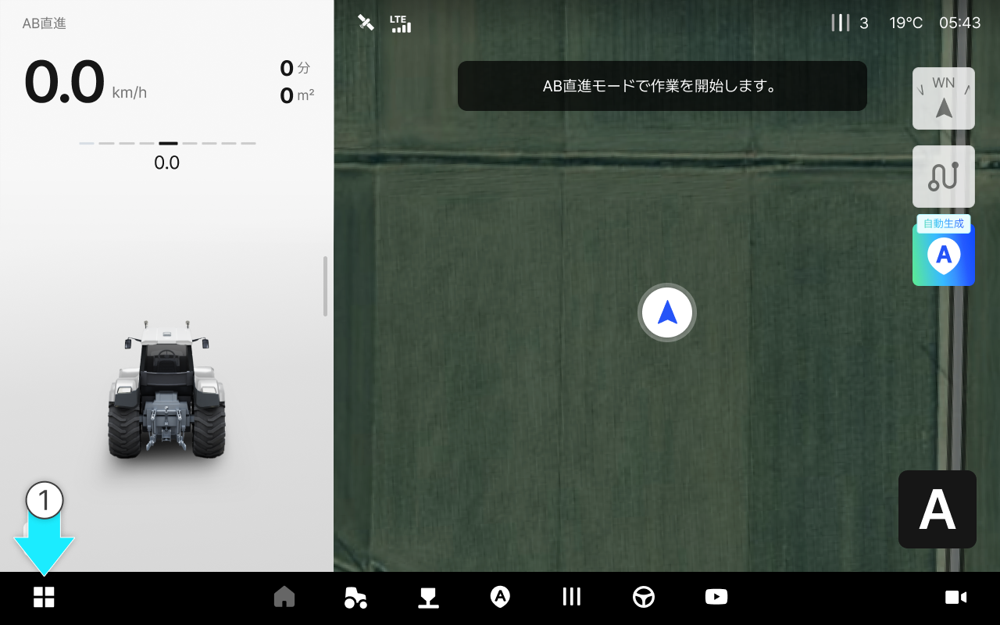<figcaption></figcaption></figure>



My Farmの農場管理の\[圃場]タブをクリックすると圃場の管理へアクセスできます。

<figure>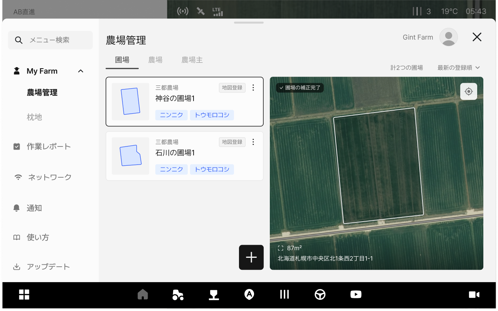<figcaption></figcaption></figure>



 \[圃場の追加]ボタンをクリックします。

<figure>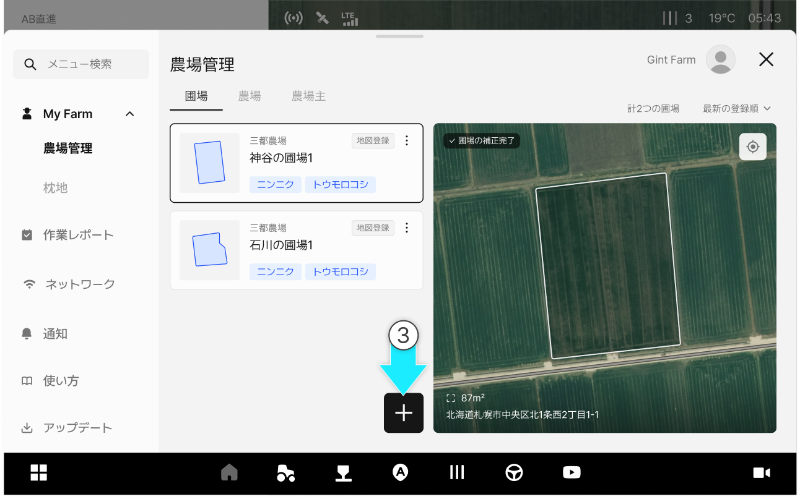<figcaption></figcaption></figure>



\[確認]をクリックします。

<figure>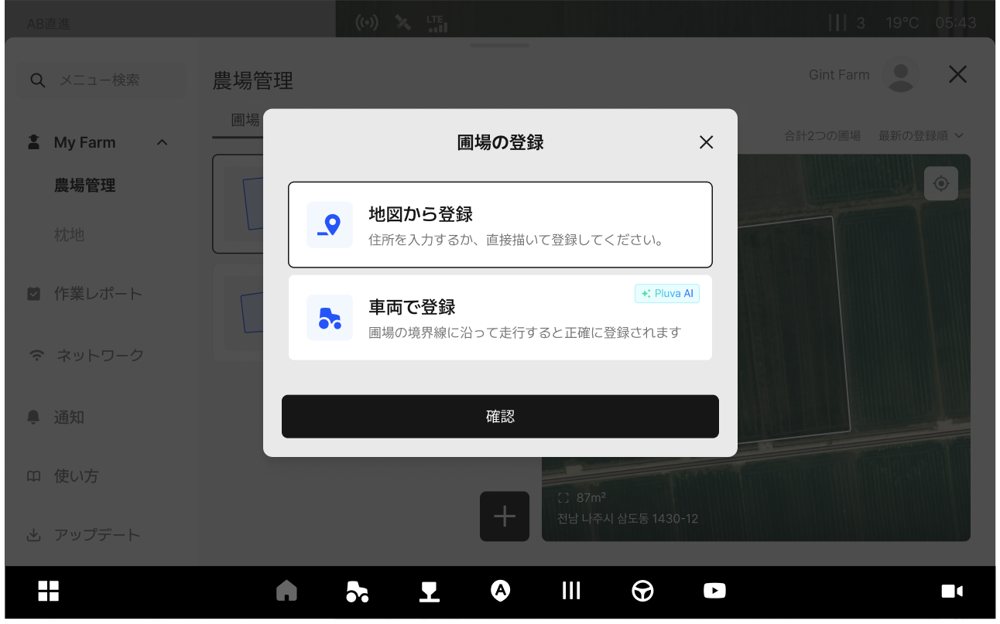<figcaption></figcaption></figure>



***

### 地図から登録



「地図から登録」オプションを選択し、\[確認]をクリックします。

<figure>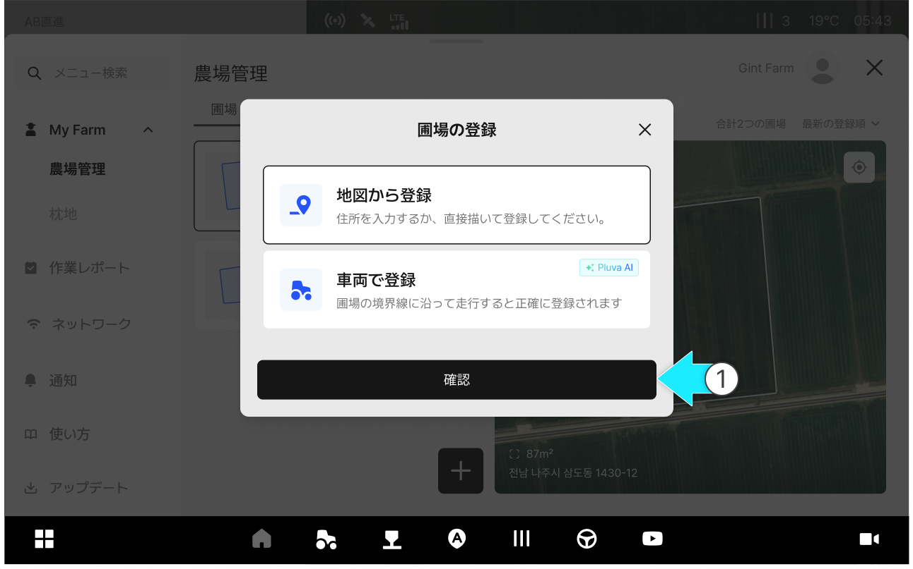<figcaption></figcaption></figure>



地図から圃場を選択します。

<figure>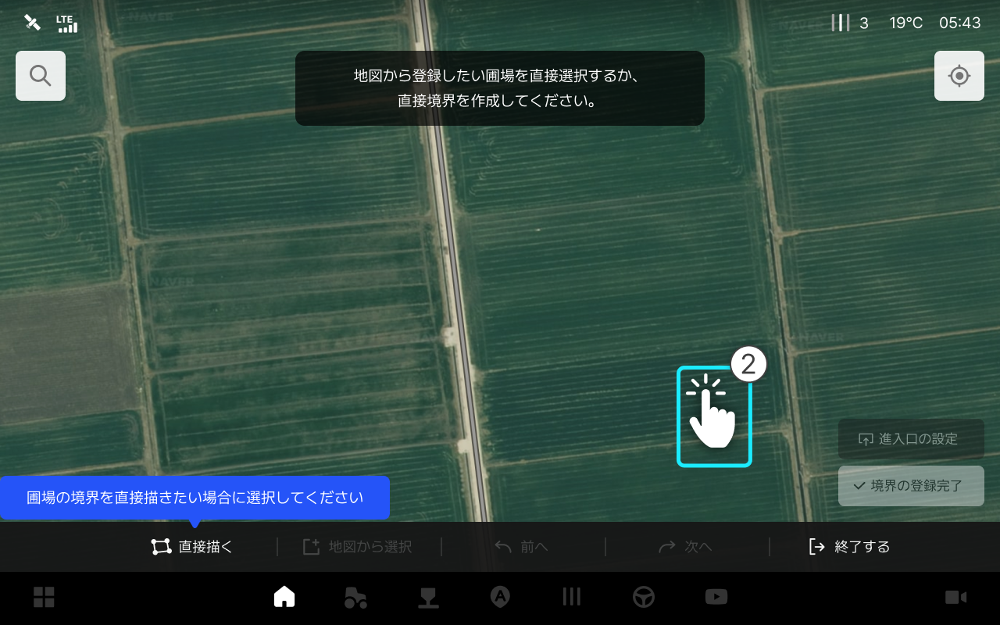<figcaption></figcaption></figure>


圃場登録の基本設定は\[地図から選択]になっています。
境界を直接作成するには、\[直接描く]をクリックします。




境界の生成後、\[進入口の設定]をクリックし、ご希望の場所を選択します。

<figure>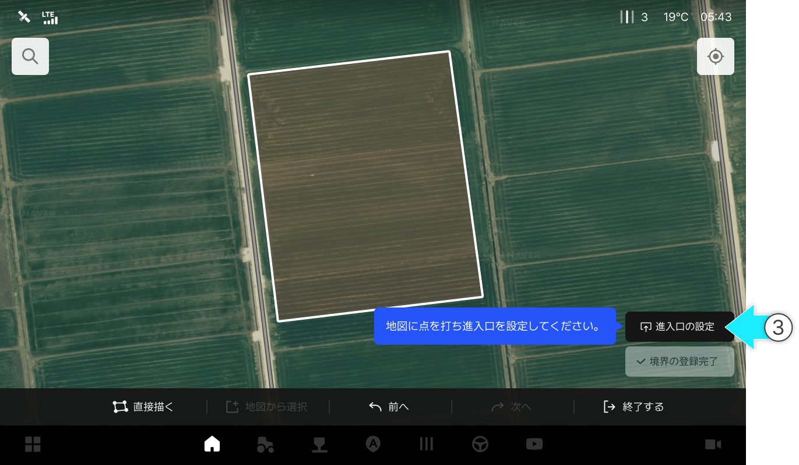<figcaption></figcaption></figure>



進入・退出口の位置設定ポップアップから\[同じ場所に設定]を選択します。

<figure>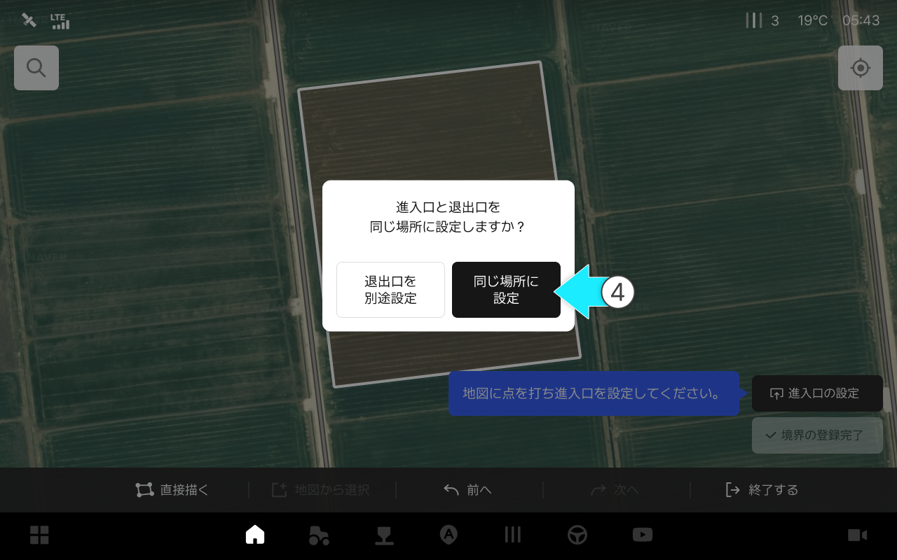<figcaption></figcaption></figure>


\[退出口を別途設定]を選択した場合は、進入/退出口をそれぞれ指定する必要があります。

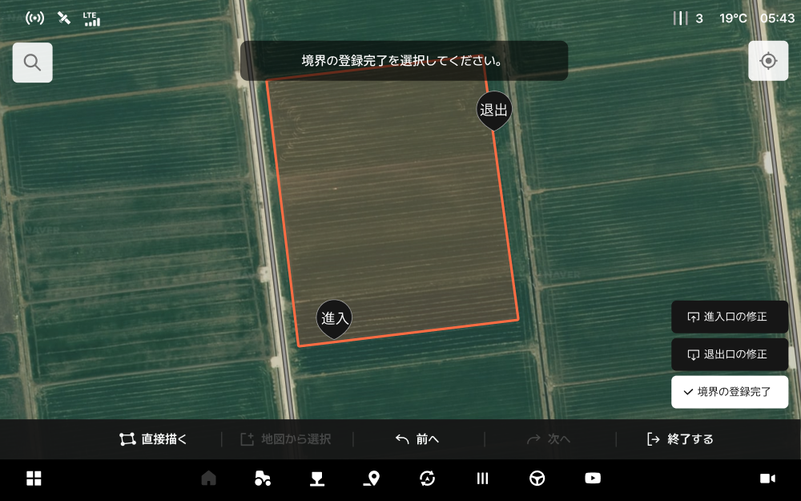




進入・退出口の設定が完了したら圃場情報を入力し、\[登録]をクリックします。

<figure>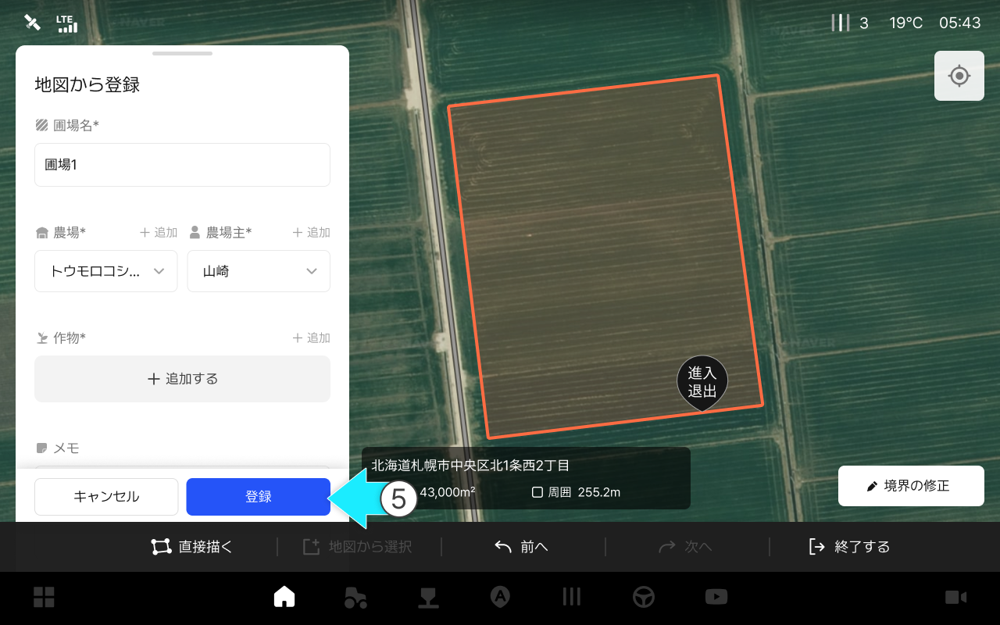<figcaption></figcaption></figure>



圃場の登録が完了します。

<figure>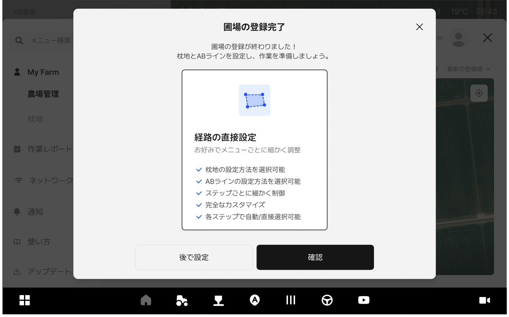<figcaption></figcaption></figure>



### 地図から圃場登録の画面のご案内

<figure>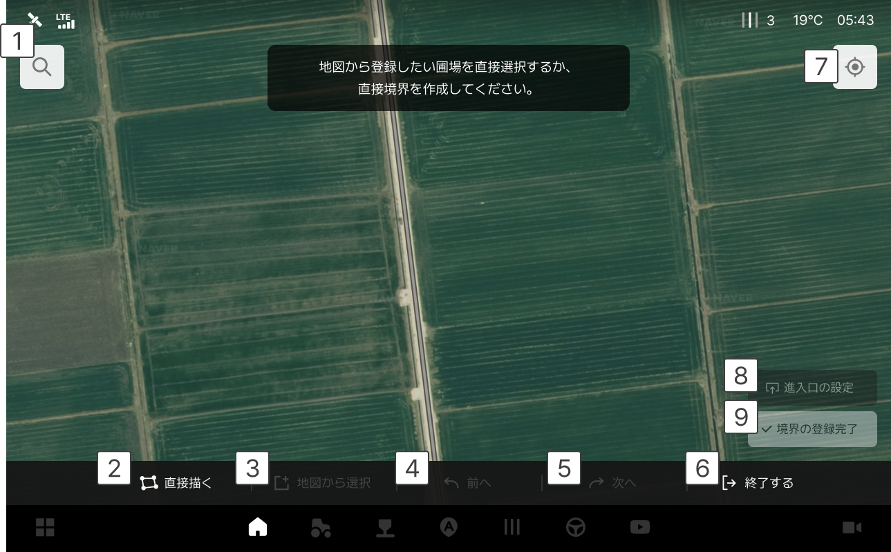<figcaption></figcaption></figure>

 **住所を検索し圃場を選択**

* アドレス検索で圃場を選択します。

<figure>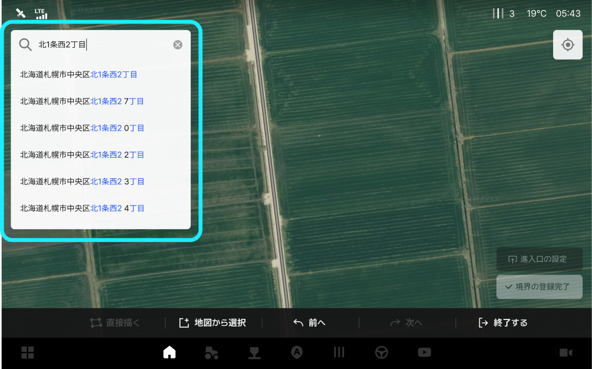<figcaption></figcaption></figure>

 **直接描く**

* 圃場エリアに直接点を打って生成します。

<figure>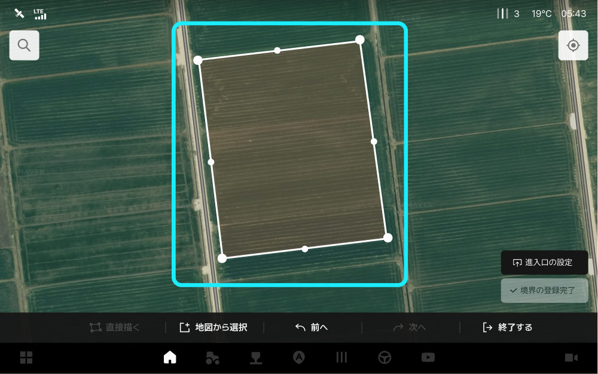<figcaption></figcaption></figure>

 **地図から選択**

* 地図上で圃場を直接クリックして選択します。\[地図から登録]が基本設定になっています。

 **前へ**

* 前へ戻ります。

 **次へ**

* 次へ進みます。

 **終了する**

* 「圃場を追加する」画面から出ます。

 **現在地へ移動する**

* 現在地に地図を移動させます。

 **進入/退出口の設定**

* 進入/退出口の位置を設定します。圃場を選択すると、そのボタンが使用できます。進入/退出口は同じ位置に設定するか、別々に設定することができます。なお、修正ボタンから位置変更ができます。

 **境界の登録完了**

* 境界登録を完了します。進入/退出口を選択するとそのクリックが可能になります。

### 地図から圃場登録モーダルのご案内

<figure>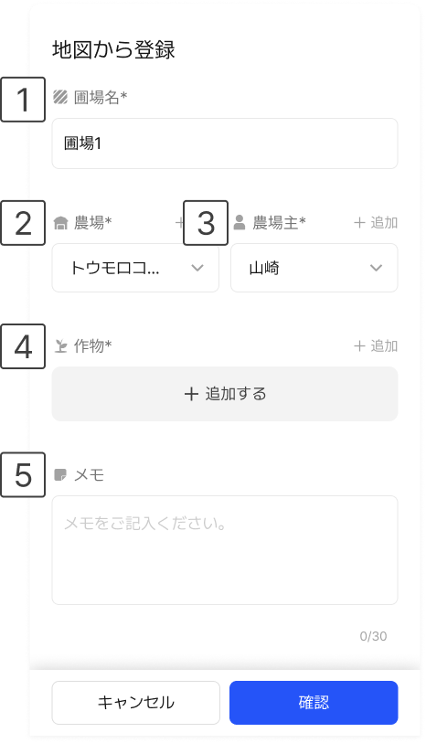<figcaption></figcaption></figure>

 **圃場名**

* 代表として表記する圃場の名前を入力します。

 **農場**

* 圃場と紐づく農場を選択します。

 **農場主**

* 圃場と紐づく農場主を選択します。

 **作物**

* 現在の圃場で作業中の作物を追加します。

 **メモ**

* メモに追加情報を記入できます

***

### 車両から登録

手動運転し、圃場の境界を走行しながらポイントをマッピングする方法です。地図上に表示されない圃場や、境界が分かりづらい場合に有効です。



圃場の登録方法を選択する際に、「車両から登録」をタップし\[確認]を押します。

<figure><figcaption></figcaption></figure>



車両から登録画面にアクセスできます。車両を圃場の各ポイントへ移動させ、マッピングします。

<figure><figcaption></figcaption></figure>


設定直後、該当するポイントの修正ボタンが表示されます。位置を修正したい場合は、修正ボタンをタップして再設定します。



**車両から圃場登録時のご注意**

* 最大20ポイントまで設定できます。
* ポイントは順番に設定してください。順不同で設定すると境界線が正しく生成されません。



ご希望の位置でボタンをタップし、進入口・退出口を設定できます。

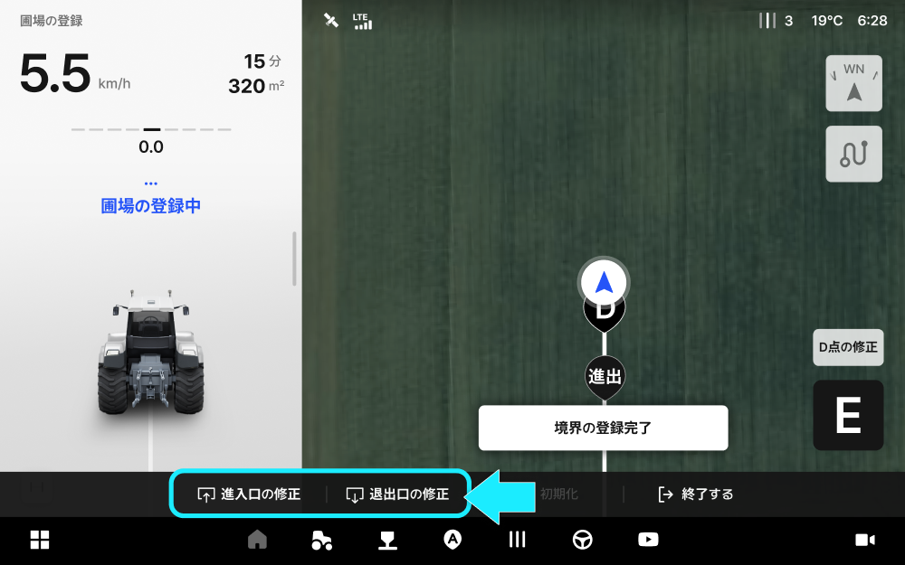




「境界の生成完了」をタップします。

<figure><figcaption></figcaption></figure>



境界の登録が完了すると、圃場登録のボタンが有効になります。「**圃場登録」**&#x3092;押して下さい。

<figure><figcaption></figcaption></figure>



圃場情報の入力画面から、圃場名、農場、作物などを入力します。**「登録」**&#x3092;タップすると圃場の登録が完了します。

<figure><figcaption></figcaption></figure>



#### 画面のボタンに関するご案内

<figure>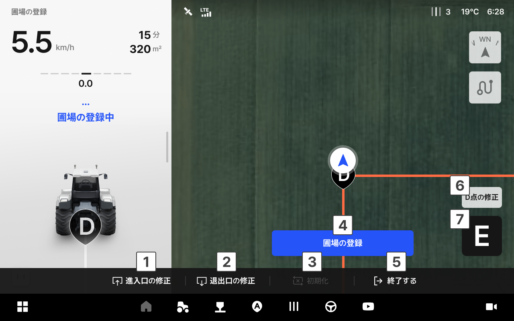<figcaption></figcaption></figure>

 **進入口の修正**

* 進入口を車両の現在地に設定します。

 **退出口の修正**

* 退出口を車両の現在地に設定します。

 **初期化**

* 設定したポイントを初期化します。

 **圃場の登録**

* 全てのポイントを設定し終わったら、圃場を登録します。

 **終了する**

* 登録を中断し、前の画面に戻ります。

 **修正**

* 既に設定したポイントを現在地に変更します。

 **A / B / C / D / E / F**&#x20;

* 該当するポイントを車両の現在地に設定します。

### 車両から圃場登録モーダルに関するご案内

<figure>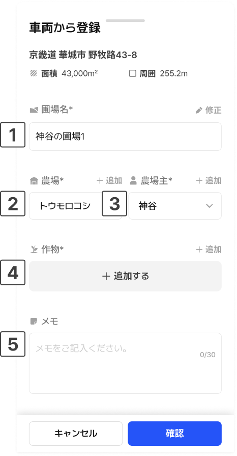<figcaption></figcaption></figure>

 **圃場名**

* 表示したい圃場名を入力します。

 **農場**

* 圃場と紐づける農場を選択します。

 **農場主**

* 圃場と紐づける農場主を選択します。

 **作物**

* 現在の圃場で作業中の作物を追加します。

 **メモ**

* 補足情報をメモします。
