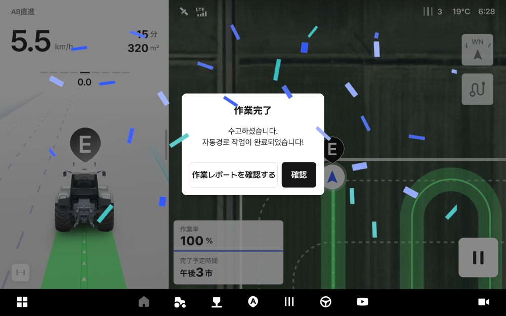

# 作業レポート

作業レポートでは、完了した作業記録を日付ごとに確認でき、作業軌跡・作業効率・環境情報を一目で把握できます。\
単なる記録の保管にとどまらず、作業当時の天候や機器の状態及び結果を紐づけることで、次回の作業効率を高める根拠データとして活用いただけます。

***

### アクセス方法



ホーム画面から  アイコンをタップします。

<figure><figcaption></figcaption></figure>



\[作業レポート]をタップすると、作業レポート一覧へアクセスできます。

<figure><figcaption></figcaption></figure>




作業完了直後には、完了画面から\[作業履歴を確認する]をタップすると、アクセスできます。



***

### 作業履歴の一覧画面

作業履歴の一覧は、日付ごとにグループ化されたカード形式で表示されます。

<figure><figcaption></figcaption></figure>

 **並べ替え**

* 新しい順・古い順に一覧を並べ替えられます。

 **日付の選択**

* 週表示カレンダーからご希望の日付を選択すると、その日の作業記録が確認できます。
* 上部の「年/月」またはカレンダーのアイコンをタップすると、表示する「年/月」を変更できます。

<figure><figcaption></figcaption></figure>

 **作業時刻**

* 作業の開始・終了時刻を表します。

 **自動経路の表示**

* 自動経路で作業が行われた作業履歴にタグされ、自動経路を表示します。

 **車両**

* 作業に使用された車両を表します。

 **作業機**

* 作業に使用された作業機を表します。

 **作業時間**

* 作業にかかった実際の時間が表示されます。

 **作業面積**

* 作業した面積が表示されます。

***

### 詳細画面

一覧からカードをタップすると、該当する作業の詳細情報が確認できます。

<figure><figcaption></figcaption></figure>

 **作業時刻**

* 作業の開始・終了時刻を表します。

 **作業した場所の地図**

* 作業経路と作業完了エリアが地図上から表示されます。
* 地図の上部には、作業した圃場の住所および圃場名が表示されます。
* 自動経路で作業した場合は、地図の左上に「自動経路」のタグが表示されます。


- **自動**: 自動操舵で作業したエリア
- **手動**: 手動走行で作業したエリア
- **RTK不安定エリア**: 走行中にRTK信号の受信が不安定だった区間



「拡大する」をタップすると、地図を全画面表示で確認できます。


 **作業面積**

* 自動操舵で作業完了した、総面積を表します。

 **走行距離**

* 作業時に走行した総距離が表示されます。自動操舵と手動走行距離も併せて表示されます。

 **作業時間に関する情報**

* 作業時間とは、自動操舵、または手動走行で実際作業した総時間のことです。
* 作業が行われた時間帯（午前作業/午後作業）が併せて表示されます。

 **メモ**

* 作業時に入力したメモが確認できます。

 **車両**

* 作業に使用した車両情報です。

 **作業機**

* 作業に使用した作業機、および作業幅が表示されます。
