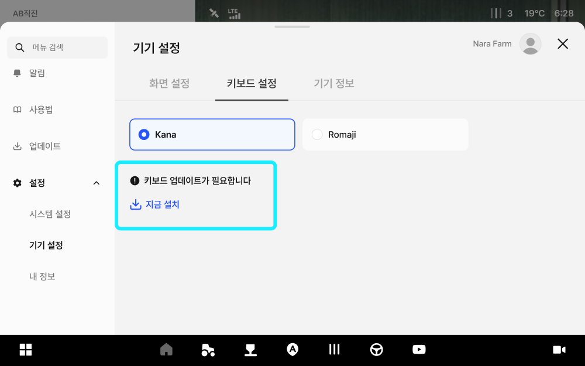
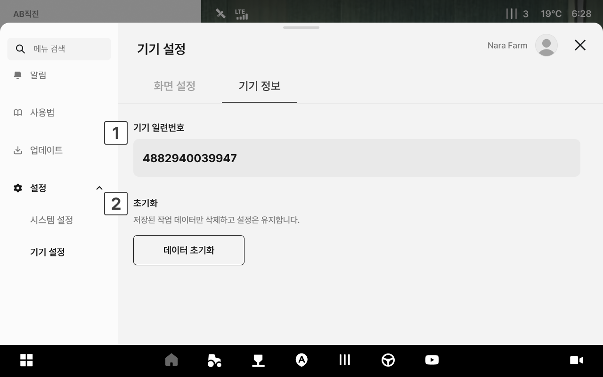

# 機器の設定

走行画面の明るさや音量、カメラの表示に関する設定を行います。

***

### アクセス方法



アプリ下部のメニューから\[設定]アイコンをタップします。

<figure><figcaption></figcaption></figure>



左のメニューから\[機器の設定]をタップすると、機器の設定画面へアクセスします。

<figure><figcaption></figcaption></figure>



***

### 画面の設定ページ

画面の明るさや音量、カメラ表示に関する設定を行います。

<figure><figcaption></figcaption></figure>

.svg>) **画面の明るさ**

* スライダーを動かし、画面の明るさを調整します。

.svg>) **音量**

* スライダーを動かし、音量を調整します。
  * **テスト再生**: 設定した音量を事前に確認します。
  * **音量のリセット**: 音量を初期設定に戻します。

.svg>) **カメラ**

* 走行画面上にカメラ映像を表示するかどうかを設定します。
  * **全カメラ**: 全てのカメラを一度にON/OFFします。
  * **ターン時に自動的にON**: ターンする際にカメラ画面が自動的に表示されます。

***

### キーボード設定

キーボードの入力方法を選択します。

<figure><figcaption></figcaption></figure>


Youtube検索時にはKana入力はできず、Romajiのみ入力できます。



**キーボードのアップデートが必要な場合**

キーボードのアップデートが必要な場合は、画面上に「キーボードのアップデートが必要です」という案内とともに「今すぐアップデート」が表示されます。

\[今すぐアップデート]を選択すると、アップデートが始まります。


***

### 機器情報

機器の基本情報を確認し、保存された作業データを初期化できます。

<figure><figcaption></figcaption></figure>

.svg>) 機器のシリアル番号

* 機器のシリアル番号が表示されます。

.svg>) データの初期化

* 登録済みの接続情報をすべて解除し、初期設定の状態に戻します。
* データを初期化すると、初期画面へ移動され、簡単セットアップを最初から再実行する必要があります。


ご注意: データを初期化すると、全てのデータが完全に消去され復元できません。

