# My車両の追加

My車両の画面から車両を追加し、車両情報や寸法を入力してから補正まで進めます。

***

#### My車両の追加



My車両画面の右下にある  アイコンをタップします。

<figure>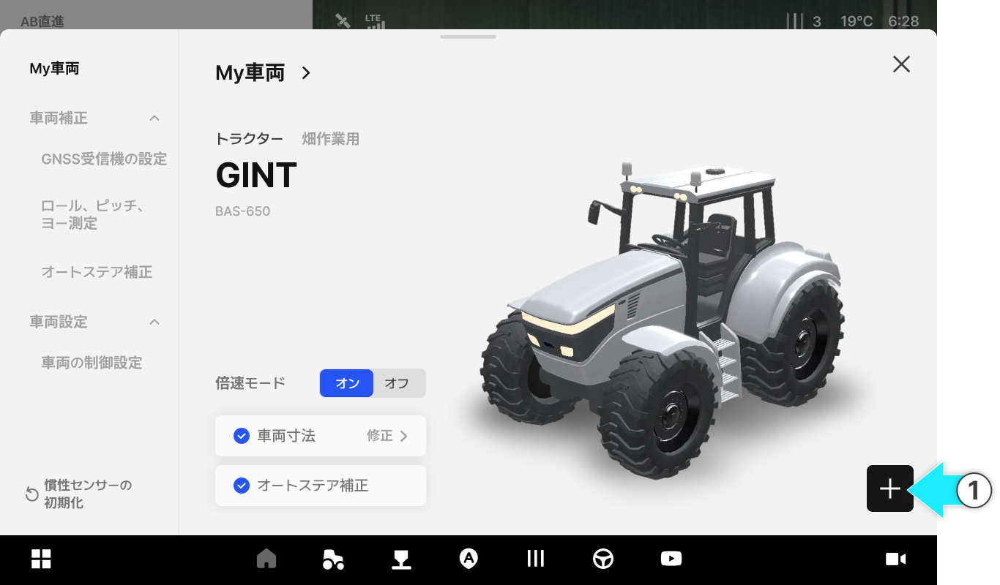<figcaption></figcaption></figure>



車両タイプを選択し、\[選択完了]をタップします。

<figure>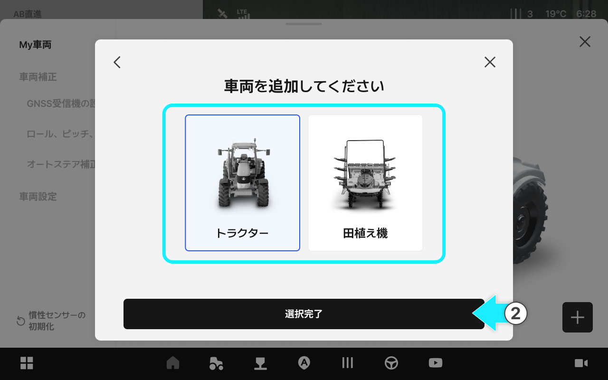<figcaption></figcaption></figure>



車両情報を入力してから「車両の追加」をタップします。

<figure>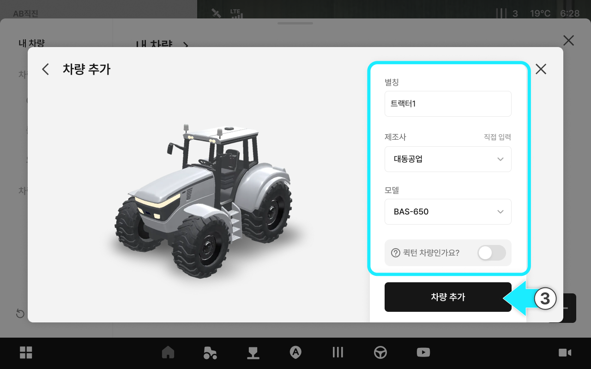<figcaption></figcaption></figure>


**倍速ターン付き車両のトグル**

* 倍速ターン付き車両は、倍速ターンの特性に合った補正値が必要なため、\[倍速ターン付き車両]のトグルを必ず有効にしてから進めてください。
* 倍速ターン機能は、トラクターにしかありません。田植え機には倍速ターン機能がありません。




**メーカー/型式の直接入力**

お探しのメーカー及び型式がない場合は、「直接入力」を選択し手入力します。

入力されたメーカー名は、後日、名称変更する場合があります。

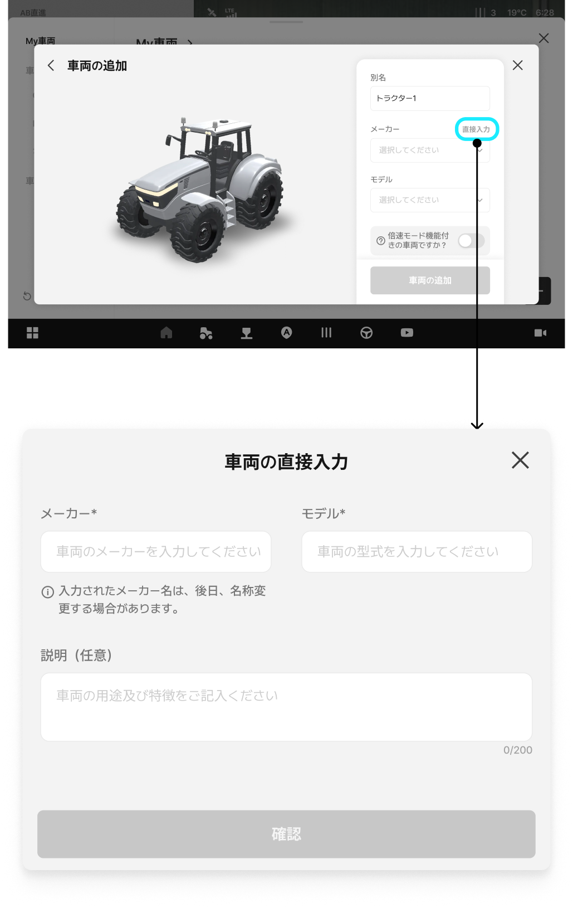




車両の寸法を入力し\[確認]をタップします。

<figure>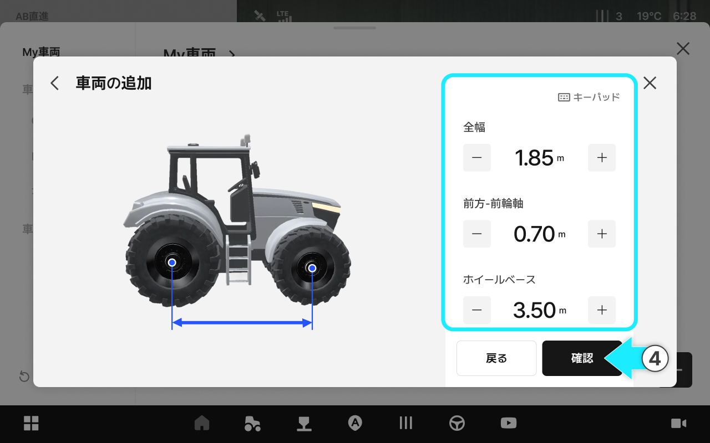<figcaption></figcaption></figure>



車両が追加されると、GNSS受信機との連動が完了します。\[次のステップへ]をタップしてください。

<figure><figcaption></figcaption></figure>



車両の補正が終わると、車両の追加が完了します。

<figure><figcaption></figcaption></figure>


補正が完了していない場合、自動操舵が制限されることがあります。補正を完了してから走行することを推奨します。

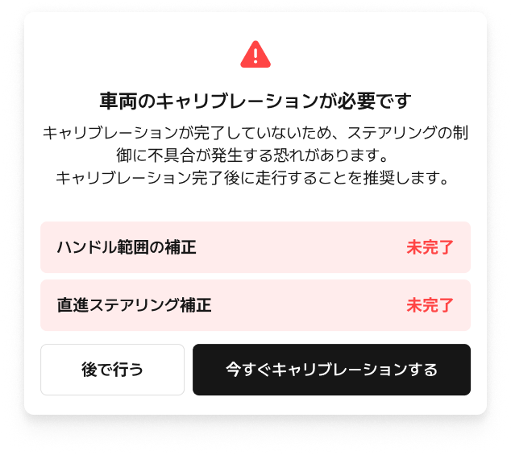




***

#### 車両の寸法設定項目


車両の寸法測定は平らな地面で行ってください。

傾斜地やぬかるんだ土の上などで測定すると、正確に測定できない場合があります。


#### トラクター

<figure>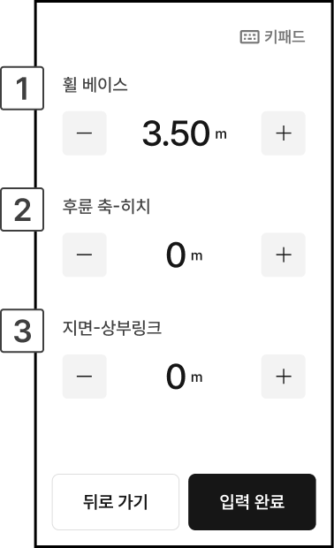<figcaption></figcaption></figure>

 ホイールベース

* トラクターの前輪の中心から、後輪の中心までの距離です。
* 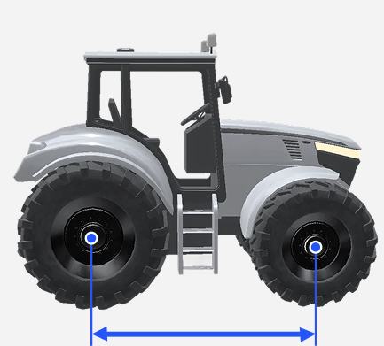

 後輪軸-ヒッチ

* トラクターの後輪軸の中心から、ヒッチまでの水平距離です。
* 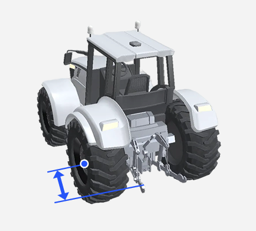

 地面-トップリンク

* 地面からトラクターのトップリンクまでの垂直距離です。
* 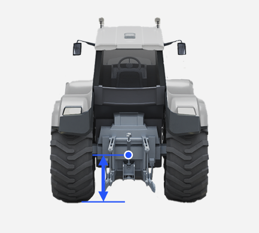

#### 田植え機

<figure>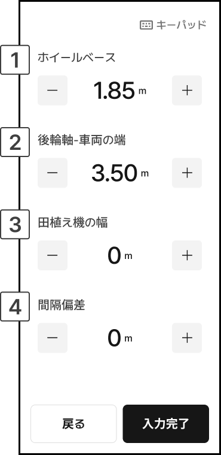<figcaption></figcaption></figure>

 ホイールベース

* 田植え機の前輪の中心から、後輪の中心までの距離です。
* 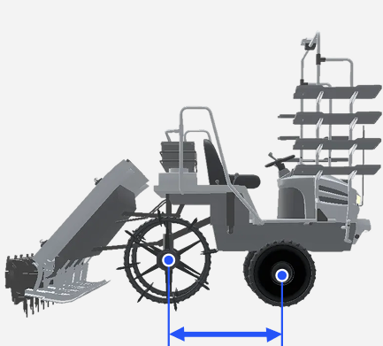

 後輪軸-車両の端

* 田植え機の後輪軸の中心から、車両の端までの水平距離です。
* 

 田植え機の幅

* 田植え機の幅を表し、タイヤの幅も含まれます。
* 

 間隔偏差

* 往復作業時に走行間隔が一定にならない場合、補正するための設定値です。（間隔偏差の絶対値を4で割った数値を入力します）
