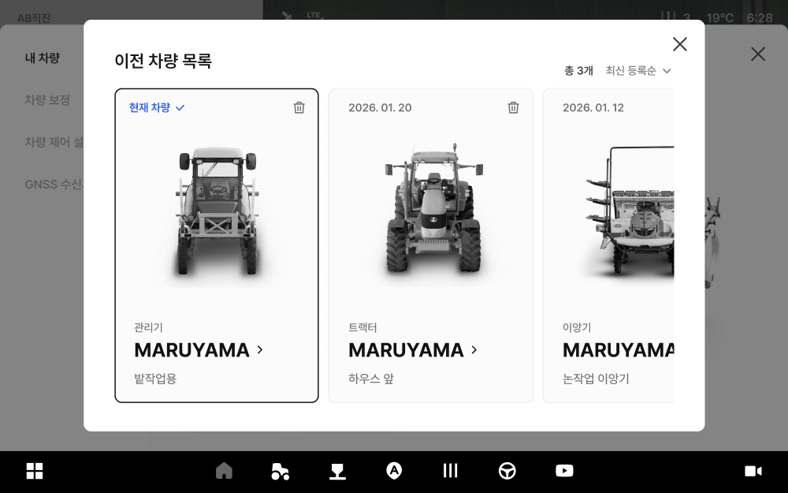
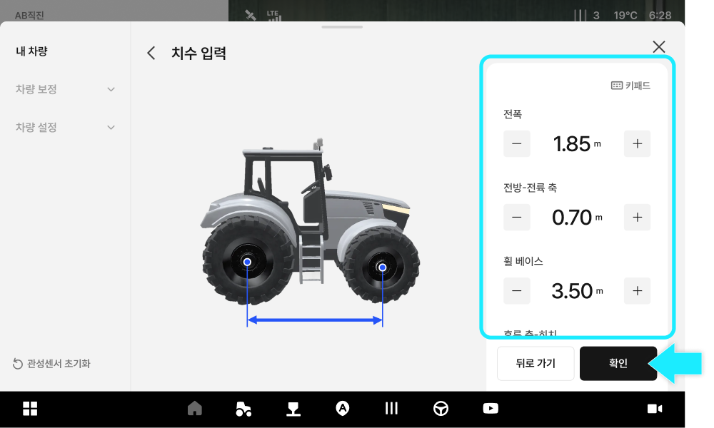

---
layout:
  width: default
  title:
    visible: true
  description:
    visible: false
  tableOfContents:
    visible: true
  outline:
    visible: true
  pagination:
    visible: true
  metadata:
    visible: true
  tags:
    visible: true
  actions:
    visible: true
---

# My車両へのアクセス及び画面のご案内

My車両では、作業に使用する車両の情報を確認し、補正や寸法など、車両に関する設定ができます。

***

#### My車両へのアクセス方法



.svg>) \[車両]アイコンをタップします。

<figure><figcaption></figcaption></figure>



My車両へアクセスできます。

<figure><figcaption></figcaption></figure>



***

#### My車両の画面に関するご案内

<figure><figcaption></figcaption></figure>

.svg>) **GNSS受信機の設定**

* 車両に取り付けられたGNSS受信機の位置を入力し、位置精度を最適化します。

.svg>) **ロール・ピッチ・ヨーの測定**

* 車両の傾き（ロール・ピッチ・ヨー）を測定および補正します。

.svg>) **オートステア補正**

* 車両の蛇行を抑え、真っ直ぐ直進できるようにステアリングを補正します。

.svg>) **車両の制御設定**

* 作業環境に合わせ、走行の特性を調整します。\
  設定を変更すると、自動操舵の精度が変わる恐れがあります。

.svg>) **慣性センサーの初期化**

* 慣性センサー（IMU）の値をリセットします。

.svg>) **My車両**

* \[My車両 ›]をタップすると、登録済みの車両一覧が表示されます。

.svg>) **車両情報**

* 現在取り付けられている車両のタイプ、別名、メーカー、型式が表示されます。

.svg>) **倍速ターンのON/OFF**

* 倍速ターンのON/OFFの設定状況が確認できます。倍速ターン付き車両でない場合は、表示されません。&#x20;

.svg>) **車両の寸法**

*   車両の寸法が入力されたかどうかが表示されます。タップすると、車両の寸法を修正できます。 

    <figure><figcaption></figcaption></figure>

.svg>) **オートステア補正（ステータス）**

* オートステア補正が完了したかどうかが表示されます。タップすると、補正画面に移動します。

 **車両の追加（＋）**

* 画面右下の＋ボタンをタップすると、車両の追加ができます。
