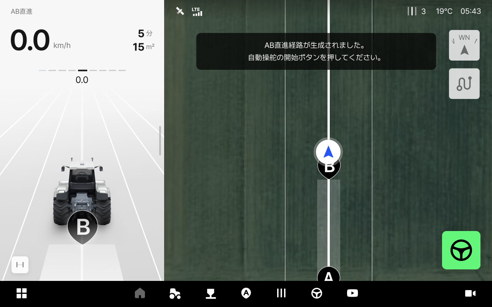
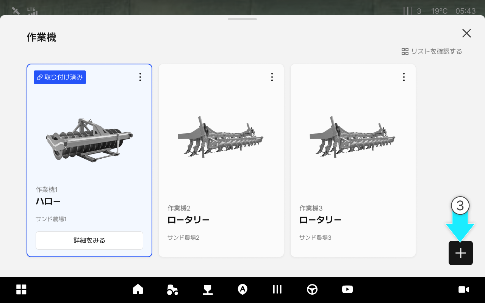
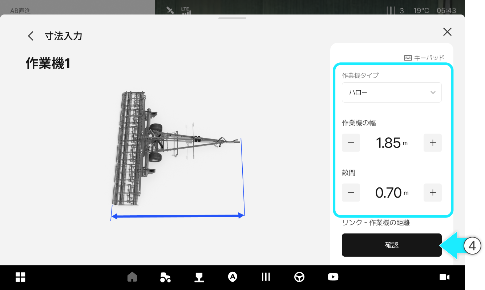
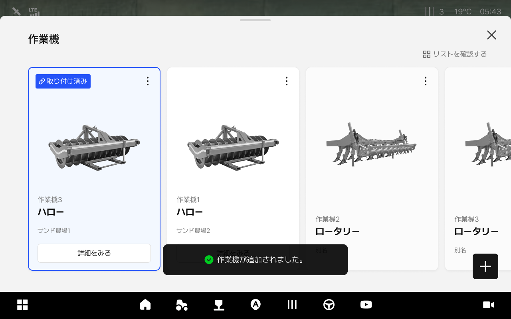
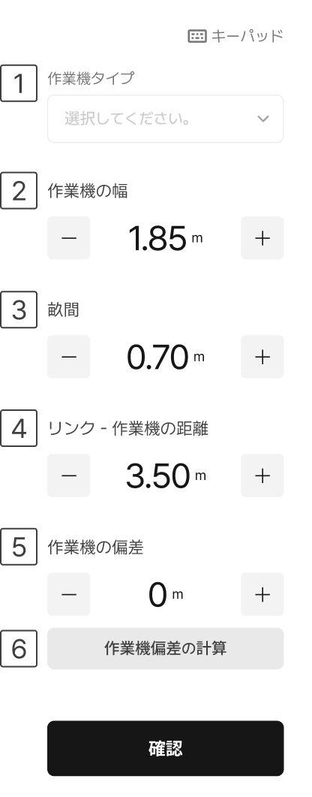

---
layout:
  width: default
  title:
    visible: true
  description:
    visible: false
  tableOfContents:
    visible: true
  outline:
    visible: true
  pagination:
    visible: true
  metadata:
    visible: true
  tags:
    visible: true
  actions:
    visible: true
---

# 作業機の追加

作業に使用する作業機を登録し、作業機の偏差などの設定値も合わせて入力することができます。

***

#### 作業機の追加方法



 \[作業機]をタップします。

<figure><figcaption></figcaption></figure>



作業機リストへのアクセスができます。

<figure><figcaption></figcaption></figure>



 作業機の追加ボタンをタップします。

<figure><figcaption></figcaption></figure>



作業機のタイプや幅などの詳細情報を入力し、確認を押します。

<figure><figcaption></figcaption></figure>



作業機の追加が完了します。

<figure><figcaption></figcaption></figure>



***

#### 作業機の追加項目のご案内

<figure><figcaption></figcaption></figure>

 別名

* 作業機を区別するための名前を入力します。（例：作業機1）

 作業機タイプ

* 作業機タイプを選択します。


**「作業機のタイプ」の直接入力**

作業機のタイプ一覧にご使用の作業機がない場合、直接入力し設定できます。入力された作業機名は、後日、名称変更する場合があります。



 作業機の幅

* 作業機の幅を入力します。
* 

 畝間

* 畝間を入力します。
* 

 リンク -作業機の距離

* リンクと作業機の間の距離を入力します。
* 

 作業機の偏差

* 作業機の偏差を入力します。

 作業機偏差の計算

* 3列を走行してライン間隔の値を入力すると、作業機の偏差が自動で計算されます。
*   画像で示された方向に沿って3本のラインを走行し、走行ライン間の距離を測定して入力してください。 

    <figure><figcaption></figcaption></figure>

    * S1：一本目と二本目の間の距離
    * S2：二本目と三本目の間の距離
    * 画面上部のトグルから、左方向または右方向を選択できます。\
      .png>)
