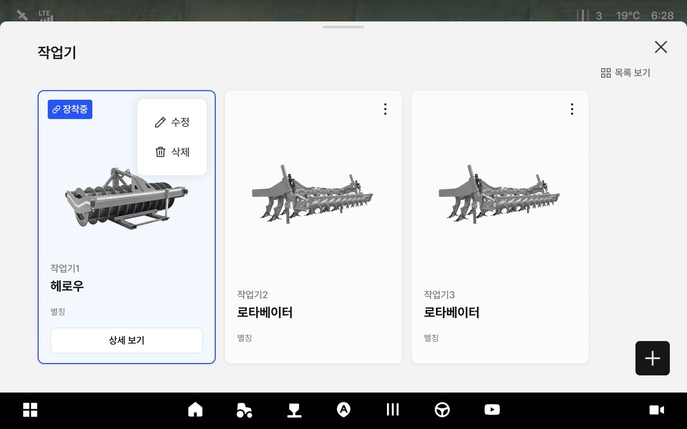
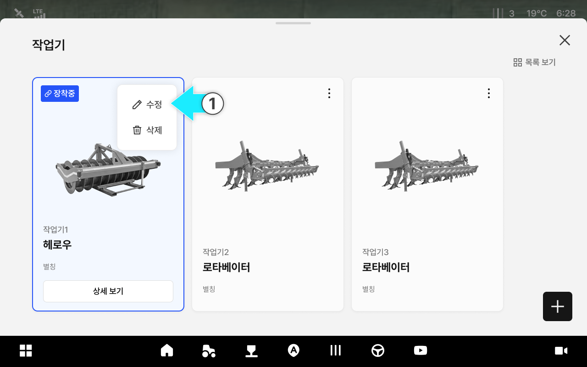
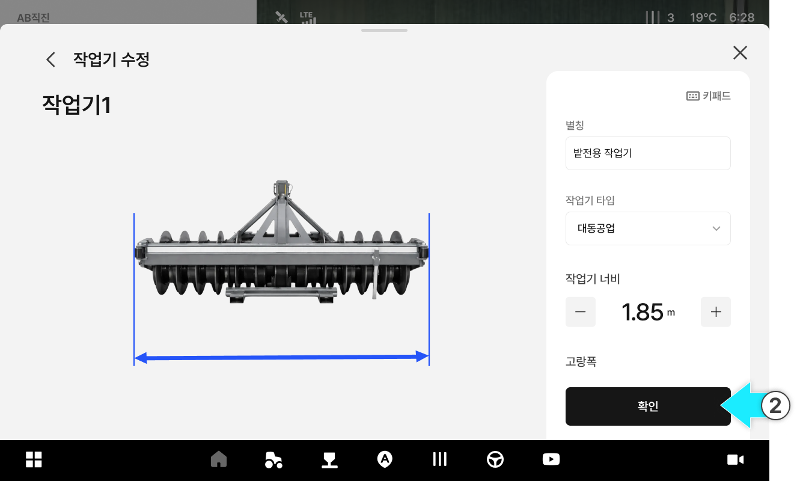
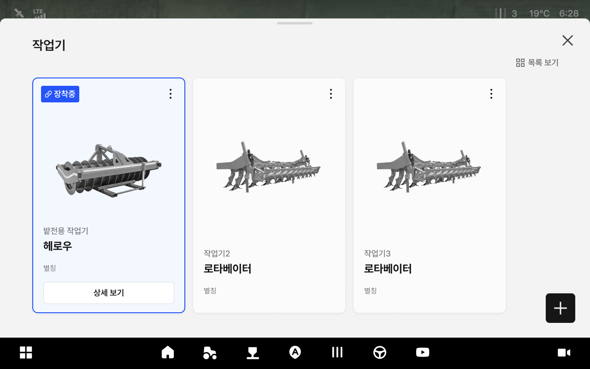
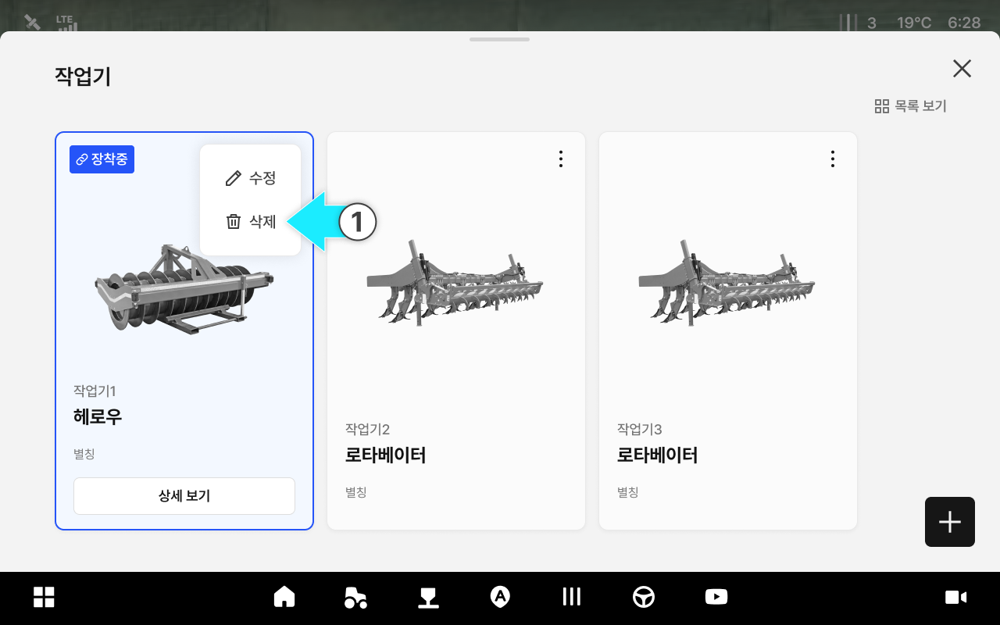
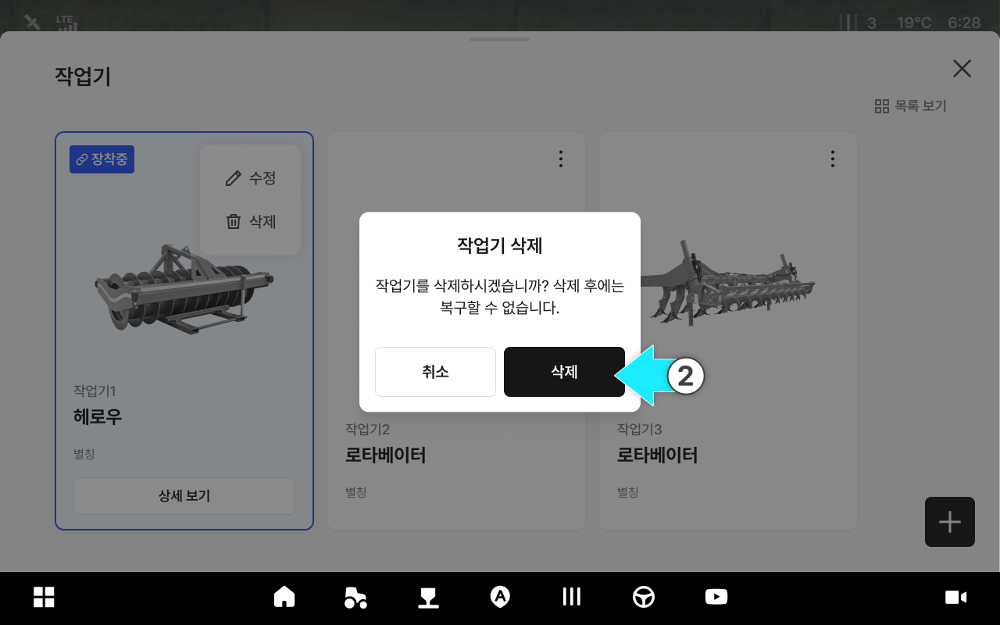
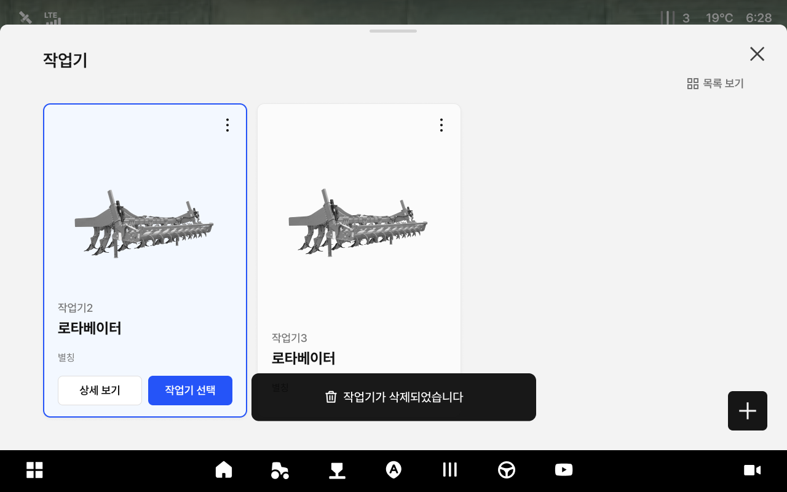

# 作業機情報の管理

作業機の別名、タイプなどの情報を修正し、削除できる機能です。

***

#### 作業機情報の管理機能へのアクセス



.svg>) \[作業機]アイコンをタップします。

<figure><figcaption></figcaption></figure>



ご希望の作業機カードの\[⋮]アイコンをタップします。

<figure><figcaption></figcaption></figure>



表示されたポップアップから、ご希望の管理機能を選択します。

<figure><figcaption></figcaption></figure>



***

#### 作業機情報の修正



\[修正]をタップします。

<figure><figcaption></figcaption></figure>



別名・作業機のタイプ・幅・畝間などを修正し、\[確認]をタップします。

<figure><figcaption></figcaption></figure>



修正が完了します。

<figure><figcaption></figcaption></figure>



***

#### 作業機情報の削除



\[削除]をタップします。

<figure><figcaption></figcaption></figure>



確認画面で\[削除]をタップします。

<figure><figcaption></figcaption></figure>



削除が完了されます。

<figure><figcaption></figcaption></figure>


ご注意: 削除した作業機は、復元できません。



