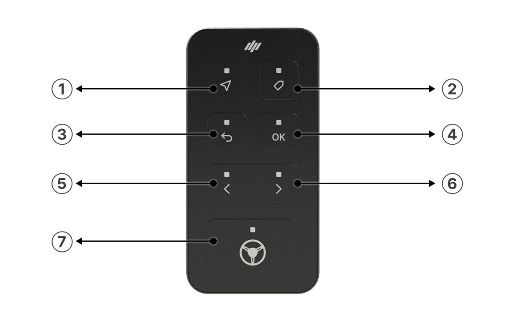

---
layout:
  width: default
  title:
    visible: true
  description:
    visible: false
  tableOfContents:
    visible: true
  outline:
    visible: true
  pagination:
    visible: true
  metadata:
    visible: true
  tags:
    visible: true
  actions:
    visible: true
---

# 스위치(옵션품)

스위치는 작업자가 조작하기 편리한 위치에 설치하여, 자율주행 시스템의 시작·정지 등 주요 기능을 간편하게 제어할 수 있습니다.
옵션품은 별도 구매가 필요하며, 모델 타입에 따라 외관 및 색상이 이미지와 다를 수 있습니다.

<figure><figcaption></figcaption></figure>

 상태

* 기능
  * 시스템 상태 표기
* 상태
  * 기본 - 미점등
  * GPS 신호 우수 - 초록 점등
  * GPS 신호 보통 - 초록 점멸

<figure><figcaption></figcaption></figure>

 즐겨찾기

* 기능
  * 즐겨찾기 기능

<figure><figcaption></figcaption></figure>

 취소 or
이전

* 기능
  * 상황에 따른 취소/이전 메뉴로 이동
* 상태
  * 기본 - 미점등
  * 동작 가능 시 초록 점등

<figure><figcaption></figcaption></figure>

 엔터

* 상태
  * 기본 - 미점등
  * 동작 가능 시 초록 점등

<figure><figcaption></figcaption></figure>

 좌측(◀)

* 기능
  * 설정 화면: 선택 항목을 왼쪽으로 이동합니다.
* 상태
  * 기본 - 미점등
  * 동작 가능 시 초록 점등

<figure><figcaption></figcaption></figure>

 우측(▶)

* 기능
  * 설정 화면: 선택 항목을 오른쪽으로 이동합니다.
* 상태
  * 기본 - 미점등
  * 동작 가능 시 초록 점등

<figure><figcaption></figcaption></figure>

 자율주행 ON/OFF

* 기능
  * 자율주행 모드를 진입·해제합니다.
  * 경로 설정 중에는 A·B 지점도 지정할 수 있습니다.
* 상태
  * 기본 - 미점등
  * 동작 가능 시 초록 점등

<figure><figcaption></figcaption></figure>


**원터치 스위치로 자율주행 시작하기**

1. **경로 점 찍기** : 경로에 필요한 점이 아직 남아 있으면, 원터치 스위치의 \[자율주행 버튼]을 눌러 다음 점을 순서대로 설정합니다.
   * 예 1) AB직진 : A점 → B점
   * 예 2) 격자 주행 : A점 → B점 → C점 → D점
2. **자율주행 켜기 / 끄기** : 해당 모드에 필요한 점이 모두 생성된 뒤부터는 \[자율주행 버튼]이 자율주행을 켜고 끄는(ON/OFF) 기능으로 동작합니다.

