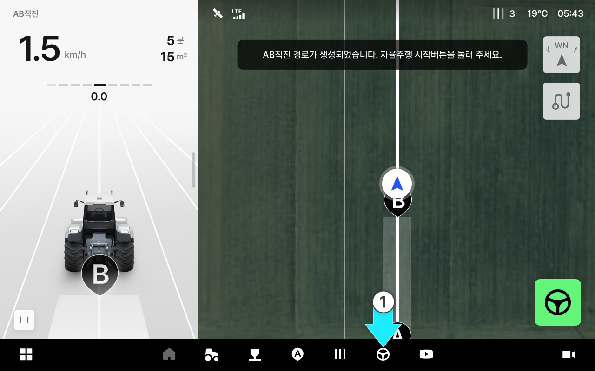
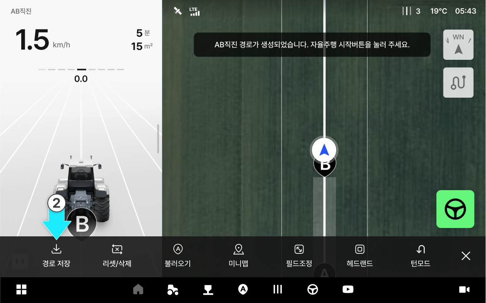

---
layout:
  width: default
  title:
    visible: true
  description:
    visible: false
  tableOfContents:
    visible: true
  outline:
    visible: true
  pagination:
    visible: true
  metadata:
    visible: true
  tags:
    visible: true
  actions:
    visible: true
---

# 경로 저장하기

생성한 주행 경로를 저장해두는 기능입니다. AB 직진, 자동 경로 등 생성한 경로를 저장할 수 있으며, 저장된 경로는 \[경로 불러오기]를 통해 다시 사용할 수 있습니다.



저장할 주행 경로를 생성한 상태에서  \[작업] 버튼을 누릅니다.

<figure><figcaption></figcaption></figure>



경로 저장을 누릅니다.

<figure><figcaption></figcaption></figure>



이름 설정을 원할 경우 '경로 이름 영역'을 눌러 경로 이름을 설정한 뒤 \[저장]을 누릅니다. 저장이 완료 됩니다.

<figure><figcaption></figcaption></figure>


경로 이름은 최대 30자 이하로 입력해주세요.





저장이 완료된 경로는 \[경로 불러오기]를 통해 다시 사용할 수 있습니다.\
자세한 내용은 [경로 불러오기](bringing-up-path.md)를 참고하세요.


