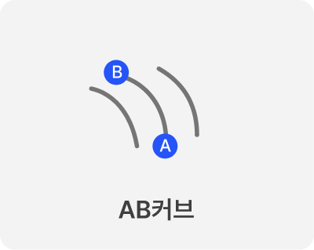
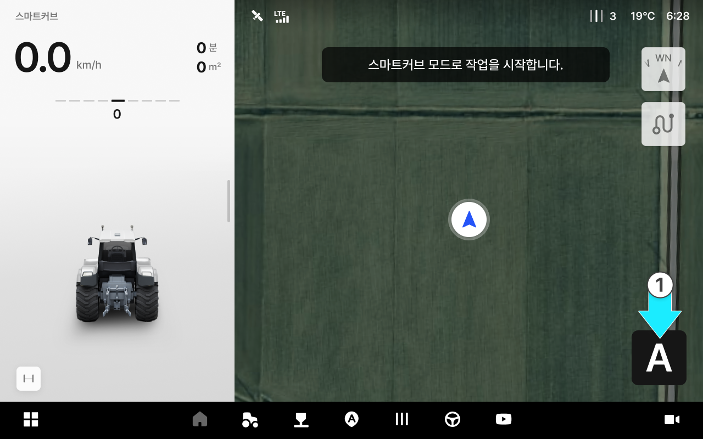
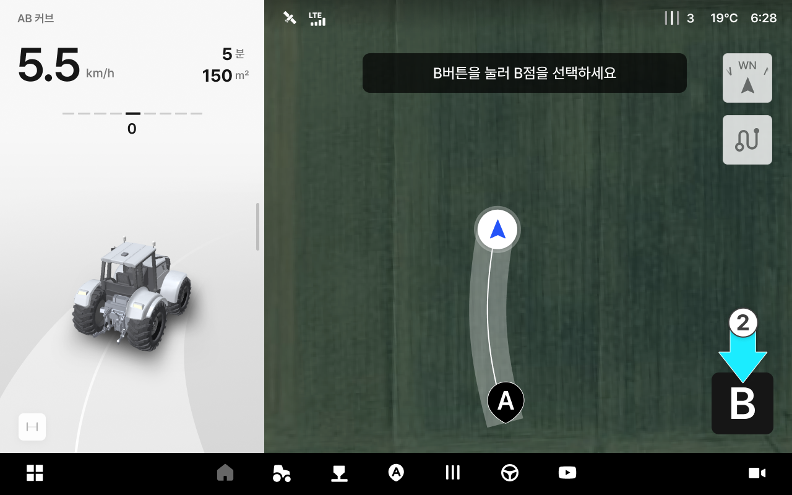
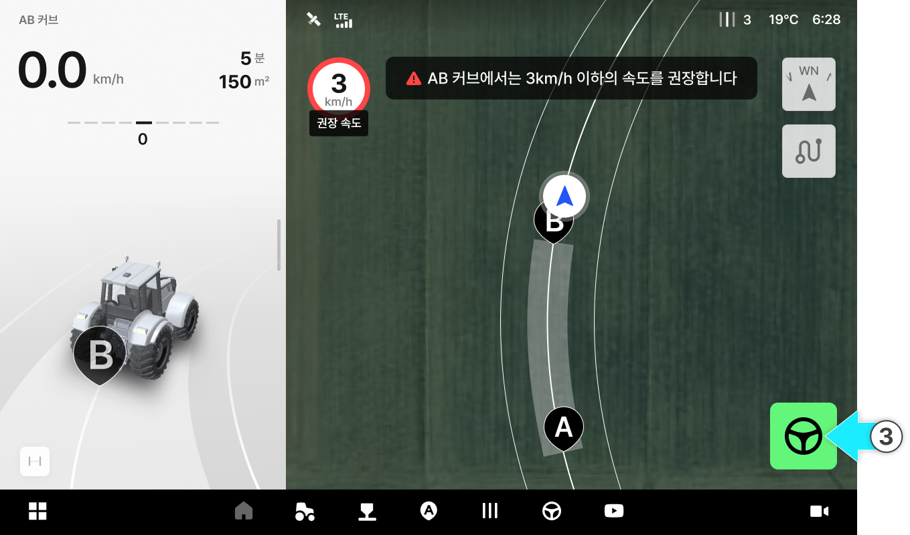
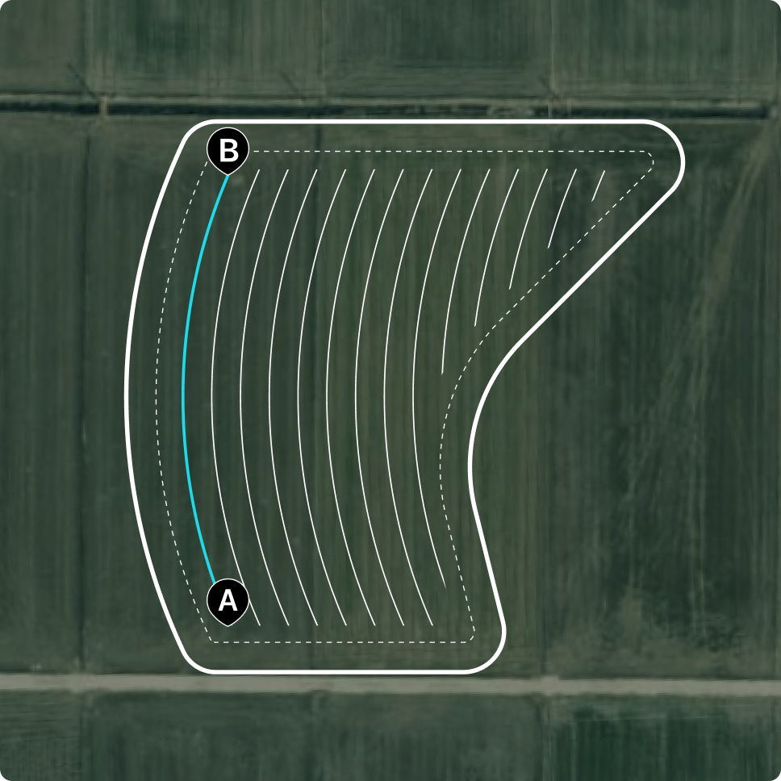
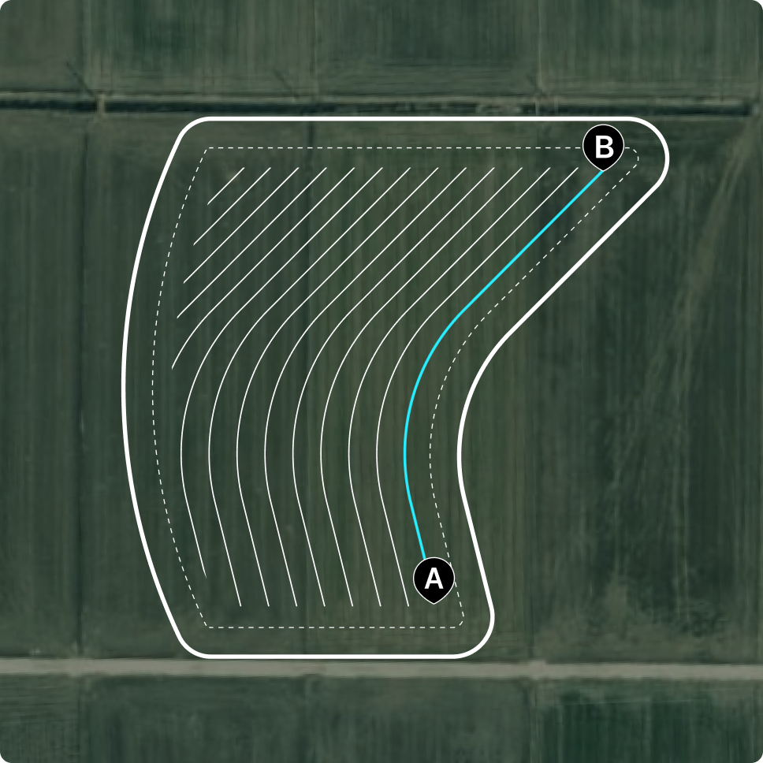
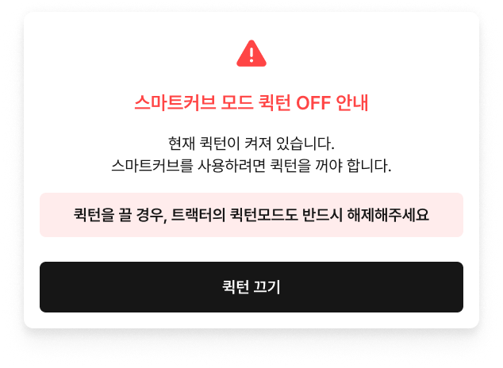
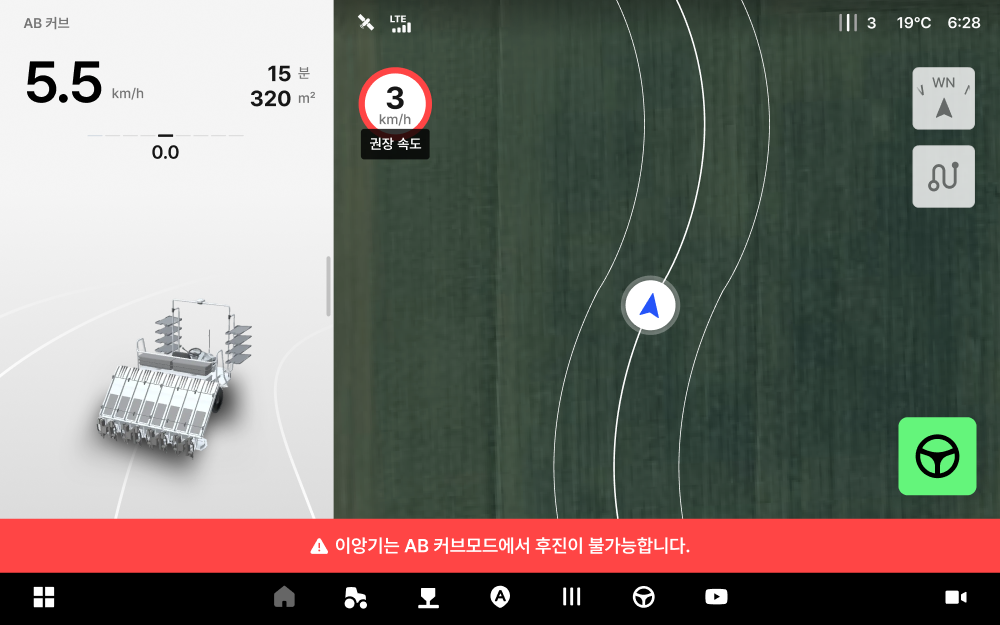
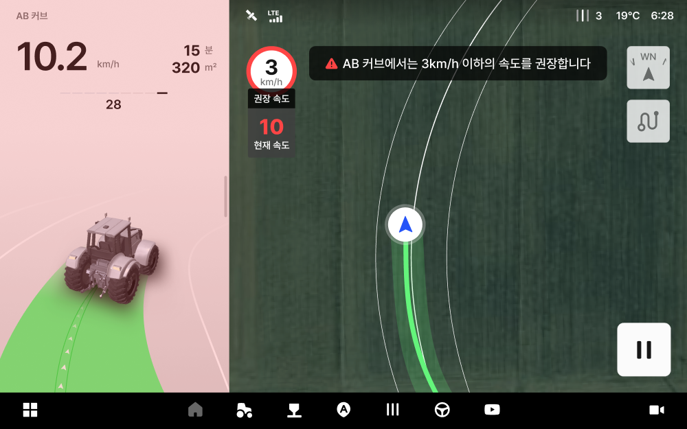
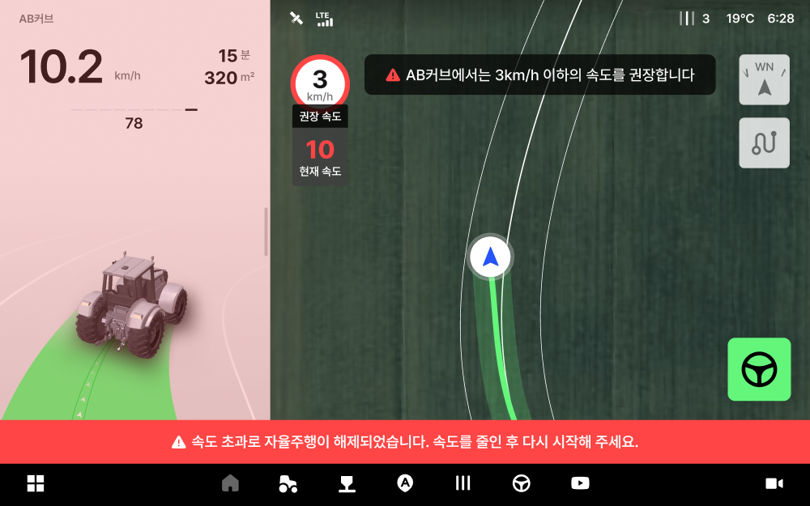

# AB 커브

곡선 형태의 작업 경로를 만들 때 사용합니다. 곧은 직선이 아닌 휘어진 이랑이나 경계에 맞춰 작업할 때 유용합니다.

AB 커브

* A점에서 시작해 원하는 곡선을 그리며 B점까지 주행하면, 그 곡선을 기준으로 자율주행 경로가 생성됩니다.

<figure><figcaption></figcaption></figure>



 버튼을 눌러 A 지점을 생성합니다.

<figure><figcaption></figcaption></figure>



원하는 곡선을 그리며 25m 이상 주행한 뒤 \[B] 버튼을 눌러 B 지점을 생성합니다.

<figure><figcaption></figcaption></figure>



\[자율주행 시작] 버튼을 눌러 주행을 시작합니다.

<figure><figcaption></figcaption></figure>



***

### **AB 커브 사용 가이드**

#### **1. AB 커브 라인 생성시 유의 사항**

* **AB 커브 라인은 되도록 길게 설정하세요.**&#x20;
  * 주행 라인은 커브 라인을 기준으로 일정한 간격을 두고 나란히 생성되므로, 커브 라인이 길수록 더 많은 주행 라인을 확보하여 넓은 구역을 한 번에 작업할 수 있습니다.
* **커브 라인은 곡선이 더 크게 휘어진 면을 따라 생성하세요.**
  * AB 커브 라인은 좌우 어느 면을 기준으로도 생성할 수 있으나, 더 휘어진 면일수록 주행 라인이 더 많이 만들 수 있습니다.
  *



1. **짧은 커브 · 덜 휘 면**

커브 라인 주행 라인이 적게 생성됩니다.

<figure><figcaption></figcaption></figure>




2. **긴 커브 · 더 휘 면**

커브 주행 라인이 많이 생성됩니다.

<figure><figcaption></figcaption></figure>




#### **2. AB 커브 진입 시 퀵턴 끄기**

* AB 커브는 <mark style="color:$primary;">퀵턴이 꺼진 상태에서만</mark> 사용할 수 있습니다.
* 퀵턴이 켜진 채로 AB 커브 모드에 진입하면 "AB 커브모드 퀵턴 OFF 안내" 창이 표시됩니다.

#### **3. 주행 속도**

* 권장 속도는 <mark style="color:$primary;">3km/h 이하</mark>입니다.

#### **4. 이앙기 후진 불가**

* 이앙기는 후진 자율주행을 지원하지 않습니다. 후진하면 자율주행이 자동 해제되며 안내 메시지가 표시됩니다.


**AB 커브 속도 초과·경로 이탈 시**

1. **속도 초과 경고**

* 권장 속도를 초과하면 현재 속도가 **빨간색**으로 표시됩니다.
* 설정 경로를 **30cm 이상** 벗어나면 화면에 경고가 표시됩니다.

2. **자율주행 해제**

* 설정 경로를 **80cm 이상** 벗어나면 자율주행이 자동 해제되며, **"속도가 빨라 자율주행이 해제되었습니다"** 안내가 표시됩니다.
* 안내를 닫으려면 다시 주행을 시작하거나 다른 모드로 변경합니다.


