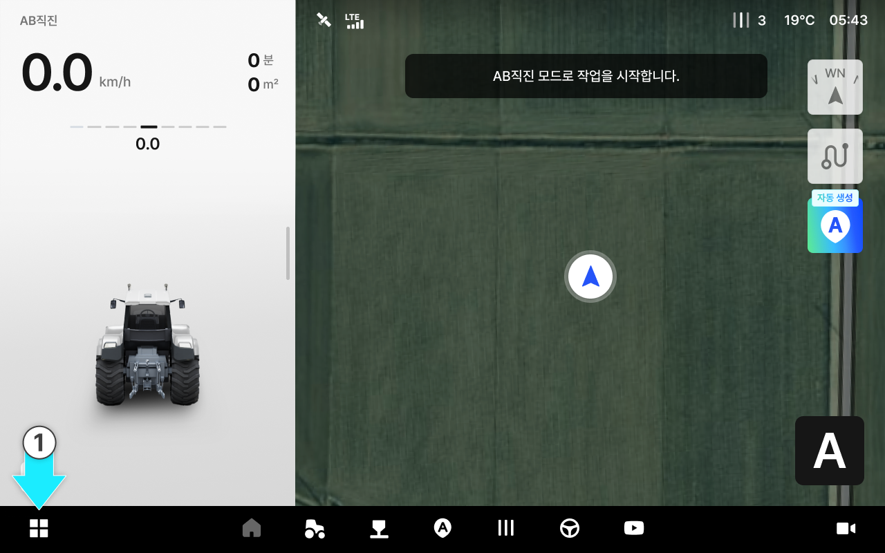
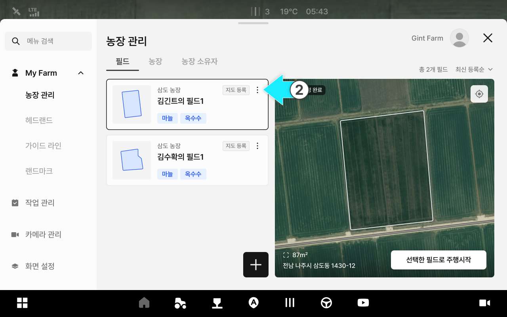
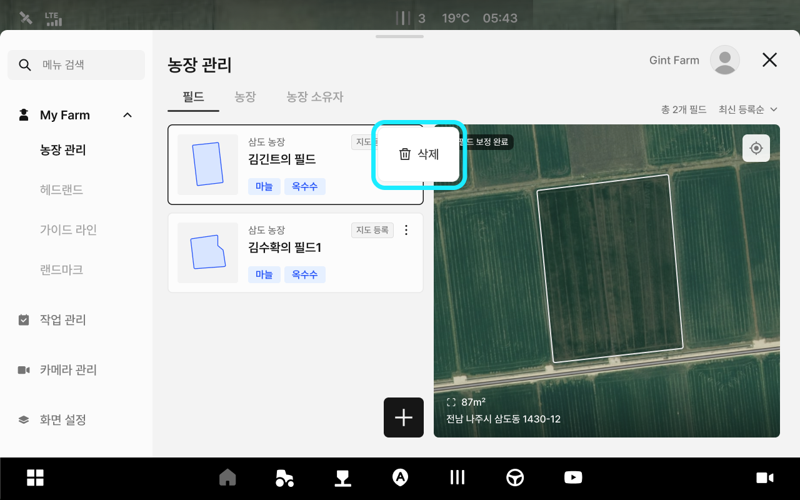
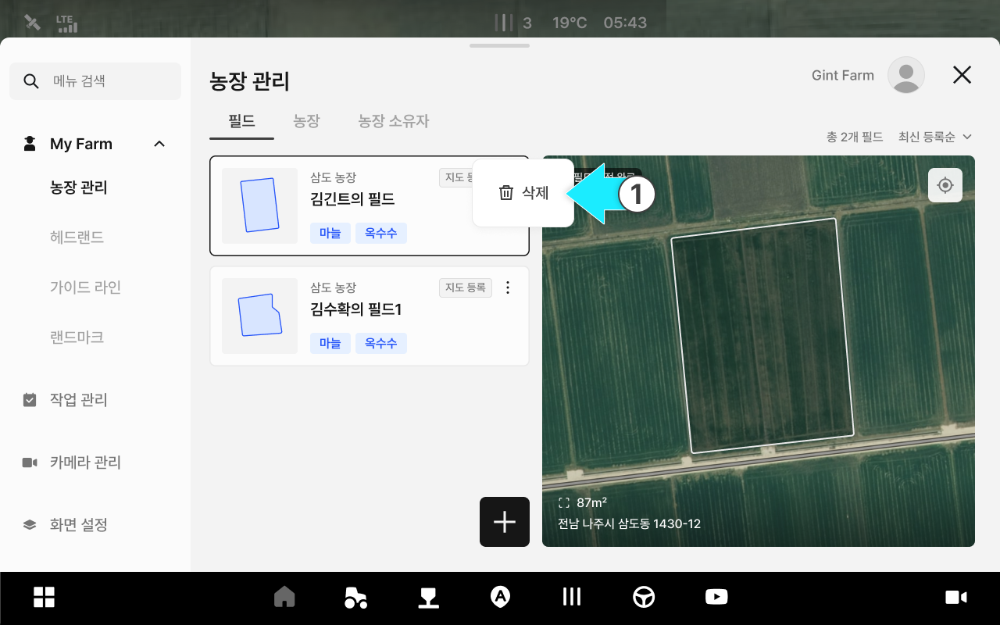
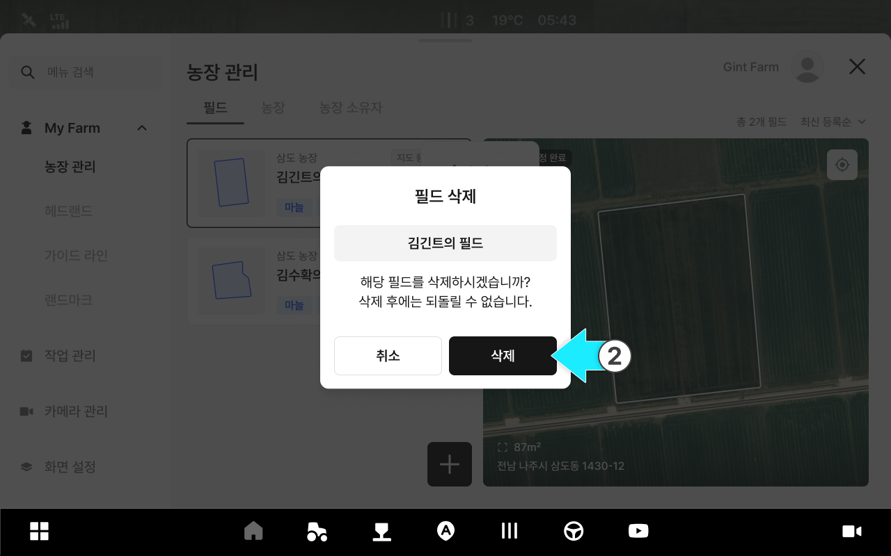
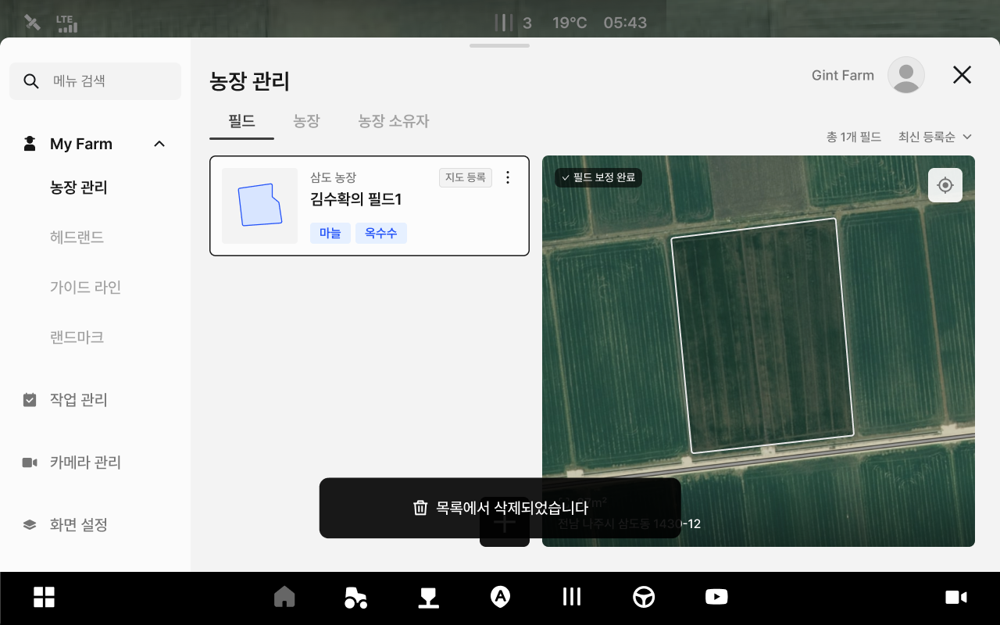

---
layout:
  width: default
  title:
    visible: true
  description:
    visible: false
  tableOfContents:
    visible: true
  outline:
    visible: true
  pagination:
    visible: true
  metadata:
    visible: true
  tags:
    visible: true
  actions:
    visible: true
---

# 필드 정보 관리

필드 이름, 농장 등의 정보를 수정하고 삭제할 수 있는 기능입니다.

***

#### 필드 정보 관리 기능 진입



 전체 메뉴 아이콘을 누릅니다.

<figure><figcaption></figcaption></figure>



원하는 필드 항목의  아이콘을 누릅니다.

<figure><figcaption></figcaption></figure>



팝업창에서 원하는 관리 기능을 선택합니다.

<figure><figcaption></figcaption></figure>



***

#### 필드 정보 수정 



\[수정] 옵션을 누릅니다.

<figure><figcaption></figcaption></figure>



원하는 정보의 수정을 마친 후 \[수정 완료]를 누릅니다.

<figure><figcaption></figcaption></figure>



수정이 완료됩니다.

<figure><figcaption></figcaption></figure>



***

#### **필드 수정 화면 설명** 

<figure><figcaption></figcaption></figure>

 **필드 이름**

* 설정된 필드 이름입니다.
* 클릭하면 이름변경이 가능합니다.

 **농장**

* 설정된 농장 이름입니다.
* 클릭하면 사전에 저장된 다른 농장으로 변경이 가능합니다.

 **농장 추가**

* \[추가]를 눌러 농장 이름을 추가합니다.

<figure><figcaption>
농장 이름과 메모를 작성한 뒤 [추가]를 눌러 농장을 추가할 수 있습니다.
</figcaption></figure>

 **농장 소유자**

* 설정된 농장 소유자 이름입니다.
* 클릭하면 사전에 저장된 다른 농장 소유자로 변경이 가능합니다.

 **농장 소유자 추가**

* \[추가]를 눌러 농장 소유자를 추가합니다.
* 농장 소유자와 메모를 작성한 뒤 \[추가]를 눌러 농장을 추가할 수 있습니다.

<figure><figcaption></figcaption></figure>

 **작물 이름**

* 설정된 작물 이름입니다.

 **작물 추가**

* <mark style="color:$danger;">**(작물 등록 모달 확인 후 등록해도 아무것도 반영이 되지 않음)**</mark>

 **작물 변경**

* 설정된 작물을 변경합니다.
* 작물과 작물 등록 연도, 파종/정식 시기, 수확 예정 시기를 변경합니다.

<figure><figcaption></figcaption></figure>

 **메모**

* 메모를 저장합니다.

***

#### 필드 정보 삭제



\[삭제]옵션을 누릅니다.

<figure><figcaption></figcaption></figure>



\[삭제]를 누릅니다.

<figure><figcaption></figcaption></figure>



삭제가 완료됩니다.

<figure><figcaption></figcaption></figure>


