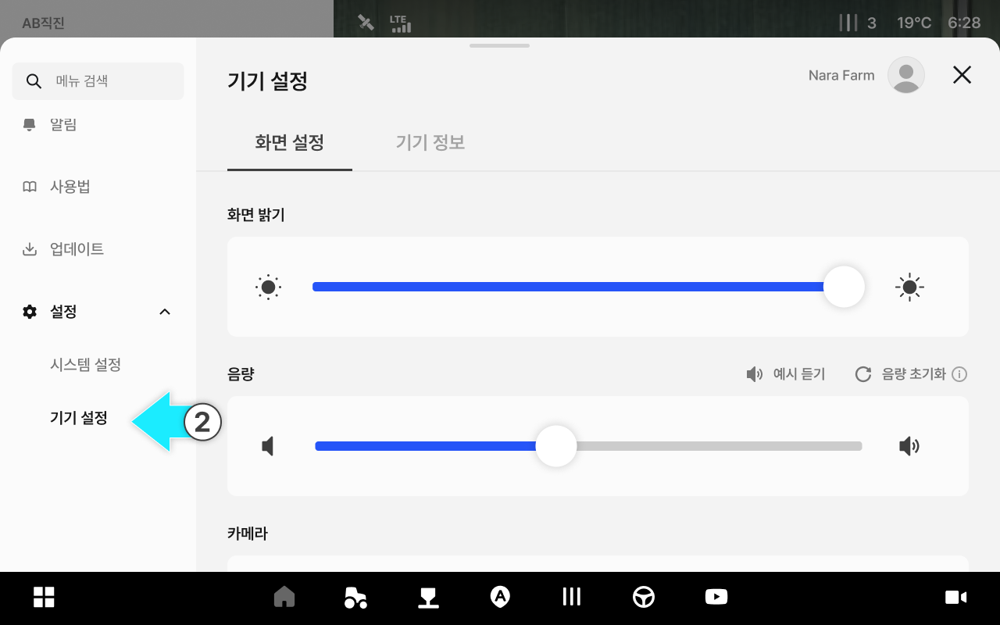
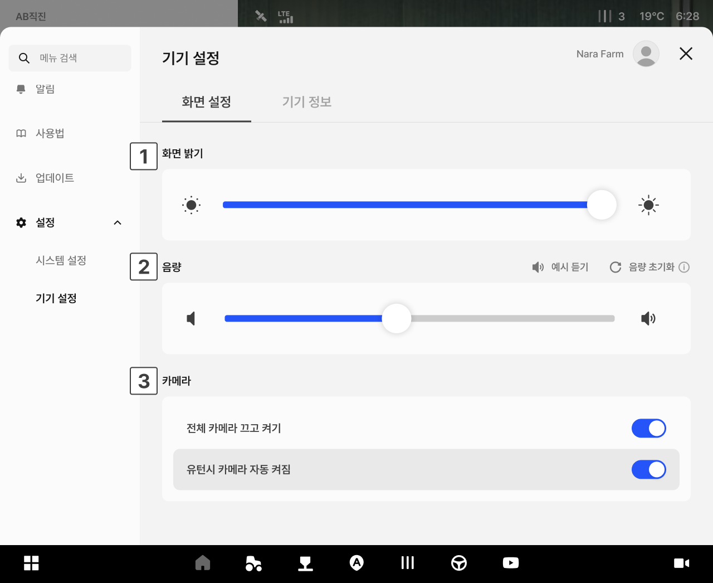

---
tags:
  - tag: kr
    primary: true
---

# 기기 설정

주행 화면의 밝기와 음량, 카메라 표시를 설정합니다.

***

### 진입 방법



앱 하단 내비게이션에서 설정 아이콘을 누릅니다.

<figure><figcaption></figcaption></figure>



왼쪽 메뉴에서 \[기기 설정]을 누르면 기기 설정 화면으로 들어갑니다.

<figure><figcaption></figcaption></figure>



***

### 화면 설정 화면

화면 밝기와 음량, 카메라 표시를 설정합니다.

<figure><figcaption></figcaption></figure>

 **화면 밝기**

* 슬라이더를 드래그하여 화면 밝기를 조절합니다.

 **음량**

* 슬라이더를 드래그하여 음량을 조절합니다.
  * **예시 듣기**: 설정한 음량을 미리 들어봅니다.
  * **음량 초기화**: 음량을 기본값으로 되돌립니다.

 **카메라**

* 주행 화면에 카메라 영상 표시 여부를 설정합니다.
  * **전체 카메라**: 카메라를 한 번에 켜거나 끕니다.
  * **유턴 시 자동 켜짐**: 유턴할 때 카메라가 자동으로 켜집니다.

***

### 기기 정보

기기의 기본 정보를 확인하고 저장된 작업 데이터를 초기화할 수 있습니다.

<figure><figcaption></figcaption></figure>

 기기 일련번호

* 기기의 일련번호가 표시됩니다.

 데이터 초기화

* 등록된 연결정보를 모두 해제하고 초기 설정 상태로 되돌립니다.
* 데이터 초기화 시 초기 화면으로 이동하여 퀵셋업을 처음부터 다시합니다.


주의: 데이터 초기화 시 모든 데이터가 영구 삭제되며 복구할 수 없습니다.


