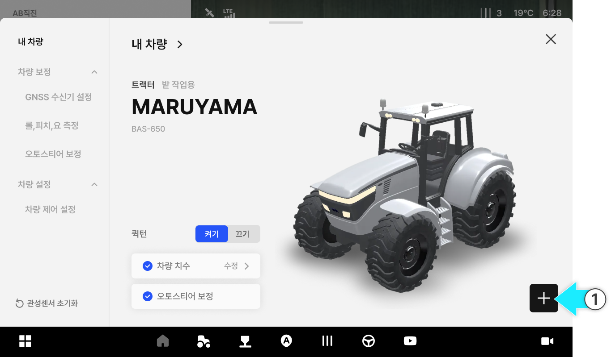
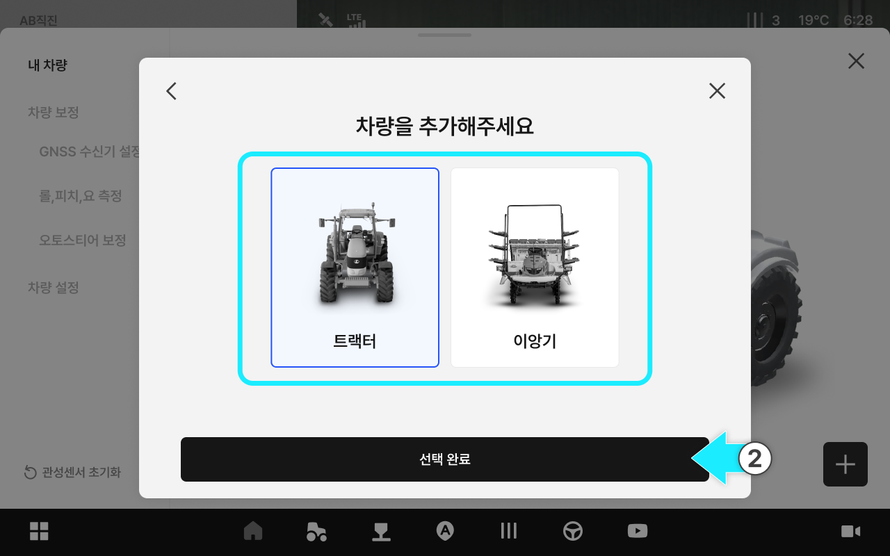
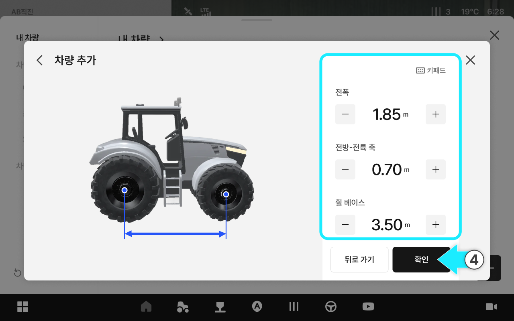
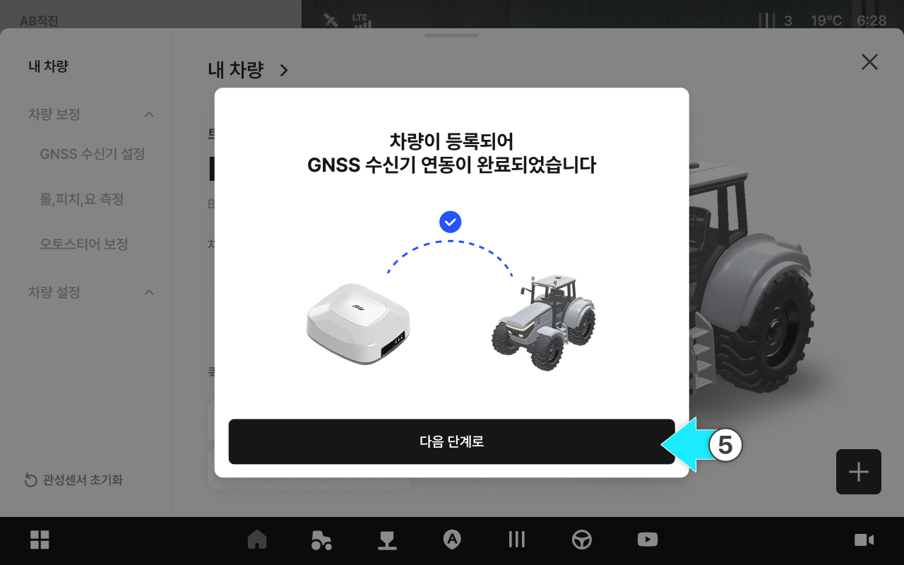
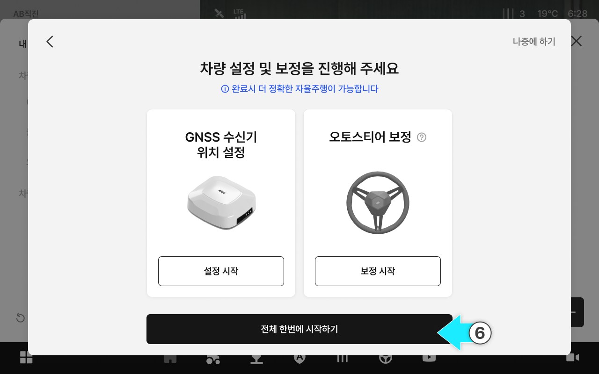
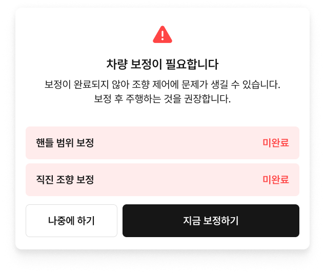
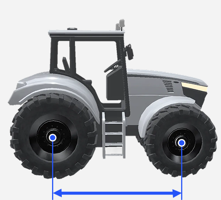
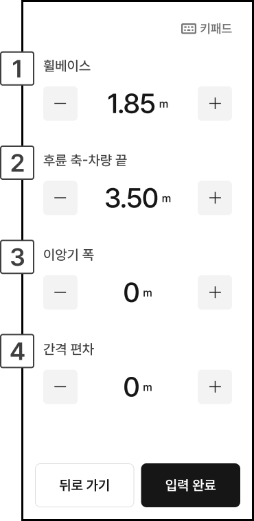
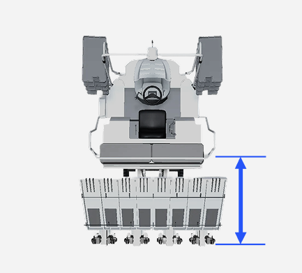
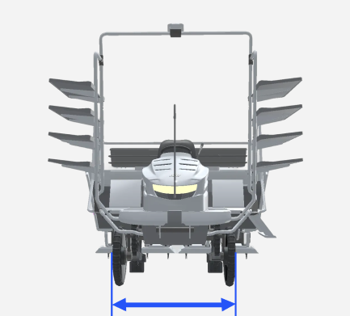

# 내 차량 추가

내 차량 화면에서 새 차량을 추가하고, 차량 정보와 치수를 입력한 뒤 보정까지 이어서 진행합니다.

***

#### 내 차량 추가하기



내 차량 화면에서 우측 하단의  버튼을 누릅니다.

<figure><figcaption></figcaption></figure>



차량 타입을 선택하고 \[선택 완료]를 누릅니다.

<figure><figcaption></figcaption></figure>



차량 정보를 입력후 차량 추가를 누릅니다.

<figure><figcaption></figcaption></figure>


**퀵턴 차량 토글**

* 퀵턴 차량은 퀵턴 특성에 맞춘 보정값이 필요하므로, \[퀵턴 차량] 토글을 반드시 켜고 진행해 주세요.
* 퀵턴은 트랙터에만 적용되는 옵션입니다. 이앙기에는 퀵턴 옵션이 없습니다.




**제조사/모델 직접 입력**

원하는 제조사 혹은 모델이 없을 시 직접 입력을 눌러 항목을 추가합니다.

입력한 제조사는 검토 후 정식 명칭으로 변경될 수 있습니다.





차량 치수를 입력한 뒤 \[확인]을 누릅니다.

<figure><figcaption></figcaption></figure>



차량이 추가되면 GNSS 수신기 연동이 완료됩니다. \[다음 단계로]를 누릅니다.

<figure><figcaption></figcaption></figure>



차량 보정을 진행하고 나면 차량 추가가 완료됩니다.

<figure><figcaption></figcaption></figure>


보정이 완료되지 않으면 자율주행이 제한될 수 있습니다. 보정을 마친 뒤 주행하는 것을 권장합니다.





***

#### 차량 치수 설정 항목


차량 치수 측정은 평평한 바닥에서 측정해야합니다.

경사지나 흙바닥에서 측정 시 정확하지 않을 수 있습니다.


#### 트랙터

<figure><figcaption></figcaption></figure>

 휠 베이스

* 트랙터의 앞바퀴 중심과 뒷바퀴 중심 간의 거리입니다.
* 

 후륜 축-히치

* 트랙터의 후륜 축 중심에서 히치까지의 수평 거리입니다.
* 

 지면-상부링크

* 지면에서부터 트랙터의 상부 링크까지의 수직 거리입니다.
* 

#### 이앙기

<figure><figcaption></figcaption></figure>

 휠베이스

* 이앙기의 앞바퀴 중심과 뒷바퀴 중심 간의 거리입니다.
* 

 후륜 축-차량 끝

* 이앙기의 후륜 축 중심에서 차량 끝까지의 수평 거리입니다.
* 

 이앙기 폭

* 이앙기의 폭을 의미하며 타이어 너비를 포함합니다.
* 

 간격 편차

* 양방향 작업 주행 시 간격이 일정하지 않을 때 보정하기 위한 수치값입니다. (간격 편차의 절대값을 4로 나눈 수치를 입력)
