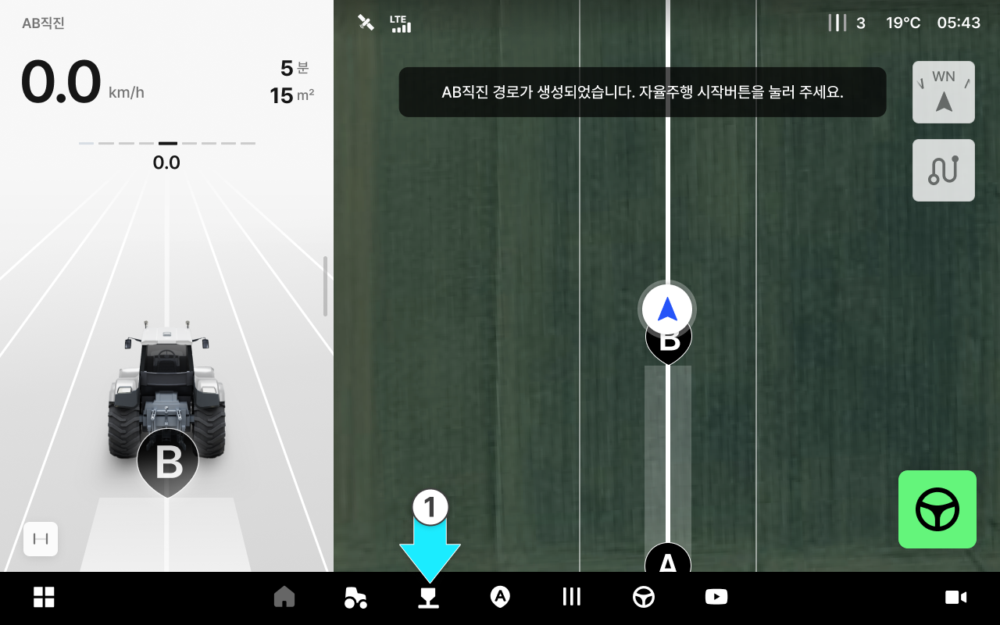
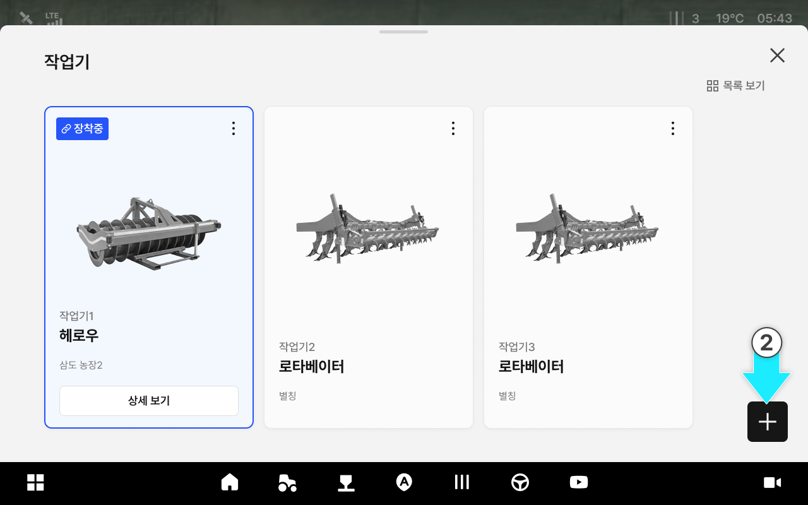
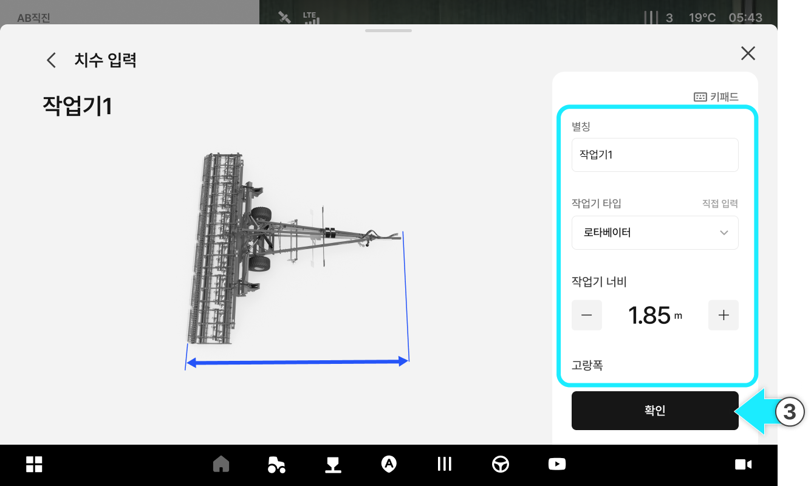
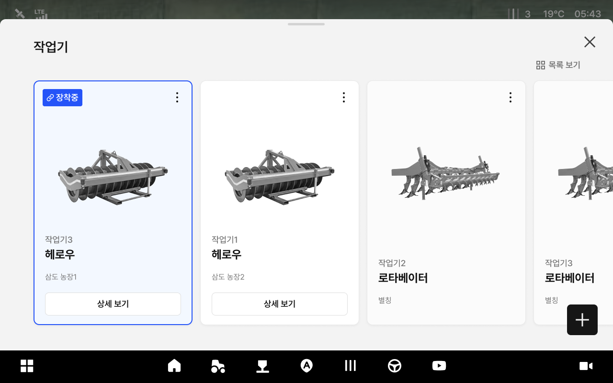
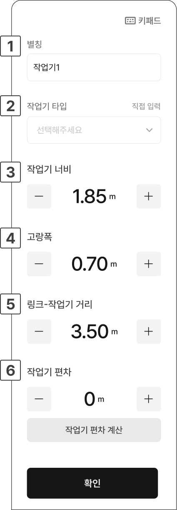
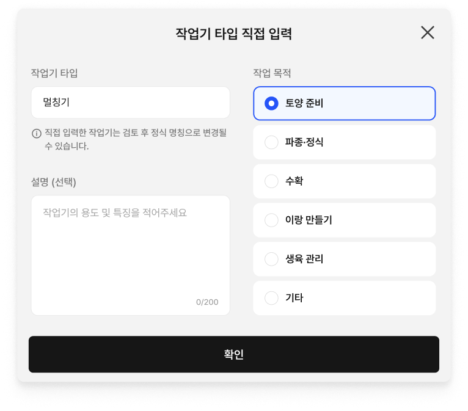
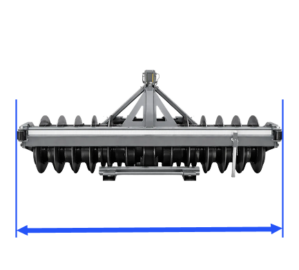
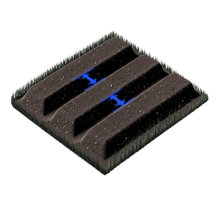
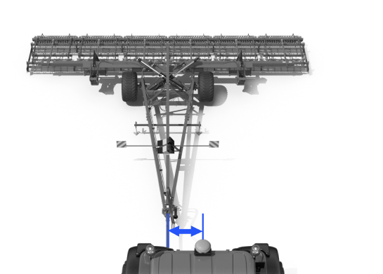

---
layout:
  width: default
  title:
    visible: true
  description:
    visible: false
  tableOfContents:
    visible: true
  outline:
    visible: true
  pagination:
    visible: true
  metadata:
    visible: true
  tags:
    visible: true
  actions:
    visible: true
---

# 작업기 추가

작업에 사용할 작업기를 등록하고, 작업기 편차 등 설정값을 함께 입력할 수 있습니다.

***

#### 작업기 추가 방법



 \[작업기] 버튼을 누릅니다.

<figure><figcaption></figcaption></figure>



 작업기 추가 버튼을 누릅니다.

<figure><figcaption></figcaption></figure>



작업기 타입, 너비 등의 세부 정보를 입력하고 확인을 누릅니다.

<figure><figcaption></figcaption></figure>



작업기 추가가 완료됩니다.

<figure><figcaption></figcaption></figure>



***

#### 작업기 추가 항목 설명

<figure><figcaption></figcaption></figure>

 **별칭**

* 작업기를 구분할 이름을 입력합니다. (예: 작업기1)

 **작업기 타입**

* 작업기 타입을 선택합니다.


**작업기 타입 직접 입력**

작업기 타입 목록에 원하는 작업기가 없으면 직접 입력할 수 있습니다. 직접 입력한 작업기 명칭은 검토를 거쳐 정식 명칭으로 변경될 수 있습니다.



 **작업기 너비**

* 작업기 너비를 입력합니다.
* 

 **고랑폭**

* 고랑폭을 입력합니다.
* 

 **링크-작업기 거리**

* 링크와 작업기 간의 거리를 입력합니다.
* 

 **작업기 편차**

* 작업기 편차를 입력합니다.

 **작업기 편차 계산**

* 3개의 라인을 주행하여 라인 간격을 입력하면 작업기 편차를 자동으로 계산할 수 있습니다.
*   그림에서 안내하는 방향으로 3개의 라인을 주행하고,
주행 라인 사이의 거리를 측정하여 입력하세요. 

    <figure><figcaption></figcaption></figure>

    * S1: 첫 번째 라인과 두 번째 사이의 거리

    * S2: 두 번째 라인과 세 번째 사이의 거리
    * 화면 상단의 토글을 통해 좌측 방향/우측 방향을 선택할 수 있습니다.\
      .png>)
