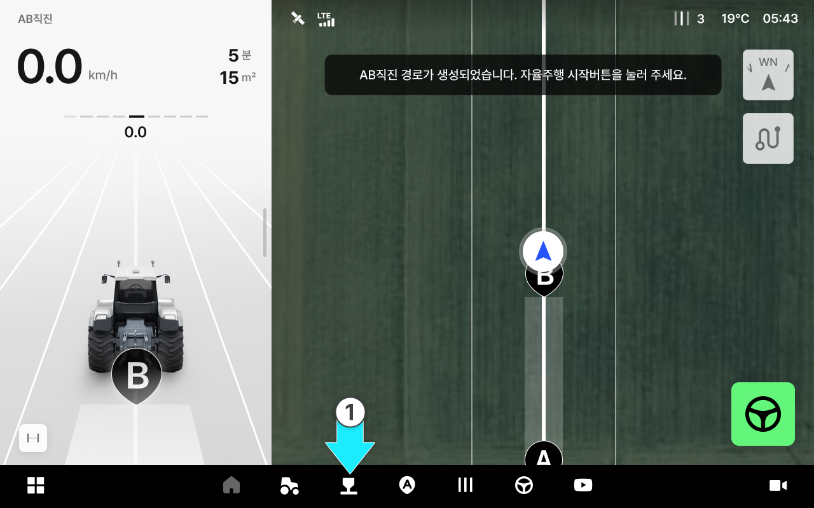
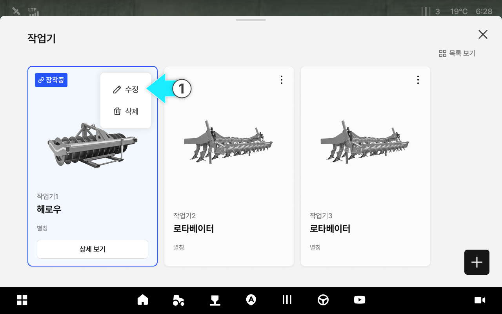
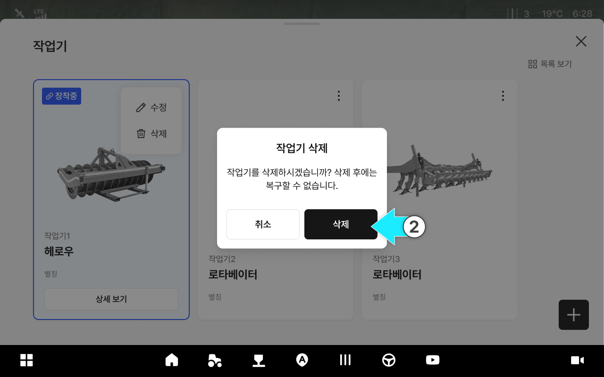
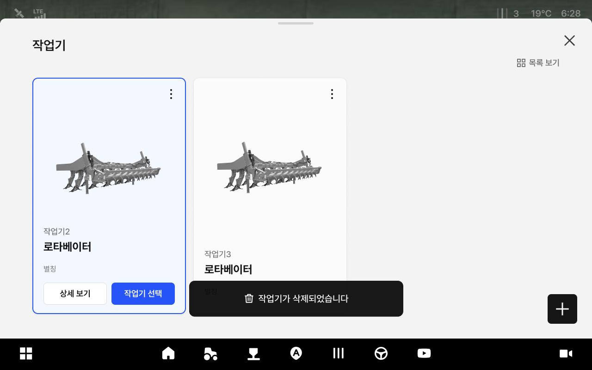

# 작업기 정보 관리

작업기 별칭, 타입 등의 정보를 수정하고 삭제할 수 있는 기능입니다.

***

#### 작업기 정보 관리 기능 진입



.svg>) \[작업기] 버튼을 누릅니다.

<figure><figcaption></figcaption></figure>



원하는 작업기 카드의 \[⋮] 아이콘을 누릅니다.

<figure><figcaption></figcaption></figure>



팝업에서 원하는 관리 기능을 선택합니다.

<figure><figcaption></figcaption></figure>



***

#### 작업기 정보 수정



\[수정]을 누릅니다.

<figure><figcaption></figcaption></figure>



별칭·작업기 타입·너비·고랑폭 등을 수정하고 \[확인]을 누릅니다.

<figure><figcaption></figcaption></figure>



수정이 완료됩니다.

<figure><figcaption></figcaption></figure>



***

#### 작업기 정보 삭제



\[삭제]를 누릅니다.

<figure><figcaption></figcaption></figure>



확인 창에서 \[삭제]를 누릅니다.

<figure><figcaption></figcaption></figure>



삭제가 완료됩니다.

<figure><figcaption></figcaption></figure>


주의: 삭제한 작업기는 복구할 수 없습니다.



