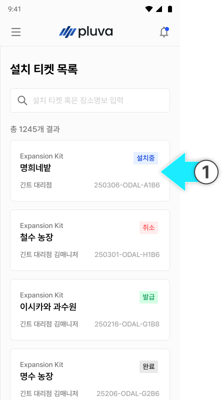
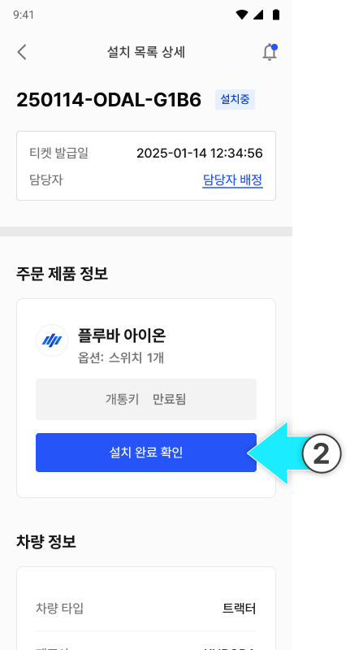
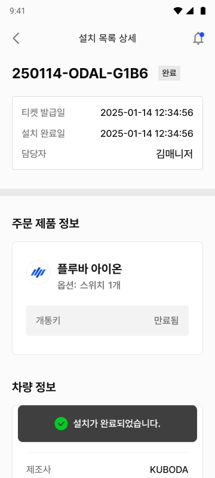
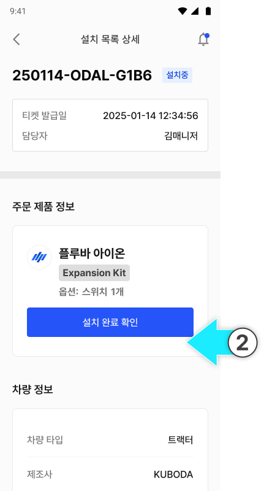
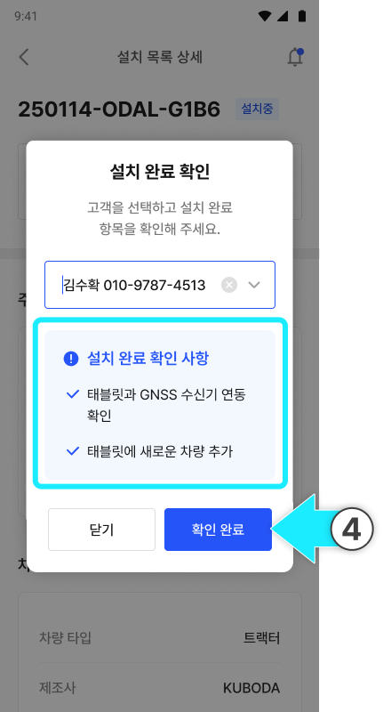
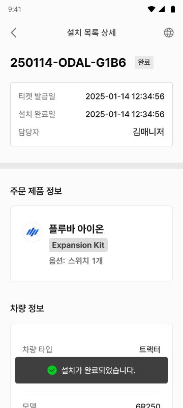

---
layout:
  width: default
  title:
    visible: true
  description:
    visible: false
  tableOfContents:
    visible: true
  outline:
    visible: true
  pagination:
    visible: true
  metadata:
    visible: true
  tags:
    visible: true
metaLinks:
  alternates:
    - >-
      https://app.gitbook.com/s/S9QxvkgOCtdmIoYhCUqg/order-installation/installation-completed
---

# 取り付け完了確認

取り付け及び簡単セットアップ作業における完了項目を確認し、取り付けチケットのステータスを「取り付け完了」に変更する作業です。


**全ての取り付け作業を完了してから、\[確認完了]をタップします。**

* 製品が正しく取り付けられました。
* 必要なソフトウェアの設定が全て完了しました。
* お客様がサービスをすぐにご利用できる状態です。


### Pluva iON（完成品）の場合



取り付けチケット一覧から、「取り付け中」のチケットをタップします。

<figure><figcaption></figcaption></figure>



\[取り付け完了確認]をタップします。

<figure><figcaption></figcaption></figure>



取り付け完了の確認事項をチェックし、\[確認完了]をタップします。

<figure><figcaption></figcaption></figure>



取り付けが完了されます。

<figure><figcaption></figcaption></figure>



***

### エクスパンションキットの場合



取り付けチケット一覧から、「取り付け中」のチケットをタップします。

<figure><figcaption></figcaption></figure>



\[取り付け完了確認]をタップします。

<figure><figcaption></figcaption></figure>



取り付けた製品のお客様のアカウントを選択します。

<figure><figcaption></figcaption></figure>


お客様名、または電話番号で検索するとお客様リストが表示されます。リストが表示されない場合は、キーワードが正しく入力されたかをご確認ください。





取り付け完了の確認事項をチェックし、\[確認完了]をタップします。

<figure><figcaption></figcaption></figure>



取り付けが完了されます。

<figure><figcaption></figcaption></figure>


