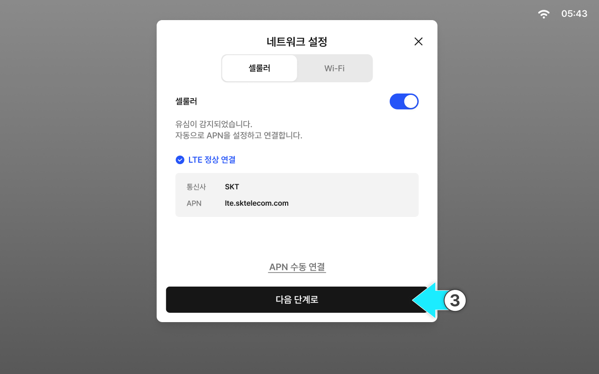
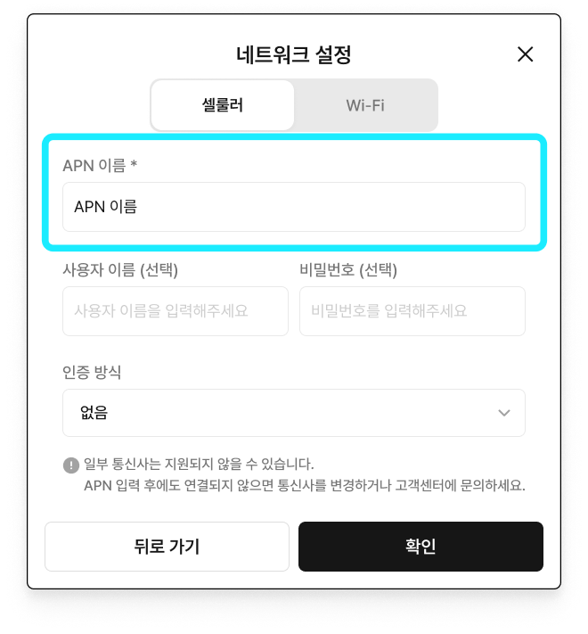
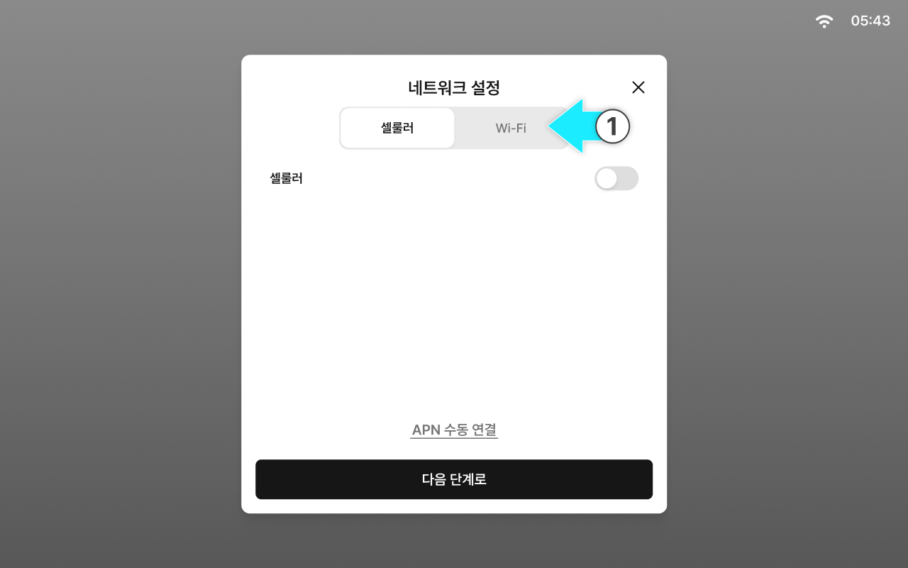

---
layout:
  width: default
  title:
    visible: true
  description:
    visible: false
  tableOfContents:
    visible: true
  outline:
    visible: true
  pagination:
    visible: true
  metadata:
    visible: true
  tags:
    visible: true
metaLinks:
  alternates:
    - >-
      https://app.gitbook.com/s/HCwHYcTtOkjeZoSlrD77/order-installation/quick-setup/network-settings
---

# 네트워크 설정

퀵셋업을 시작할 수 있도록 현재 네트워크를 설정합니다.

네트워크 연결이 되지않으면 퀵셋업을 진행할 수 없으니 반드시 설정해야합니다.

***

#### 네트워크 설정 항목

1. 셀룰러
2. Wi-Fi


퀵셋업 완료 후에도 태블릿의 네트워크 설정에서 네트워크 상태를 확인하고 설정을 변경할 수 있습니다.


***

#### 셀룰러 연결

셀룰러는 태블릿에 삽입된 유심(USIM)을 통해 이동통신망으로 인터넷에 연결하는 방식입니다.


셀룰러는 연결이 안정적이므로, 실시간 보정 신호가 필요한 정밀 작업에는 셀룰러 사용을 권장합니다.



요금제/데이터 사용량에 따라 비용이 발생할 수 있으니 작업 전 유심 개통 상태, 데이터 잔여량, 사용 가능 기간을 확인합니다.




셀룰러 토글을 켭니다.

<figure><figcaption></figcaption></figure>



APN이 자동으로 연결됩니다

<figure><figcaption></figcaption></figure>


셀룰러 설정은 USIM을 태블릿에 장착된 상태에만 설정이 가능합니다.



USIM 카드 삽입 후 통신 시작까지 수 분이 걸리는 경우가 있습니다. 접속이 확인될 때까지 전원을 끄지 말고 기다려 주십시오.




\[다음 단계로] 버튼을 누르면 네트워크 설정이 완료됩니다.

<figure><figcaption></figcaption></figure>



***

#### セルラー（LTE）へ接続不可時の対応フロー

セルラー（LTE）に接続できない場合には、下記のフローに従って確認してください。


状況

* セルラー（LTE）アイコンが表示されない場合
* セルラー（LTE）接続が頻繁に途切れる場合




**接続待機**

電源を入れてから最大**10分間**待機してください。ネットワーク登録及びAPN認証に時間がかかる場合があります。


10分経っても繋がらない場合は、**APNの手動接続**を行ってください。

APN名の入力：ご使用のSimカードの通信事業者に合ったAPN名を入力します。

* APN名の入力：ppsim.jp を入力します。

名前、パスワードなど任意の項目を入力した後、\[確認]をタップすると手動接続できます。


> **接続済み：** セルラー（LTE）アイコンの表示およびサーバー/RTKが正常接続した状態
>
> **接続失敗：** 信号なしの表示。ステップ2を進める。



**電源の再起動**

機器の電源を切ってから約10秒後に再び電源を入れます。再起動後、最大**5～10分間**待ちます。

> **接続済み：** セルラー（LET）接続アイコンの表示
>
> **接続失敗：** 信号なしの表示。ステップ3を進める。



**Simカードが正常認識されているかを確認し、再度差し込む**

1.  **Simカードの正常性確認**

    タブレットからSimカードを取り出し、スマートフォンに差し込んでからデータ通信（インターネット接続）できるかを確認します。


**接続失敗時：**&#x30B9;マートフォンでも接続できない場合は、通信事業者へお問い合わせするか、Simカードを交換してください。


2. **タブレットに再度差し込んでから確認する**\
   タブレットにSimカードを再度差し込み、電源を再起動してから最大**30分～1時間**待ちます。ネットワークへの再登録やIP割り当てに時間がかかる場合があります。

> **接続済み：** セルラー（LTE）へ接続済み
>
> **接続失敗：** 信号なし表示。ステップ4を進める。



**本社への取り合わせ**

1～3ステップまで全て進めたにもかかわらず接続できない場合は、以下の情報を確認のうえ、本社までお問い合わせください。

* Pluva iONのタブレット番号
* 接続できない状況が発生し始めた時間およびその内容
* 取り付け場所（地域）
* セルラー（LTE）アイコンのステータス（なし/弱い/繰り返し途切れる）
* 対応フロー（1～3ステップを進めたかどうか）



***

#### Wi-Fi 연결

Wi-Fi는 주변의 무선 공유기 또는 스마트폰 테더링에 연결해 인터넷을 사용하는 방식입니다.


환경에 따라 신호가 약하거나 범위를 벗어나면 연결이 끊길 수 있어, 제한된 작업 구간에서 사용을 권장합니다.



테더링 사용 시 스마트폰 배터리 소모와 데이터 사용량이 늘 수 있으니 작업 전 배터리 상태와 절전 설정을 확인합니다.




\[Wi-Fi] 탭을 누릅니다.

<figure><figcaption></figcaption></figure>



Wi-Fi 토글을 켭니다.

<figure><figcaption></figcaption></figure>



연결할 Wi-Fi를 선택합니다.

<figure><figcaption></figcaption></figure>



\[다음 단계로] 버튼을 누르면 네트워크 설정이 완료됩니다.

<figure><figcaption></figcaption></figure>


Wi-Fi 범위를 벗어나면 연결이 끊길 수 있습니다.



