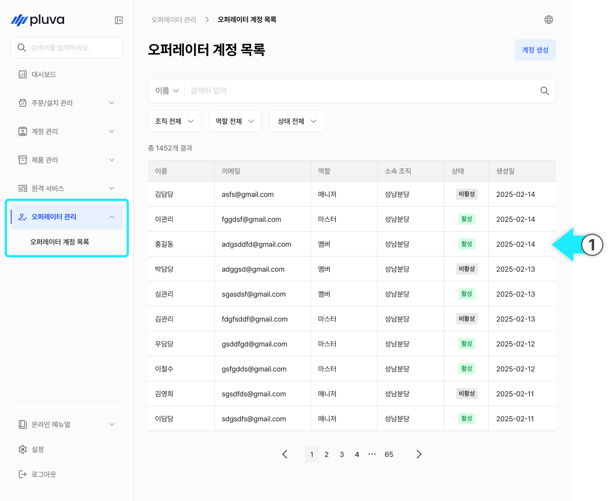
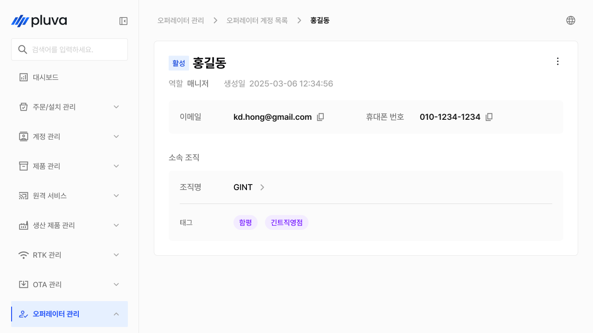
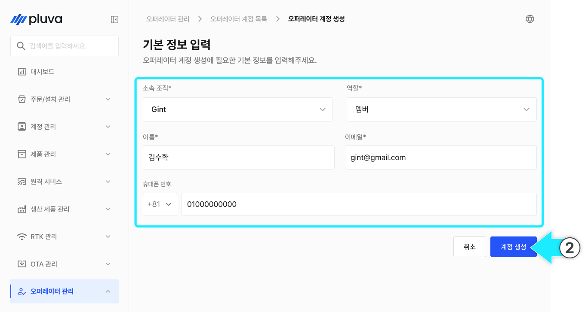
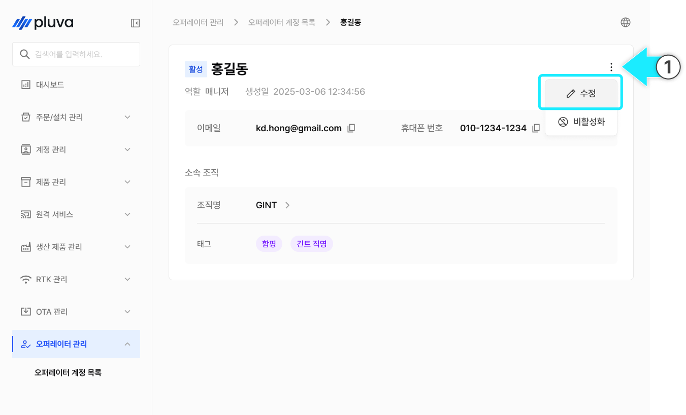
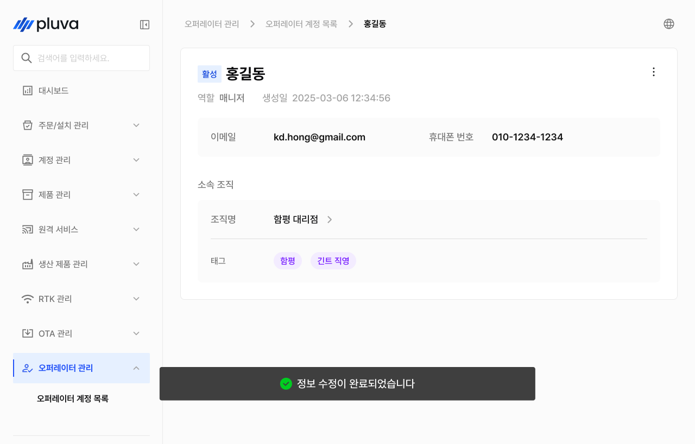
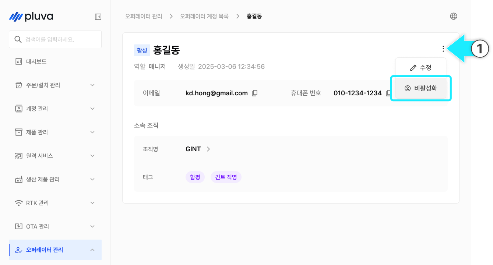
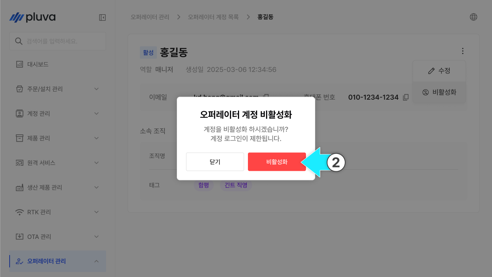
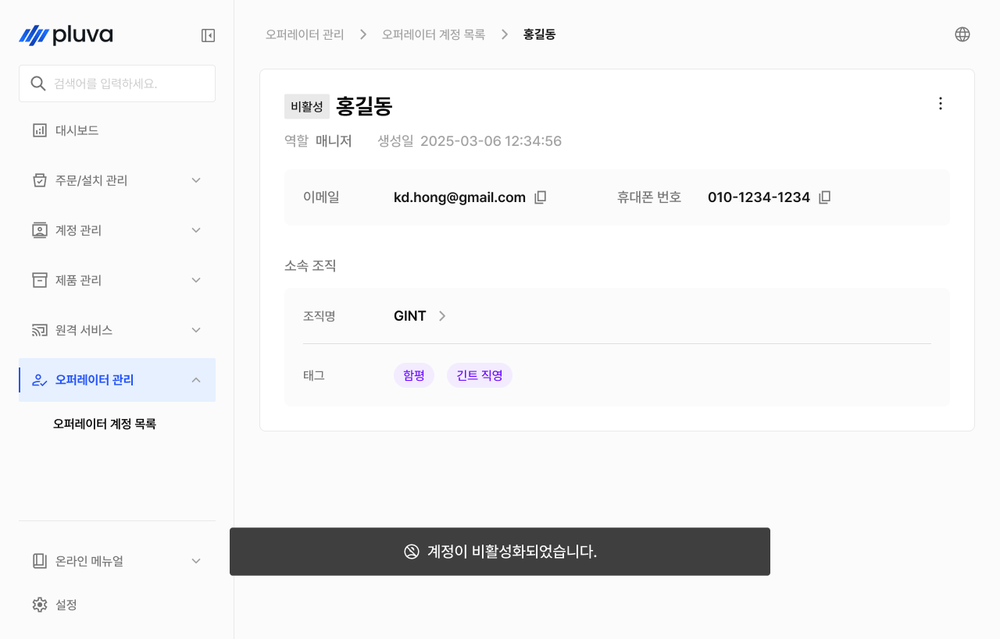
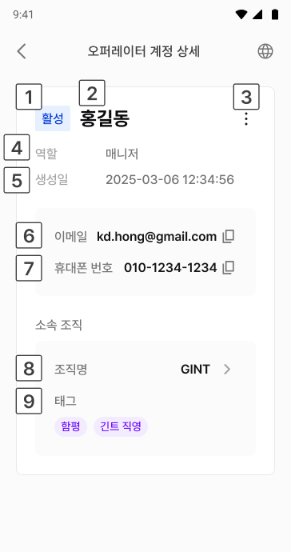

---
metaLinks:
  alternates:
    - https://app.gitbook.com/s/S9QxvkgOCtdmIoYhCUqg/others/operator-management
---

# 管理者アカウントの管理

管理者の管理は、アドミンにアクセスする運用担当者（管理者）のアカウントを作成・管理するメニューです。割り当てられた担当に基づき権限が区分されるほか、アカウントの有効化‐無効化によりアクセスを制御することができます。


このメニューは、パートナーアドミン以上の担当、またはGINTアカウントでのみアクセス可能です。


***

### アクセス方法



左側のメニューから「管理者の管理」を選択します。

<figure><figcaption></figcaption></figure>



下位メニューから管理者のアカウントリストを選択すると、アカウントリスト画面へ移動します。

<figure><figcaption></figcaption></figure>



***

### 管理者アカウントの作成



管理者リスト画面の右上の\[アカウントの作成]を選択します。

<figure><figcaption></figcaption></figure>



下記の項目を入力します。\*は必ず入力してください。

<figure><figcaption></figcaption></figure>


所属部署は、このアカウントの管理範囲を決めます。所属部署に応じて確認可能な製品・アカウント・履歴情報が異なります。



**担当ごとの権限に関するご案内**

* **メンバー**
  * パートナー会社に所属する一般社員向けの権限です。注文の作成及び照会、取り付けチケットの対応、お客様アカウントの確認など、現場のサービス業務を担当します。
* **パートナーアドミン**
  * パートナー会社内でアカウントと部署を管理する、管理者向けの権限です。所属部署の管理者アカウントの作成及び無効化、担当変更などの全体的な組織運営を担当します。
* **一般マネージャー**
  * GINTに所属する運用担当者向けの権限です。お客様のアカウント検索、リモートサポート、OTAの配信状況など、実務的な運用を担当します。GINTのマスターアカウントでのみ付与できます。
* **アドミン**
  * GINTに所属する運用担当者向けの権限です。管理者のアカウント作成及び管理、OTAの配信作成、RTKアカウントの管理など、全体的なシステムを統括します。GINTのマスターアカウントでのみ付与できます。




全ての必須項目を入力すると、\[アカウントの作成]ボタンが有効になります。ボタンを押し、アカウントの作成を完了します。

<figure><figcaption></figcaption></figure>


**アカウントの作成時に、登録済みのメールアドレスに仮パスワードが送信されます。**\
メールが届かない場合は、迷惑メールフォルダーをご確認ください。




***

### 管理者情報の修正



管理者の詳細からをクリックし、\[修正]を選択します。

<figure><figcaption></figcaption></figure>



変更事項を記入し、\[修正完了]をクリックします。

<figure><figcaption></figcaption></figure>



修正完了しました。

<figure><figcaption></figcaption></figure>



***

### 管理者の無効化・有効化

アカウントの使用を一時的に中止し、または再度有効化できます。


管理者アカウントは削除されません。無効にすることでアクセスを遮断します。無効になったアカウントではログインができませんが、履歴はそのまま保存されます。




管理者の詳細からをクリックし、\[無効化]を選択します。

<figure><figcaption></figcaption></figure>



確認のポップアップから\[確認]を選択します。

<figure><figcaption></figcaption></figure>



無効になりました。

<figure><figcaption></figcaption></figure>




無効のアカウント状態では、無効化ではなく有効化のオプションのみが表示されます。該当する項目を選択すると、アカウントが有効になります。


<figure><figcaption></figcaption></figure>

***

### 管理者アカウントの詳細情報

アカウントリストからお客様を選択すると、そのアカウントの詳細情報画面へ移動します。

#### PC環境

<figure><figcaption></figcaption></figure>

 ステータス

 名前

 「詳細をみる」ボタン


ボタンを押すと、\[修正]、\[無効化]（または、\[有効化]）オプションを選択できます。


 担当

 作成日

 メールアドレス

 携帯電話番号

 部署名


部署名をクリックすると、その部署の詳細画面へ移動します。


 タグ

* 部署に関する情報が表示されます。

#### モバイル環境

<figure><figcaption></figcaption></figure>

 ステータス

 名前

 「詳細をみる」ボタン


ボタンを押すと、\[修正]、\[無効化]（または、\[有効化]）オプションを選択できます。


 担当

 作成日

 メールアドレス

 携帯電話番号

 部署名


部署名をクリックすると、その部署の詳細画面へ移動します。


 タグ

* 部署に関する情報が表示されます。
