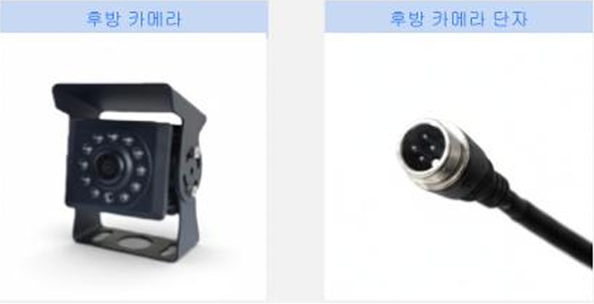
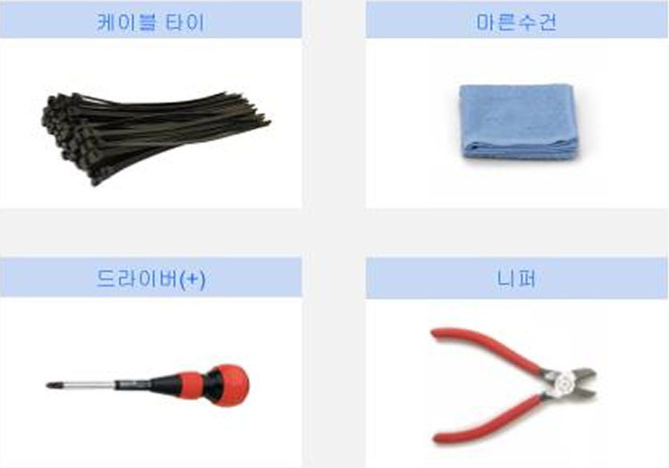
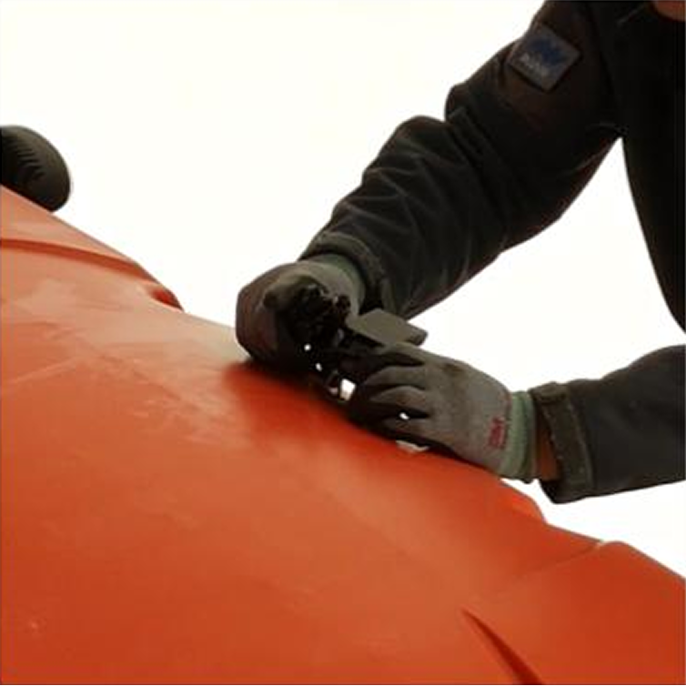
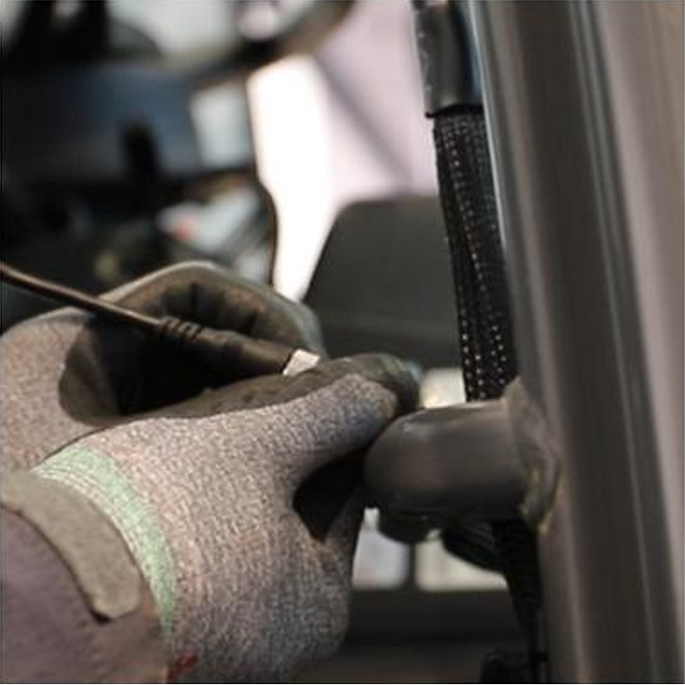

---
layout:
  width: default
  title:
    visible: true
  description:
    visible: false
  tableOfContents:
    visible: true
  outline:
    visible: true
  pagination:
    visible: true
  metadata:
    visible: true
  tags:
    visible: true
metaLinks:
  alternates:
    - >-
      https://app.gitbook.com/s/HCwHYcTtOkjeZoSlrD77/order-installation/product-installation/camera
---

# 카메라

플루바 아이온과 연동하여 후방 시야를 확보할 수 있는 카메라를 설치합니다.

***

### 필요 공구 및 준비물

#### 🔩 준비물

<figure><figcaption></figcaption></figure>

<table><thead><tr><th width="130.5">이름</th><th>규격</th><th>수량</th></tr></thead><tbody><tr><td>후방 카메라</td><td>-</td><td>1</td></tr></tbody></table>

#### 🛠️ 필요 공구

<figure><figcaption></figcaption></figure>

<table><thead><tr><th width="130.5">이름</th><th>규격</th><th>수량</th></tr></thead><tbody><tr><td>마른수건</td><td>-</td><td>1</td></tr><tr><td>케이블타이</td><td>6 X 150</td><td>10</td></tr><tr><td>드라이버(+)</td><td>4mm, 5mm</td><td>1</td></tr><tr><td>니퍼</td><td>200mm 8"</td><td>1</td></tr></tbody></table>

***

### 설치 방법


{% column width="83.33333333333334%" %}
#### 1. 후방 최적의 시야가 확보될 수 있는 위치에 카메라를 장착합니다.

<figure><figcaption></figcaption></figure>



{% column width="16.666666666666657%" %}





{% column width="83.33333333333334%" %}
#### **2.** 카메라 단자와 하네스 단자를 연결합니다.

<figure><figcaption></figcaption></figure>



{% column width="16.666666666666657%" %}




