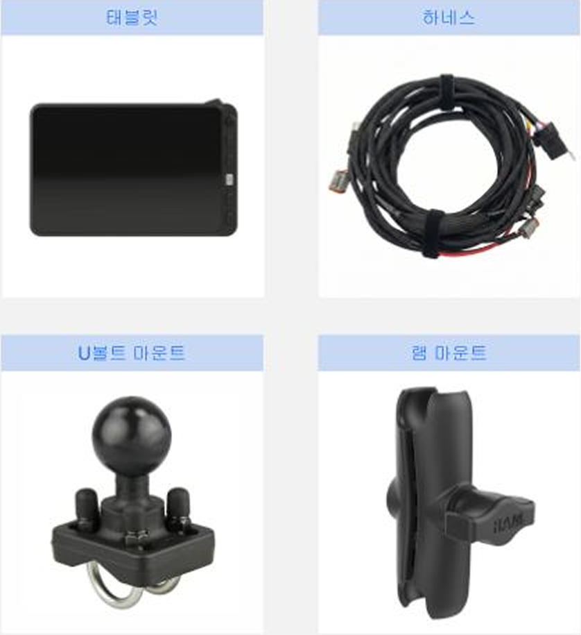
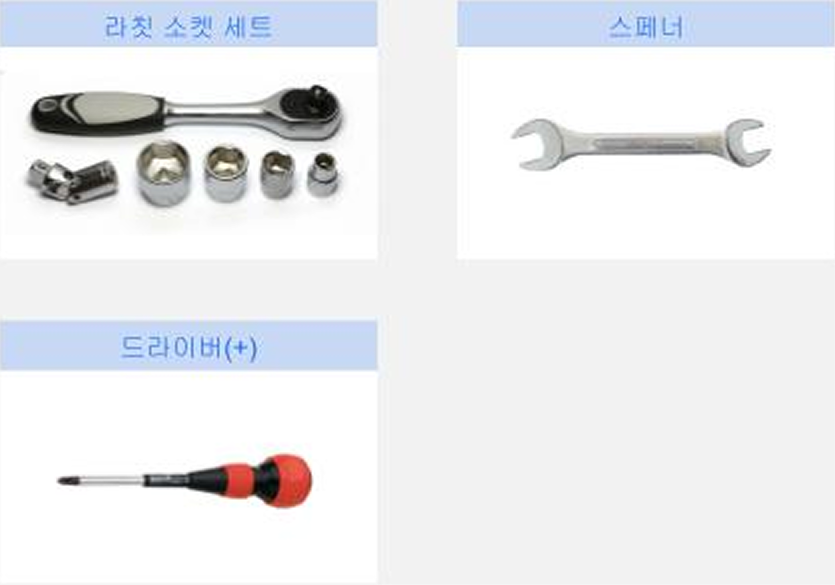
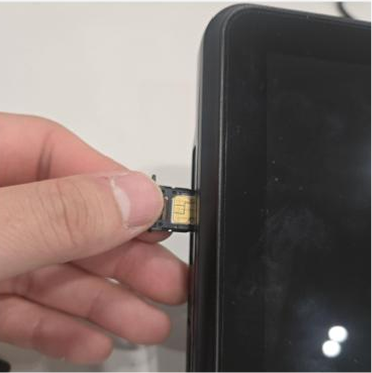
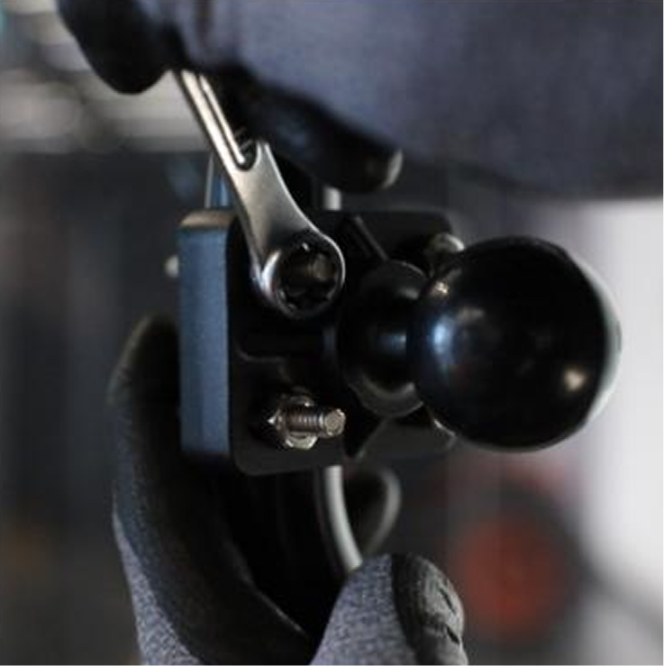
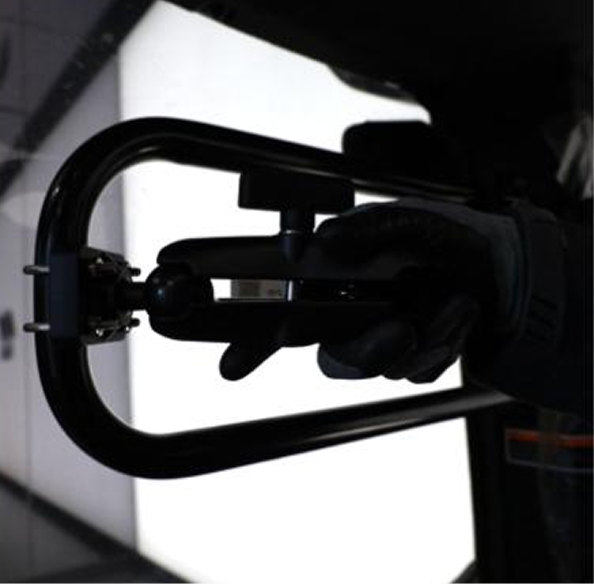

---
layout:
  width: default
  title:
    visible: true
  description:
    visible: false
  tableOfContents:
    visible: true
  outline:
    visible: true
  pagination:
    visible: true
  metadata:
    visible: true
  tags:
    visible: true
metaLinks:
  alternates:
    - >-
      https://app.gitbook.com/s/HCwHYcTtOkjeZoSlrD77/order-installation/product-installation/tablet
---

# 태블릿

플루바 아이온 자율주행에 필요한 태블릿를 설치합니다.

***

### 필요 공구 및 준비물

#### 🔩 준비물

<figure><figcaption></figcaption></figure>

<table><thead><tr><th width="161.1815185546875">이름</th><th>규격</th><th>수량</th></tr></thead><tbody><tr><td>태블릿</td><td>-</td><td>1</td></tr><tr><td>하네스</td><td>-</td><td>1</td></tr><tr><td>U볼트 마운트</td><td>-</td><td>1</td></tr><tr><td>램 마운트</td><td>-</td><td>1</td></tr></tbody></table>

#### 🛠️ 필요 공구

<figure><figcaption></figcaption></figure>

<table><thead><tr><th width="130.5">이름</th><th>규격</th><th>수량</th></tr></thead><tbody><tr><td>소켓 렌치</td><td>11mm</td><td>1</td></tr><tr><td>스패너</td><td>4mm, 5mm</td><td>1</td></tr><tr><td>드라이버(+)</td><td>4mm, 5mm</td><td>1</td></tr></tbody></table>

***

### 설치 방법


{% column width="83.33333333333334%" %}
#### 1. 태블릿 측면 SIM 포트 커버를 정밀 드라이버를 이용하여 제거 합니다.

<figure><figcaption></figcaption></figure>


{% column width="16.666666666666657%" %}





{% column width="83.33333333333334%" %}
#### 2. SIM 카드를 방향에 맞게 결합 후 포트 커버를 결합합니다.

<figure><figcaption></figcaption></figure>



{% column width="16.666666666666657%" %}





{% column width="83.33333333333334%" %}
#### 3. 태블릿 설치 위치를 확인합니다.

<figure><figcaption></figcaption></figure>



{% column width="16.666666666666657%" %}





{% column width="83.33333333333334%" %}
#### **4.** 동봉된 볼트(M5x10 / 4EA)를 이용하여 고정 볼을 결합합니다.&#x20;

<figure><figcaption></figcaption></figure>



{% column width="16.666666666666657%" %}





{% column width="83.33333333333334%" %}
#### **5.** 마운트볼에 태블릿을 결합합니다.

<figure><figcaption></figcaption></figure>



{% column width="16.666666666666657%" %}





{% column width="83.33333333333334%" %}
#### **6.** 사용하기 편하게 태블릿을 조정합니다.

<figure><figcaption></figcaption></figure>



{% column width="16.666666666666657%" %}



