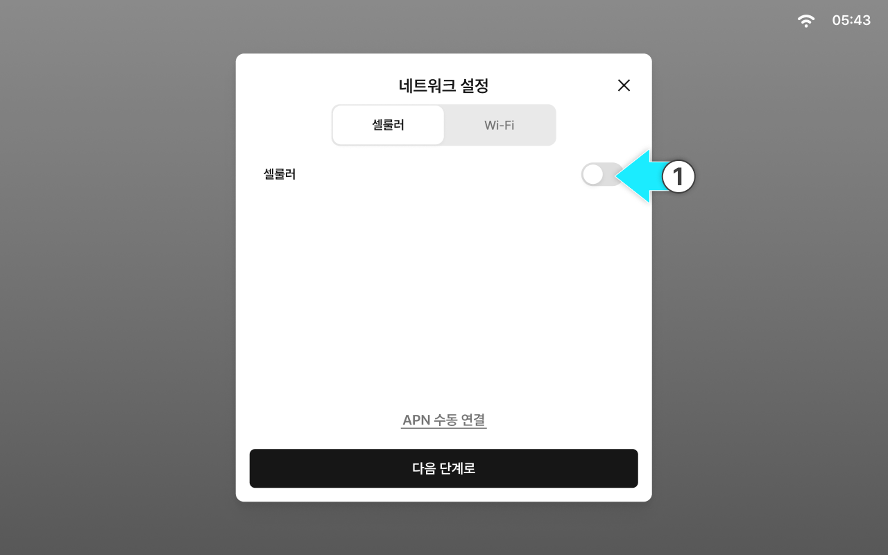
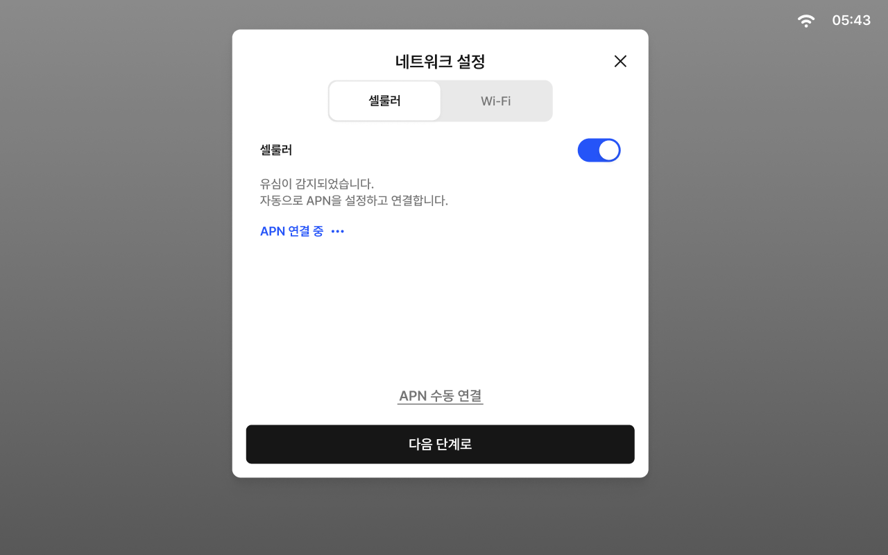
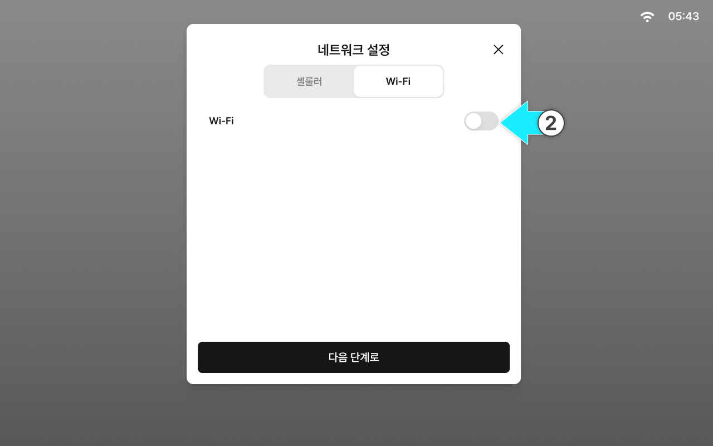
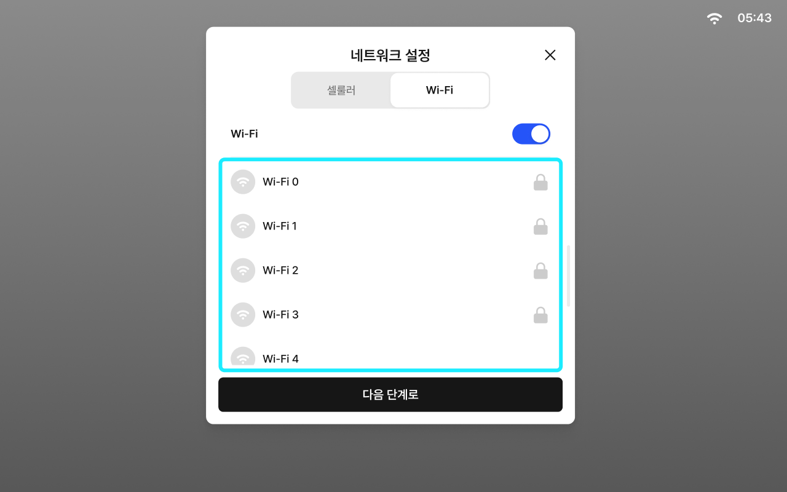
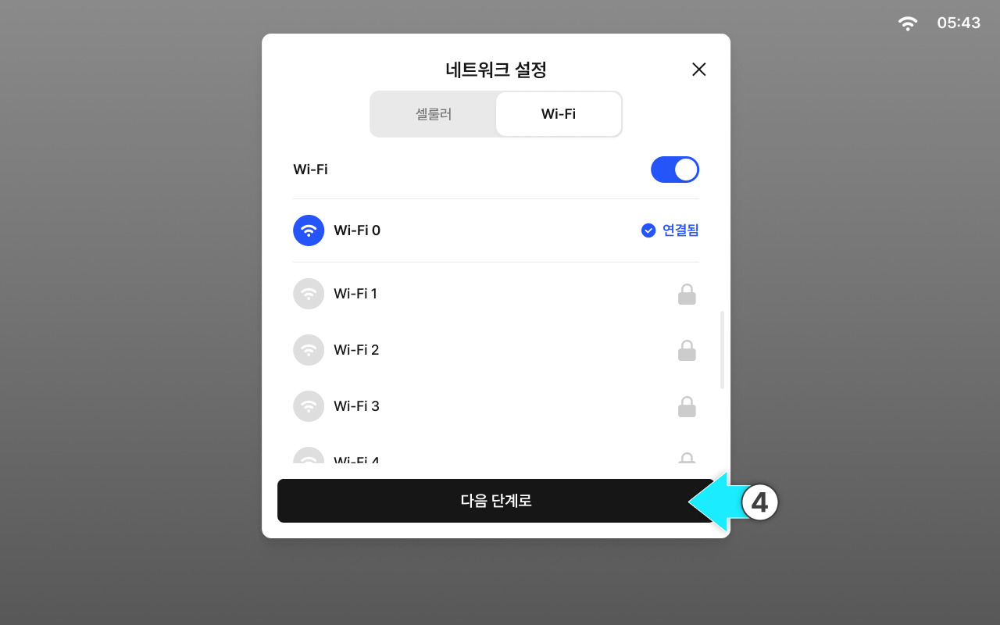

---
layout:
  width: default
  title:
    visible: true
  description:
    visible: false
  tableOfContents:
    visible: true
  outline:
    visible: true
  pagination:
    visible: true
  metadata:
    visible: true
  tags:
    visible: true
metaLinks:
  alternates:
    - >-
      https://app.gitbook.com/s/HCwHYcTtOkjeZoSlrD77/order-installation/quick-setup/network-settings
---

# 네트워크 설정

퀵셋업을 시작할 수 있도록 현재 네트워크를 설정합니다.

네트워크 연결이 되지않으면 퀵셋업을 진행할 수 없으니 반드시 설정해야합니다.

***

#### 네트워크 설정 항목

1. 셀룰러
2. Wi-Fi


퀵셋업 완료 후에도 태블릿의 네트워크 설정에서 네트워크 상태를 확인하고 설정을 변경할 수 있습니다.


***

#### 셀룰러 연결

셀룰러는 태블릿에 삽입된 유심(USIM)을 통해 이동통신망으로 인터넷에 연결하는 방식입니다.


셀룰러는 연결이 안정적이므로, 실시간 보정 신호가 필요한 정밀 작업에는 셀룰러 사용을 권장합니다.



요금제/데이터 사용량에 따라 비용이 발생할 수 있으니 작업 전 유심 개통 상태, 데이터 잔여량, 사용 가능 기간을 확인합니다.




셀룰러 토글을 켭니다.

<figure><figcaption></figcaption></figure>



APN이 자동으로 연결됩니다

<figure><figcaption></figcaption></figure>


셀룰러 설정은 USIM을 태블릿에 장착된 상태에만 설정이 가능합니다.



USIM 카드 삽입 후 통신 시작까지 수 분이 걸리는 경우가 있습니다. 접속이 확인될 때까지 전원을 끄지 말고 기다려 주십시오.




\[다음 단계로] 버튼을 누르면 네트워크 설정이 완료됩니다.

<figure><figcaption></figcaption></figure>



***

#### LTE 연결 불가 시 단계별 대응

LTE 연결이 되지 않을 경우 아래 절차에 따라 순서대로 점검합니다.


**증상**

* LTE 아이콘이 표시되지 않음
* LTE 연결이 반복적으로 끊김




**초기 연결 대기 및 APN 확인**

전원 ON 후 최대 **10분**까지 대기합니다.

LTE 망 등록 및 APN 인증에 시간이 소요될 수 있습니다.


정상 기준: LTE 아이콘 표시 및 서버/RTK 연결 정상 동작


10분 후에도 연결되지 않으면 **APN 수동 연결**을 진행합니다.

<figure><figcaption></figcaption></figure>

1. APN 이름 입력 — 사용 중인 유심 통신사에 따라 아래 APN 이름을 입력합니다.


유심 통신사에 따른 APN 이름

* KT: lte.ktfwing.com
* LG: internet.lguplus.co.kr


2. 이름, 비밀번호 등 선택 사항을 입력한 후 \[확인]을 누릅니다.



**전원 재부팅**

장비 전원을 OFF한 후 약 10초 뒤 다시 ON합니다. 재부팅 후 최대 **5~10분** 대기합니다.


정상 기준: LTE 연결 아이콘 표시




**USIM 정상 여부 확인 (핵심 단계)**

태블릿에서 USIM을 꺼내 휴대폰에 삽입한 후 데이터 통신(웹 접속) 가능 여부를 확인합니다.


* **정상 (휴대폰에서 LTE 사용 가능)**: USIM을 재장착 후 4단계 진행
* **비정상 (휴대폰에서도 안 됨)**: USIM 불량 또는 통신사 문제 → 통신사 문의 또는 USIM 교체 후 대응 종료




**USIM 재장착 후 재확인**

태블릿에 USIM을 재삽입하고 전원 재부팅 후 최대 **30분~1시간** 대기합니다.

네트워크 재등록 및 IP 할당에 시간이 소요될 수 있습니다.


정상 기준: LTE 연결 정상 표시




**본사 문의**

1~4단계를 모두 진행했음에도 연결되지 않을 경우 아래 정보를 확보하여 본사에 문의합니다.

* ION Tablet 번호
* 증상 발생 시점 및 증상 내용
* 현재 설치 위치 (지역)
* LTE 아이콘 상태 (없음 / 약함 / 반복 끊김)
* 수행한 조치 단계 (1~4단계 진행 여부)




**요약**: 전원 ON 후 10분 대기 → 재부팅 → USIM 휴대폰 테스트 → 1시간 대기 → 본사 문의

USIM을 휴대폰에 테스트하는 것이 가장 중요한 분기점입니다.


***

#### Wi-Fi 연결

Wi-Fi는 주변의 무선 공유기 또는 스마트폰 테더링에 연결해 인터넷을 사용하는 방식입니다.


환경에 따라 신호가 약하거나 범위를 벗어나면 연결이 끊길 수 있어, 제한된 작업 구간에서 사용을 권장합니다.



테더링 사용 시 스마트폰 배터리 소모와 데이터 사용량이 늘 수 있으니 작업 전 배터리 상태와 절전 설정을 확인합니다.




\[Wi-Fi] 탭을 누릅니다.

<figure><figcaption></figcaption></figure>



Wi-Fi 토글을 켭니다.

<figure><figcaption></figcaption></figure>



연결할 Wi-Fi를 선택합니다.

<figure><figcaption></figcaption></figure>



\[다음 단계로] 버튼을 누르면 네트워크 설정이 완료됩니다.

<figure><figcaption></figcaption></figure>


Wi-Fi 범위를 벗어나면 연결이 끊길 수 있습니다.




