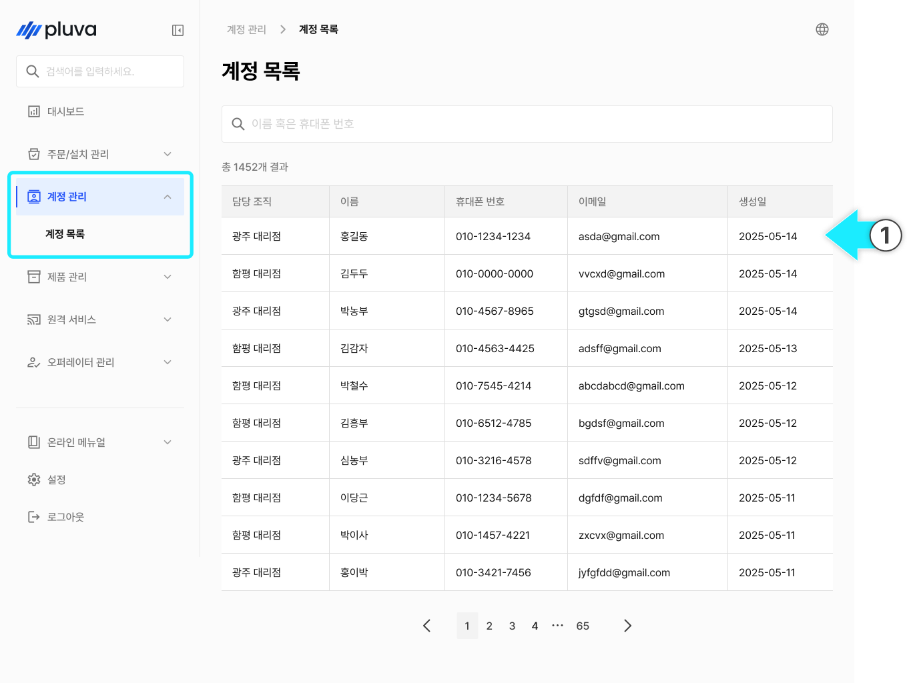
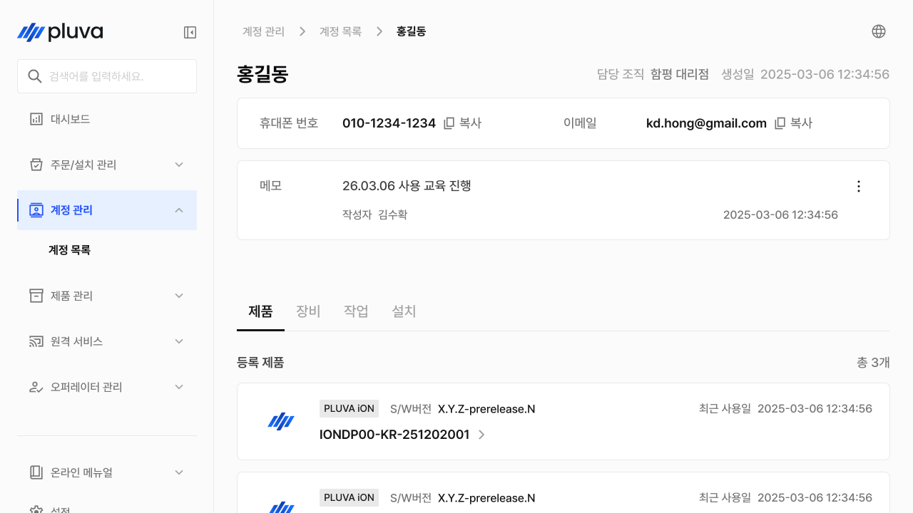
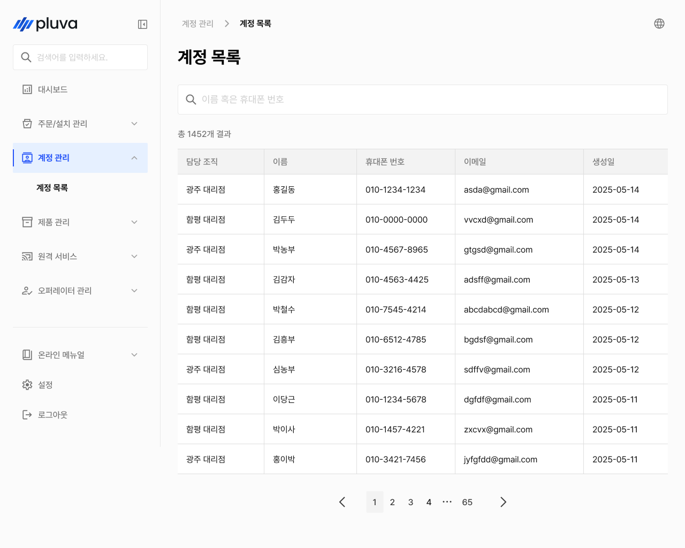
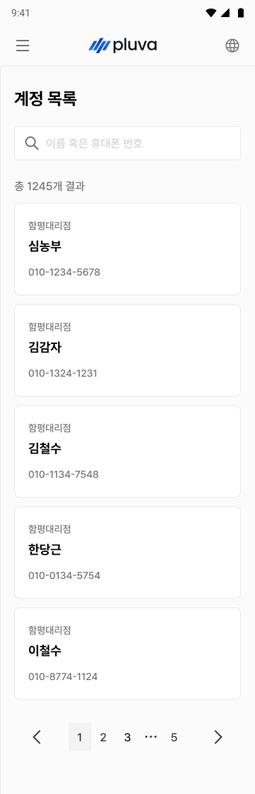

# 계정 관리

고객 계정의 기본 정보와 보유 제품·장비·설치 이력을 조회합니다.


계정 생성, 수정, 삭제는 이 화면에서 제공되지 않습니다. 고객 계정은 통합 회원가입 페이지를 통해 생성되며, 계정 정보 변경이 필요한 경우 고객에게 직접 통합 회원가입 페이지에서 수정하도록 안내해주세요.


***

### 진입 방법



좌측 메뉴에서 **계정 관리**를 선택합니다.

<figure><figcaption></figcaption></figure>



원하는 계정 항목을 선택하면 계정 상세 진입이 완료됩니다.

<figure><figcaption></figcaption></figure>



***

### 계정 상세 정보

계정 목록에서 고객을 선택하면 해당 계정의 상세 정보 화면으로 이동합니다.

#### PC 환경

<figure><figcaption></figcaption></figure>

&#x20; 계정 이름

&#x20; 소속 대리점 및 생성일

&#x20; 계정 정보

* 해당 계정에 등록된 휴대폰 번호와 이메일 주소가 표시됩니다.


**참고**: 휴대폰 번호와 이메일 주소 항목 옆의 복사 버튼을 누르면 클립보드에 바로 복사됩니다.


&#x20; 메모

* **⋮ 버튼**을 눌러 내용을 수정하거나 삭제할 수 있습니다.
* **작성자 이름**과 **작성 일시**가 함께 표시됩니다.

&#x20; 계정 상세 정보

* 계정 상세 화면 하단에서 **제품**, **장비**, **작업**, **설치** 탭을 선택하여 각 이력을 조회합니다. \
  목록 조회만 가능하며, 직접 추가·수정은 지원하지 않습니다.
  * 제품 탭: 고객이 보유한 제품 정보를 확인합니다.
    * **등록 제품**: 고객 명의로 등록된 제품 목록과 총 수량이 표시됩니다.
    * **구성품**: 등록된 구성품 목록과 총 수량이 표시됩니다.
  * 장비 탭: 고객이 보유한 장비 정보를 확인합니다.
    * **차량**: 등록된 차량 목록과 총 수량이 표시됩니다.
    * **작업기**: 등록된 작업기 목록과 총 수량이 표시됩니다.
  * 작업 탭: 고객의 작업 관련 이력을 확인합니다.
    * **필드**: 등록된 필드 목록과 총 수량이 표시됩니다.
  * 설치 탭: 고객의 설치 이력을 확인합니다.
    * **설치 이력**: 완료된 설치 작업 목록과 총 건수가 표시됩니다.

#### 모바일 환경

<figure><figcaption></figcaption></figure>

&#x20; 계정 이름

&#x20; 소속 대리점 및 생성일

&#x20; 계정 정보

* 해당 계정에 등록된 휴대폰 번호와 이메일 주소가 표시됩니다.


**참고**: 휴대폰 번호와 이메일 주소 항목 옆의 복사 버튼을 누르면 클립보드에 바로 복사됩니다.


&#x20; 메모

* **⋮ 버튼**을 눌러 내용을 수정하거나 삭제할 수 있습니다.
* **작성자 이름**과 **작성 일시**가 함께 표시됩니다.

&#x20; 계정 상세 정보

* 계정 상세 화면 하단에서 **제품**, **장비**, **작업**, **설치** 탭을 선택하여 각 이력을 조회합니다.\
  목록 조회만 가능하며, 직접 추가·수정은 지원하지 않습니다.
  * 제품 탭: 고객이 보유한 제품 정보를 확인합니다.
    * **등록 제품**: 고객 명의로 등록된 제품 목록과 총 수량이 표시됩니다.
    * **구성품**: 등록된 구성품 목록과 총 수량이 표시됩니다.
  * 장비 탭: 고객이 보유한 장비 정보를 확인합니다.
    * **차량**: 등록된 차량 목록과 총 수량이 표시됩니다.
    * **작업기**: 등록된 작업기 목록과 총 수량이 표시됩니다.
  * 작업 탭: 고객의 작업 관련 이력을 확인합니다.
    * **필드**: 등록된 필드 목록과 총 수량이 표시됩니다.
  * 설치 탭: 고객의 설치 이력을 확인합니다.
    * **설치 이력**: 완료된 설치 작업 목록과 총 건수가 표시됩니다.
