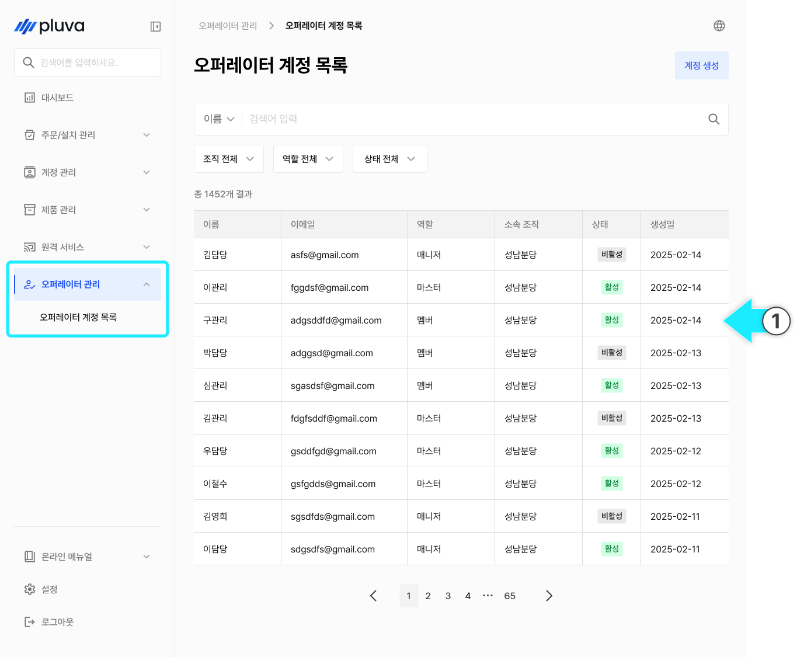
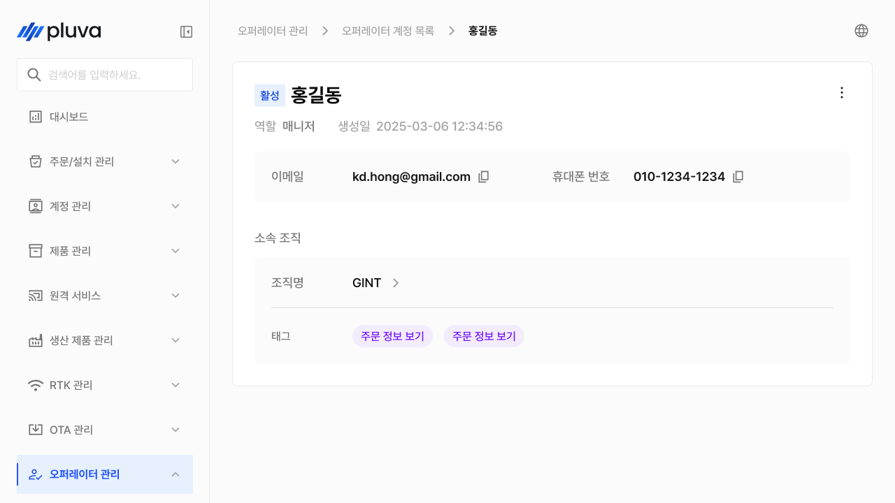
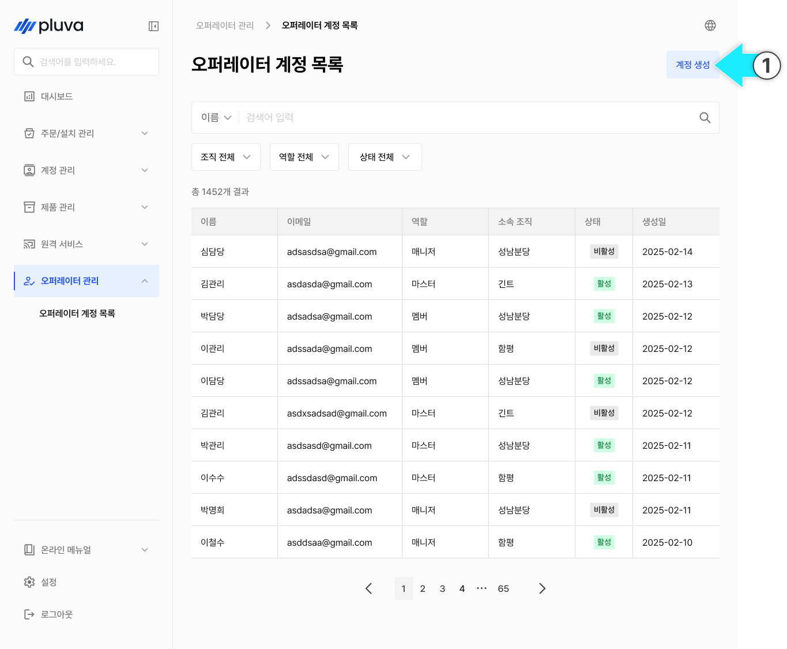
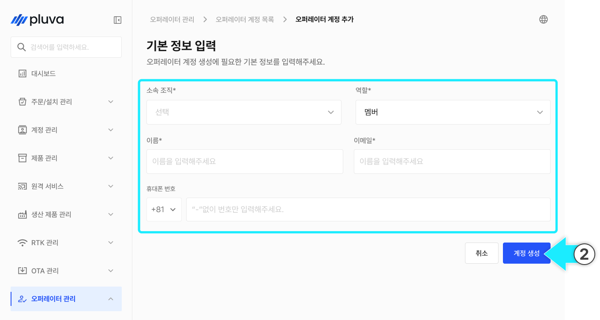
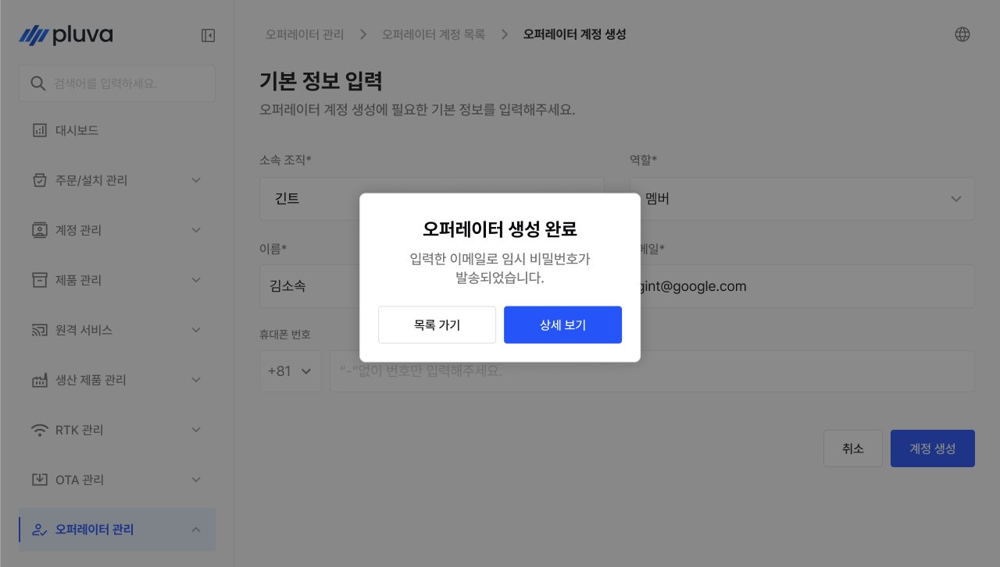
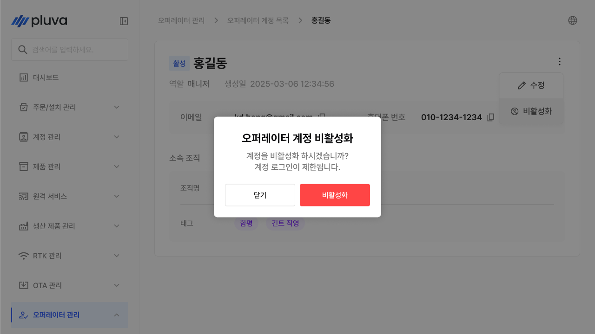
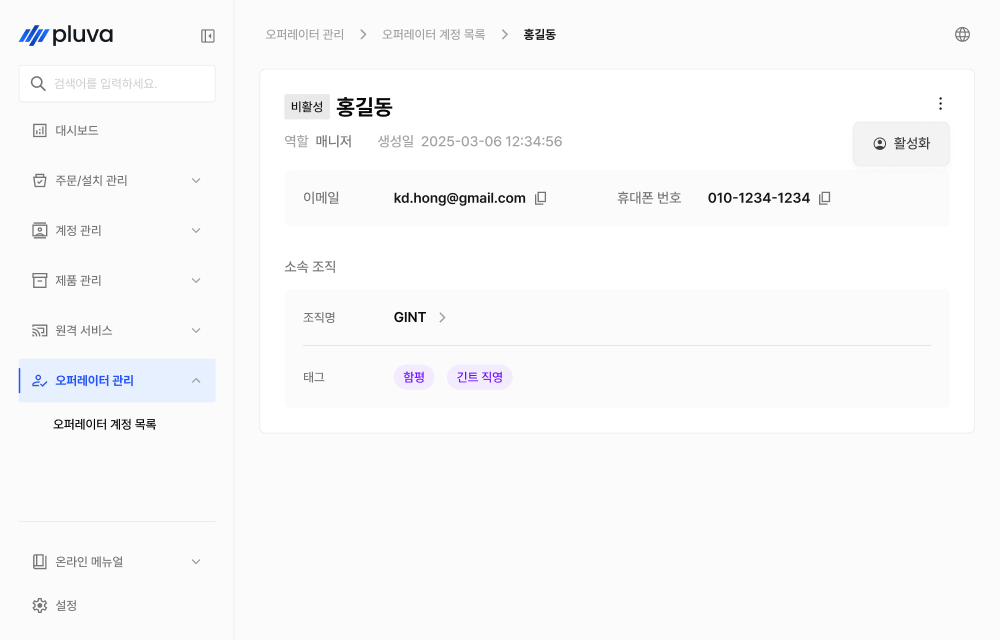
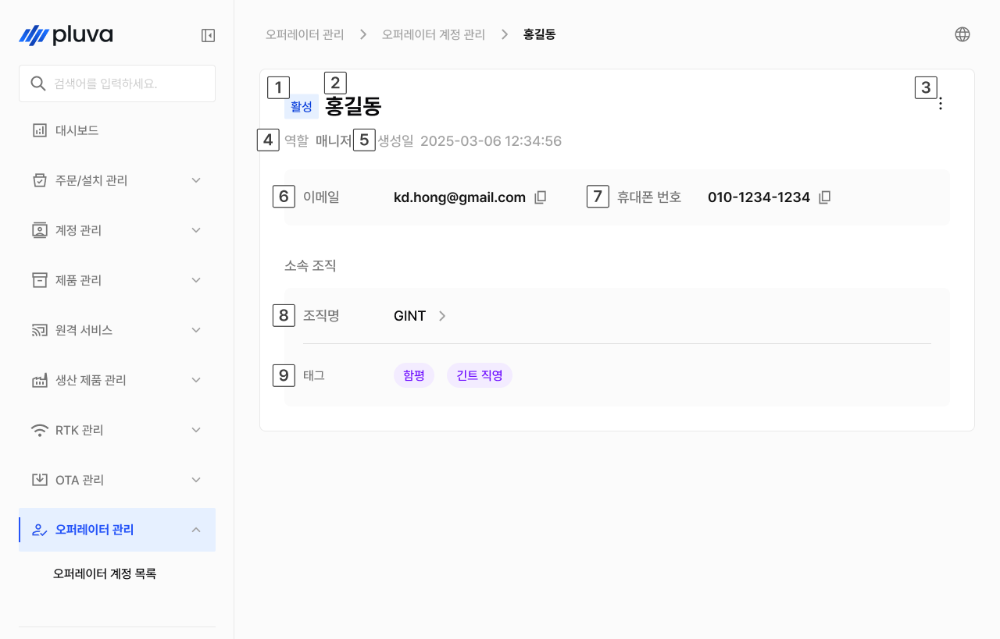

# 오퍼레이터 계정 관리

오퍼레이터 관리는 어드민에 접근하는 운영 실무자(오퍼레이터) 계정을 생성하고 관리하는 메뉴입니다. 역할에 따라 권한이 구분되며, 계정 활성화·비활성화를 통해 접근을 제어할 수 있습니다.


이 메뉴는 파트너 어드민 이상 역할 또는 긴트(Gint) 계정에서만 접근할 수 있습니다.


***

### 진입 방법



좌측 메뉴에서 오퍼레이터 관리를 선택합니다.

<figure><figcaption></figcaption></figure>



하위 메뉴에서 오퍼레이터 계정 목록을 선택하면 계정 목록 화면으로 이동합니다.

<figure><figcaption></figcaption></figure>



***

### 오퍼레이터 계정 생성



오퍼레이터 목록 화면 오른쪽 위의 \[계정 생성] 버튼을 누릅니다.

<figure><figcaption></figcaption></figure>



아래 항목을 입력합니다. \* 표시 항목은 반드시 입력해야 합니다.

<figure><figcaption></figcaption></figure>


소속 조직은 이 계정의 관리 범위를 결정합니다. 소속 조직에 따라 조회 가능한 제품·계정·이력 정보가 달라집니다.



**역할별 권한 안내**

* **멤버**
  * 파트너사에 소속된 일반 직원에게 부여됩니다. 주문 생성·조회, 설치 티켓 처리, 고객 계정 조회 등 현장 서비스 업무를 수행합니다.
* **파트너 어드민**
  * 파트너사 내 계정과 조직을 관리하는 담당자에게 부여됩니다. 소속 조직의 오퍼레이터 계정 생성·비활성화·역할 변경 등 조직 운영 전반을 담당합니다.
* **일반 매니저**
  * 긴트 소속 운영 실무자에게 부여됩니다. 고객 계정 조회, 원격 지원, OTA 배포 현황 확인 등 운영 실무를 담당합니다. 긴트 Master 계정에서만 부여할 수 있습니다.
* **어드민**
  * 긴트 소속 운영 관리자에게 부여됩니다. 오퍼레이터 계정 생성·관리, OTA 배포 생성, RTK 계정 관리 등 시스템 전반을 총괄합니다. 긴트 Master 계정에서만 부여할 수 있습니다.




모든 필수 항목을 입력하면 \[계정 생성] 버튼이 활성화됩니다. 버튼을 눌러 계정 생성을 완료합니다.

<figure><figcaption></figcaption></figure>


**계정 생성 시 임시 비밀번호가 입력한 이메일로 발송됩니다.**\
이메일이 수신되지 않는 경우, 스팸 메일함을 확인하세요.




***

### 오퍼레이터 정보 수정



오퍼레이션 상세에서 버튼을 누르고 \[수정]을 누릅니다.

<figure><figcaption></figcaption></figure>



변경할 부분을 변경하고 \[수정 완료]를 누릅니다.

<figure><figcaption></figcaption></figure>



수정이 완료됩니다.

<figure><figcaption></figcaption></figure>



***

### 오퍼레이터 비활성화 / 활성화

계정을 일시적으로 사용 중지하거나 다시 활성화할 수 있습니다.


오퍼레이터 계정은 삭제되지 않으며, 비활성화로 접근을 차단합니다. 비활성화된 계정은 로그인이 불가하며, 이력은 그대로 보존됩니다.




오퍼레이터 상세에서 버튼을 누르고 \[비활성화]를 누릅니다.

<figure><figcaption></figcaption></figure>



확인 팝업에서 \[확인] 버튼을 누릅니다.

<figure><figcaption></figcaption></figure>



비활성화가 완료됩니다.

<figure><figcaption></figcaption></figure>




비활성 상태 계정에선 비활성화 옵션대신 활성화 옵션만 표시됩니다. 해당 항목을 누르면 계정이 활성화됩니다.


<figure><figcaption></figcaption></figure>

***

### 오퍼레이터 계정 상세 정보

계정 목록에서 고객을 선택하면 해당 계정의 상세 정보 화면으로 이동합니다.

#### PC 환경

<figure><figcaption></figcaption></figure>

 상태

 이름

 더보기 버튼


버튼을 누르면 \[수정], \[비활성화] (또는 \[활성화]) 옵션을 선택할 수 있습니다.


 역할

 생성일

 이메일

 휴대폰 번호

 조직명


조직명을 클릭하면 해당 조직의 상세 화면으로 이동합니다.


 태그

* 조직에 대한 정보를 표시합니다.

#### 모바일 환경

<figure><figcaption></figcaption></figure>

 상태

 이름

 더보기 버튼


버튼을 누르면 \[수정], \[비활성화] (또는 \[활성화]) 옵션을 선택할 수 있습니다.


 역할

 생성일

 이메일

 휴대폰 번호

 조직명


조직명을 클릭하면 해당 조직의 상세 화면으로 이동합니다.


 태그

* 조직에 대한 정보를 표시합니다.
