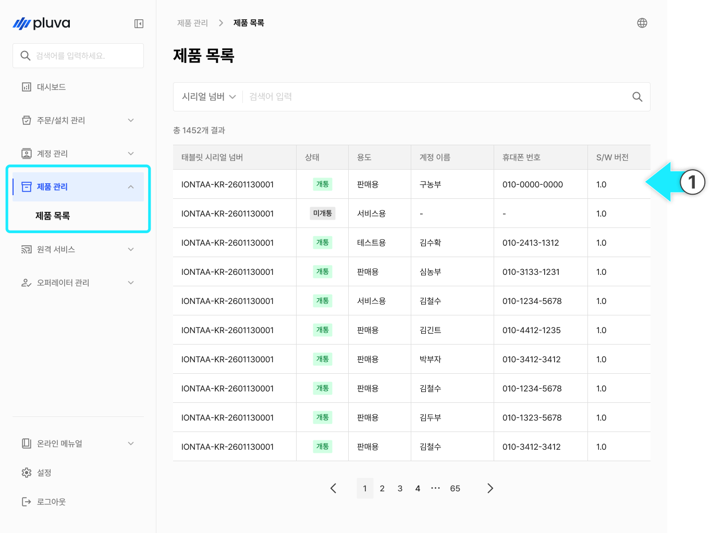
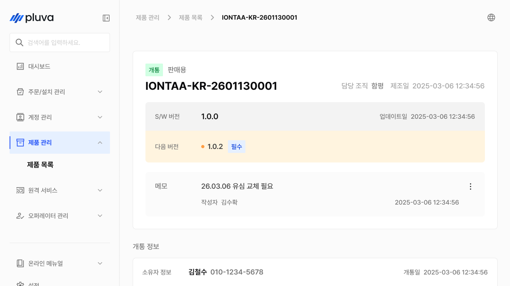
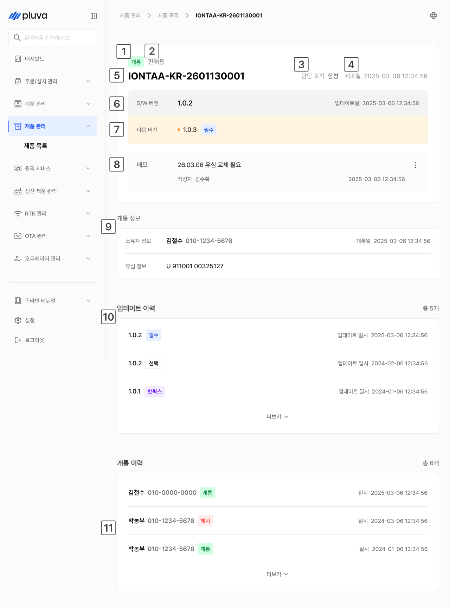
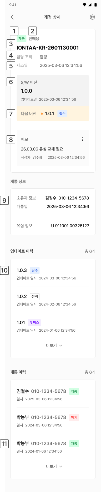

# 제품 관리

제품 관리는 우리 조직이 담당하는 제품을 한눈에 조회하는 메뉴입니다. 오퍼레이터의 소속 조직에 등록된 제품만 표시되며, 각 제품의 개통 상태·소프트웨어 버전·관련 이력을 확인할 수 있습니다.

***

### 진입 방법



사이드바에서 \[제품 관리]를 누르고 원하는 항목을 선택합니다.

<figure><figcaption></figcaption></figure>



제품 목록 상세 진입이 완료됩니다.

<figure><figcaption></figcaption></figure>



***

### 제품 상세 화면 설명

#### PC 환경

<figure><figcaption></figcaption></figure>

 **상태**

* 구분: 개통, 미개통


설치 티켓을 통해 해당 제품이 개통 처리됐는지 여부를 나타냅니다.

상태는 직접 변경할 수 없으며, 설치 티켓 완료 시 자동으로 반영됩니다.


 **용도**

* 구분: 판매용, 서비스용, 테스트용

 **담당 조직**

 **제조일**

 **태블릿 시리얼 번호**

 **현재 소프트웨어 버전**

* 제품에 설치된 버전

 **다음 소프트웨어 버전**

* 업데이트 예약된 버전 (업데이트 예약이 없는 경우 표시되지 않음)

 **메모**

* 마지막 작성자의 이름이 노출됩니다. 메모는 삭제, 수정할 수 있으며, 작성하지 않은 경우 작성 버튼이 표시됩니다.

 **개통 정보**

* 개통 소유자 정보, 개통일, 유심 정보가 노출됩니다.


개통일은 설치 티켓이 완료 처리된 날짜와 동일합니다.


 **업데이트 이력**

* 소프트웨어 업데이트가 진행된 일시와 버전 정보를 확인할 수 있습니다.

#### 모바일 환경

<figure><figcaption></figcaption></figure>

 **상태**

* 구분: 개통, 미개통


설치 티켓을 통해 해당 제품이 개통 처리됐는지 여부를 나타냅니다.

상태는 직접 변경할 수 없으며, 설치 티켓 완료 시 자동으로 반영됩니다.


 **용도**

* 구분: 판매용, 서비스용, 테스트용

 **태블릿 시리얼 번호**

 **담당 조직**

 **제조일**

 **현재 소프트웨어 버전**

 **다음 소프트웨어 버전**

* 현재 설치된 버전이 최신 버전이 아닐 경우, 업데이트될 다음 버전이 표시됩니다.

 **메모**

* 마지막 작성자의 이름이 노출됩니다. 메모는 삭제, 수정할 수 있으며, 작성하지 않은 경우 작성 버튼이 표시됩니다.

 **개통 정보**

* 개통 소유자 정보, 개통일, 유심 정보가 노출됩니다.


개통일은 설치 티켓이 완료 처리된 날짜와 동일합니다.


 **업데이트 이력**

* 소프트웨어 업데이트가 진행된 일시와 버전 정보를 확인할 수 있습니다.
