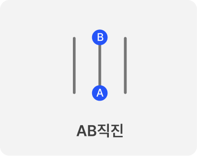
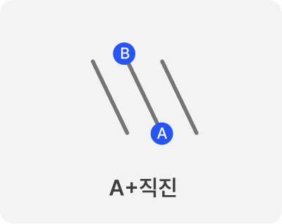
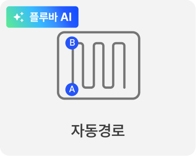
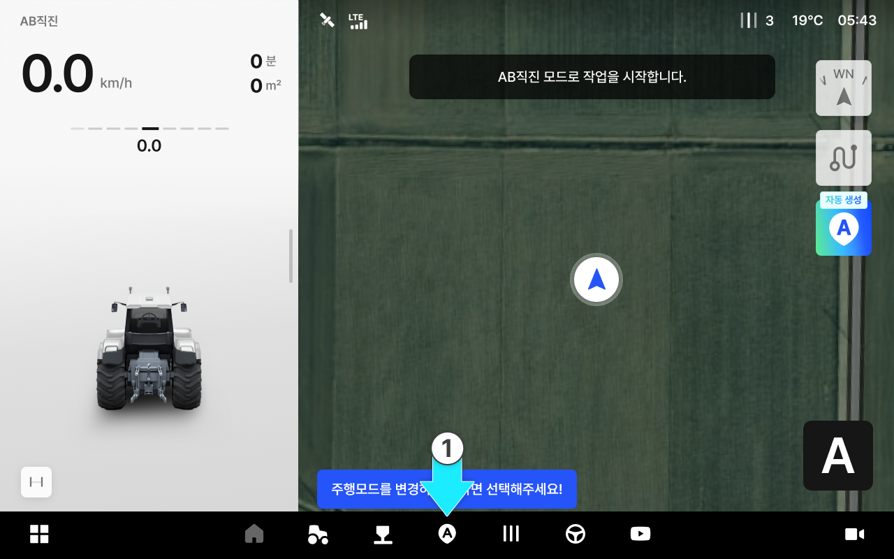
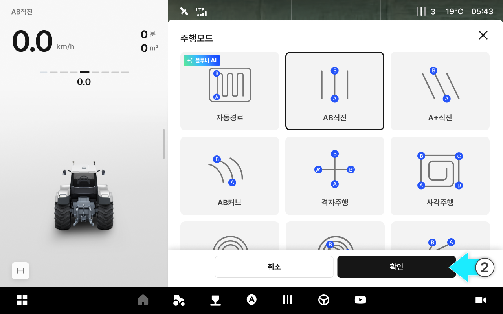
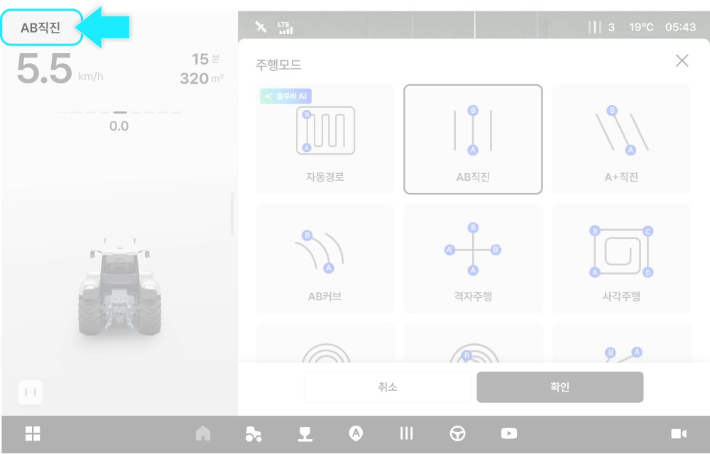
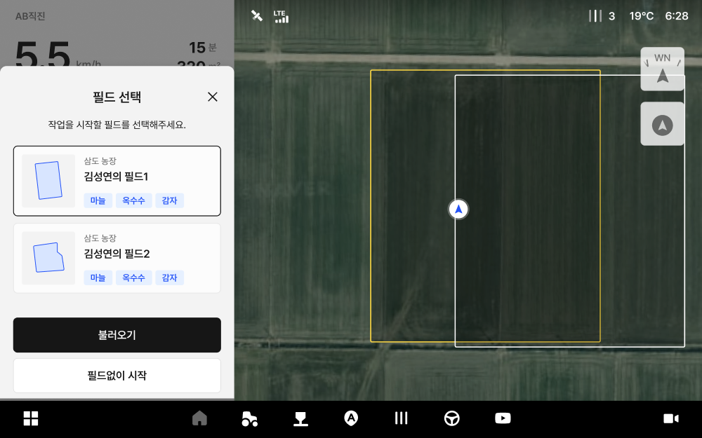

---
layout:
  width: default
  title:
    visible: true
  description:
    visible: false
  tableOfContents:
    visible: true
  outline:
    visible: true
  pagination:
    visible: true
  metadata:
    visible: true
  tags:
    visible: true
metaLinks:
  alternates:
    - >-
      https://app.gitbook.com/s/HCwHYcTtOkjeZoSlrD77/usage/driving/route-planning-settings
---

# 경로플래닝 설정 방법

작업·작물·목적에 맞는 다양한 경로 플래닝 모드를 선택할 수 있어,\
현장 조건에 맞는 경로로 작업을 진행하고 겹침·누락을 줄여 작업 효율과 완성도를 높입니다.

***

#### 경로 플래닝 모드 종류

AB 직진

* A점과 B점을 잇는 방향으로 직진 주행합니다.

<figure><figcaption></figcaption></figure>

A+직진

* A점을 기준으로 설정한 각도의 직선경로를 생성하여 주행합니다.

<figure><figcaption></figcaption></figure>

자동 경로 (pluva AI)

* 사용자의 필드/차량 조건을 바탕으로 최적의 작업 경로를 자동 생성하는 기능입니다.

<figure><figcaption></figcaption></figure>

***

#### 경로 플래닝 기능 진입



 **\[경로 플래닝]** 버튼을 누릅니다.

<figure><figcaption></figcaption></figure>



원하는 주행 모드를 선택한 후 **\[확인]**&#xC744; 누릅니다.

<figure><figcaption></figcaption></figure>




기본 주행 모드는 AB 직진입니다.
다른 주행 모드를 사용하려면 원하는 모드를 선택한 후 \[확인]을 누르세요.



현재 선택된 주행 모드는 화면 왼쪽 상단의 주행 정보 영역에서 확인할 수 있습니다.




배속턴 설정은 오른쪽 상단의 주행 정보 영역에서 확인할 수 있습니다. 해당 영역에서 배속턴 ON/OFF 상태를 확인합니다.

주행 모드에 진입하면 배속턴 설정 안내 팝업이 표시됩니다. \
안내에 따라 **배속턴을 ON으로 설정**한 뒤 **\[주행 시작]** 을 누르면 주행 모드 진입이 완료됩니다.




필드가 2개 이상 등록된 경우, 주행 모드 선택 전 필드 선택 화면이 먼저 표시됩니다.&#x20;


