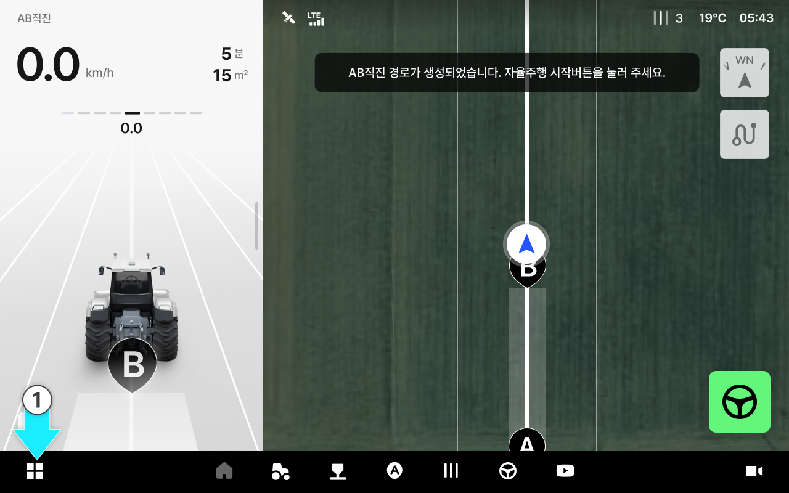
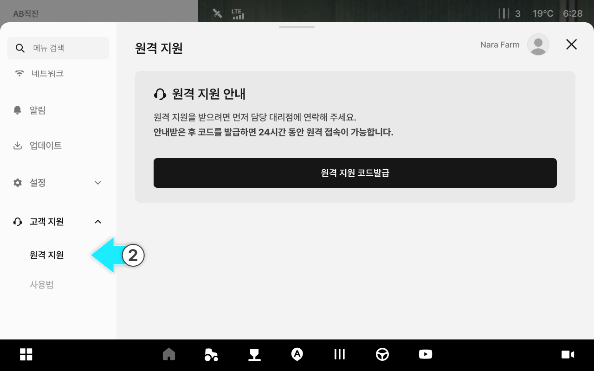
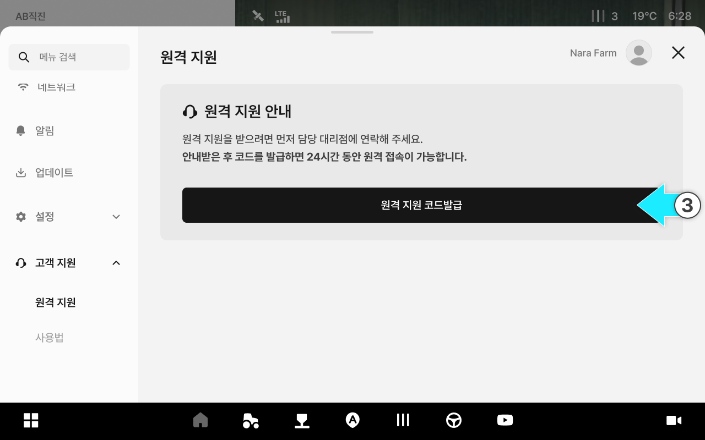
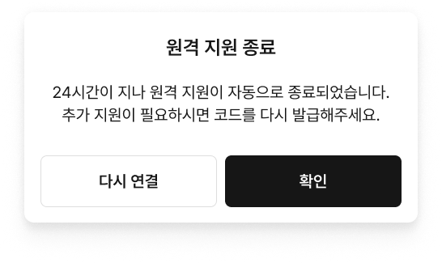
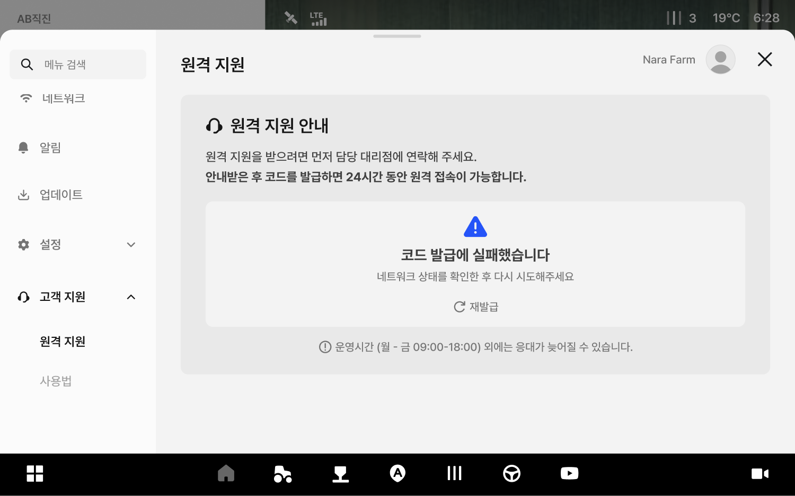
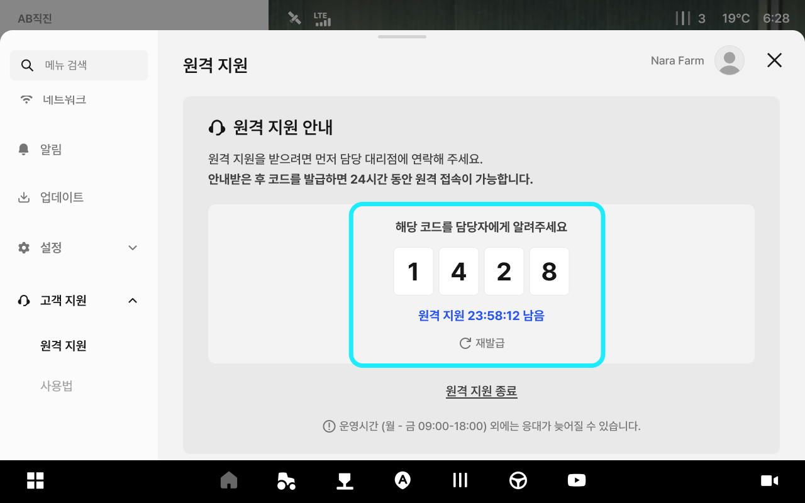
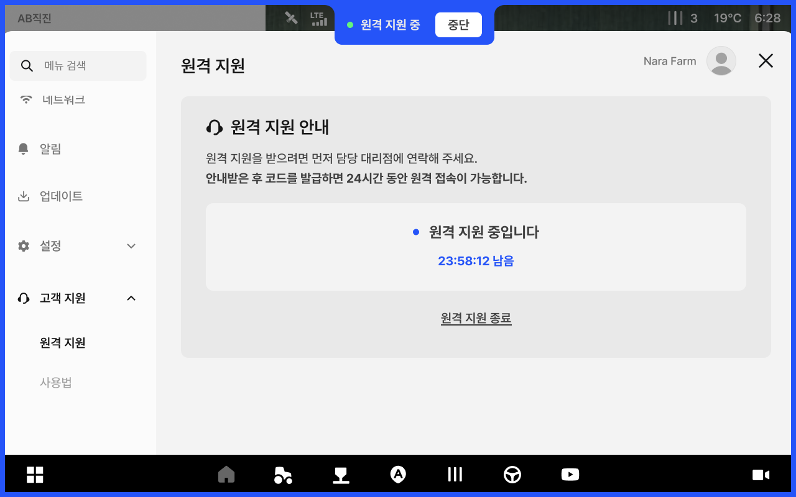
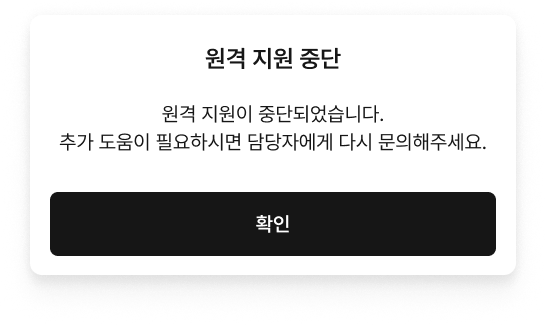

---
layout:
  width: default
  title:
    visible: true
  description:
    visible: false
  tableOfContents:
    visible: true
  outline:
    visible: true
  pagination:
    visible: true
  metadata:
    visible: true
  tags:
    visible: true
metaLinks:
  alternates:
    - >-
      https://app.gitbook.com/s/psfU8QKJyLNerdA8z35d/ion/consumer-info/remote-support
---

# 원격 지원

원격 지원은 엔지니어가 태블릿 화면을 원격으로 확인하며 문제 및 해결 방안을 안내하는 기능입니다. 태블릿에서 코드를 발급하여 엔지니어에게 전달하면 원격 지원이 시작됩니다.

***

#### 원격 지원 진행 가이드

원격 지원 시 아래 사항을 준수합니다.


**전화 통화 유지**

* 원격 지원은 반드시 엔지니어와 통화를 유지하며 진행합니다. 시작과 종료 시에도 통화를 유지합니다.



**네트워크 확인 요청**

* 화면 멈춤이나 오류를 방지하기 위해 고객의 네트워크 상태를 확인합니다.
* 셀룰러 또는 신호가 안정적인 환경에서 진행할 것을 권장합니다.



**차량 탑승 확인**

* 안전을 위해 반드시 차량에 탑승한 상태에서만 원격 지원을 진행합니다.


***

#### 원격 지원 페이지 진입&#x20;



 전체 메뉴 아이콘을 선택합니다.

<figure><figcaption></figcaption></figure>



고객 지원의 **\[원격 지원]** 탭을 선택하면 원격 지원 화면으로 진입합니다.

<figure><figcaption></figcaption></figure>



***

#### 원격 지원 순서



구매처에 문제 사항을 발송합니다.



구매처에 원격 지원을 요청합니다.



태블릿에서 원격 지원 코드를 발급합니다.

<figure><figcaption></figcaption></figure>


코드는 발급 시점으로부터 24시간 동안 유효하며, 24시간이 경과하면 자동으로 만료됩니다.




코드 발급에 실패한 경우 **\[재발급]** 버튼을 선택하여 다시 발급받습니다.




**\[원격 지원 종료]** 를 선택하면 코드가 즉시 만료됩니다. 이 경우 코드를 다시 발급받아야 합니다.




엔지니어와 함께 원격 지원을 진행합니다.

<figure><figcaption></figcaption></figure>



조치가 완료되면 **\[원격 지원 종료]** 버튼을 선택하여 원격 지원을 종료합니다.

<figure><figcaption></figcaption></figure>


원격 지원을 일시적으로 중단하려면 **\[중단]** 버튼을 선택합니다.

중단 후에는 코드 발급 시점으로부터 24시간 내에 언제든지 원격 접속이 가능합니다.\
원격 지원을 완전히 종료하려면 **\[원격 지원 종료]** 버튼을 선택합니다.





