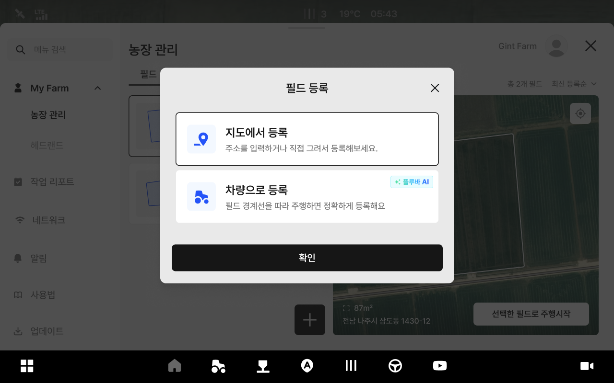
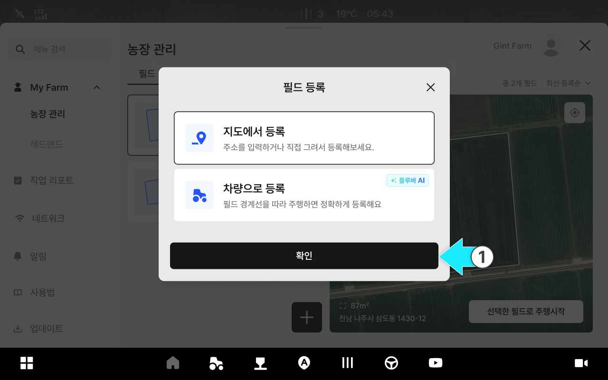
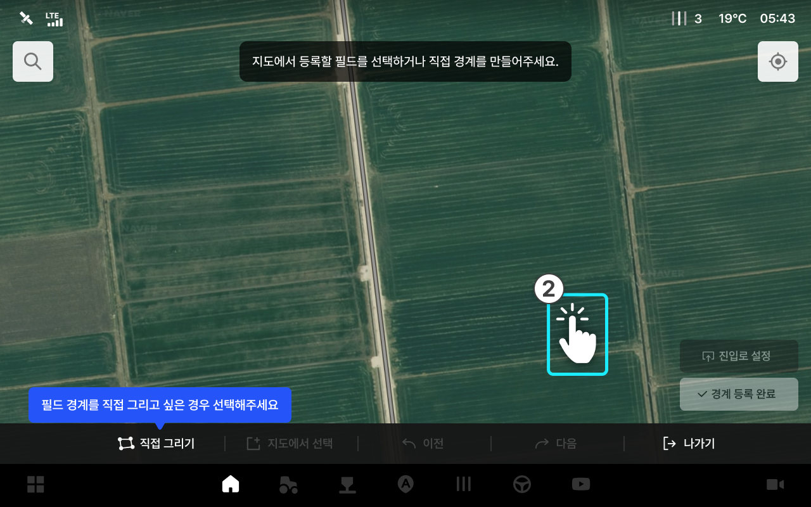

---
layout:
  width: default
  title:
    visible: true
  description:
    visible: false
  tableOfContents:
    visible: true
  outline:
    visible: true
  pagination:
    visible: true
  metadata:
    visible: true
  tags:
    visible: true
metaLinks:
  alternates:
    - https://app.gitbook.com/s/psfU8QKJyLNerdA8z35d/ion/my-farm/field-add
---

# 필드 등록

필드를 한 번 등록해두면 각 작업에서 동일한 기준을 사용할 수 있어 작업 준비 시간을 줄이고 반복 설정을 최소화할 수 있습니다. 또한 작업 이력이 필드 단위로 누적·조회되어 필지별 작업 기록을 쉽게 확인하고 농작업을 체계적으로 관리할 수 있습니다.

***

### 필드 등록 진입



 전체 메뉴 아이콘을 누릅니다.

<figure><figcaption></figcaption></figure>



My Farm의 농장관리의 \[필드 탭] 진입이 완료됩니다.

<figure><figcaption></figcaption></figure>



 필드 추가 버튼을 누릅니다.

<figure><figcaption></figcaption></figure>



원하는 필드 등록 옵션을 선택하고 \[확인]을 누릅니다.

<figure><figcaption></figcaption></figure>



***

### &#x20;지도에서 등록



지도에서 등록 옵션을 선택한 후 \[확인]을 누릅니다.

<figure><figcaption></figcaption></figure>



지도에서 필드를 선택합니다.

<figure><figcaption></figcaption></figure>


기본 필드 등록은 \[지도에서 선택]으로 설정되어 있습니다.
경계를 직접 만들려면 \[직접 그리기]를 누릅니다.




경계 생성 후 \[진입로 설정]을 누른 다음, 원하는 위치를 선택합니다.

<figure><figcaption></figcaption></figure>



진입출로 위치 설정 팝업에서 \[같은 위치로 설정]을 선택합니다.

<figure><figcaption></figcaption></figure>


\[진출로 따로 설정]을 선택한 경우, 진입/진출 위치를 각각 지정해야 합니다.





진출입로 설정이 완료되고 필드 정보를 입력한 뒤 \[등록]을 누릅니다.

<figure><figcaption></figcaption></figure>



필드 등록이 완료됩니다.

<figure><figcaption></figcaption></figure>



### 지도에서 필드 등록 화면 설명

<figure><figcaption></figcaption></figure>

&#x20; **주소 검색으로 필드 선택**

* 주소 검색으로 필드를 선택합니다.
  *

      <figure><figcaption></figcaption></figure>

&#x20; **직접 그리기**

* 필드 영역을 직접 점을 찍어 생성합니다.
  *

      <figure><figcaption></figcaption></figure>

&#x20; **지도에서 선택**

* 지도에서 필드를 직접 눌러 선택합니다. \[지도에서 등록]이 기본으로 설정되어있습니다.

&#x20; **이전**

* 이전 단계로 돌아갑니다.

&#x20; **다음**

* 다음 단계로 넘어갑니다.

&#x20; **나가기**

* 필드 추가하기 화면에서 나갑니다.

&#x20; **내 위치로 가기**

* 현재 내 위치로 지도를 이동합니다.

&#x20; **진(출)입로 설정**

* 진출입로 위치를 설정합니다. 필드를 선택한 후 해당 버튼을 사용할 수 있습니다.
진출입로는 같은 위치로 설정하거나, 각각 따로 설정할 수 있으며, 수정 버튼을 통해\
  위치를 변경할 수 있습니다.

&#x20; **경계 등록 완료**

* 경계 등록을 완료합니다. 진출입로를 선택한 후 해당 버튼을 사용할 수 있습니다.

### 지도에서 필드 등록 모달 설명

<figure><figcaption></figcaption></figure>

&#x20; **필드 이름**

* 대표로 표기할 필드 이름을 입력합니다.

&#x20; **농장**

* 필드와 연결할 농장을 선택합니다.

&#x20; **농장 소유자**

* 필드와 연결할 농장 소유자를 선택합니다.

&#x20; **작물**

* 현재 필드에서 작업 중인 작물을 추가합니다.

&#x20; **메모**

* 추가적인 정보를 메모로 남깁니다.

***

### 차량으로 등록

차량을 직접 운전하여 필지 경계를 주행하면서 꼭지점을 설정하는 방법입니다. 지도에 표시되지 않은 필지나 경계가 불명확한 경우에 유용합니다.



등록 옵션 선택 팝업에서 차량으로 등록을 선택하고 \[확인]을 누릅니다.

{% embed url="https://www.figma.com/design/Su0Eve5h4QCKU9y0P8sbsY/%EC%B0%A8%EC%84%B8%EB%8C%80-%EC%82%AC%EC%9A%A9%EC%9E%90-%EB%A9%94%EB%89%B4%EC%96%BC?node-id=2819-240759&t=hCS5qBIYZpUDsa9g-1" %}



차량으로 등록 화면에 진입합니다. 차량을 필드의 각 꼭지점으로 이동한 후 버튼을 눌러 점을 설정합니다.

{% embed url="https://www.figma.com/design/Su0Eve5h4QCKU9y0P8sbsY/%EC%B0%A8%EC%84%B8%EB%8C%80-%EC%82%AC%EC%9A%A9%EC%9E%90-%EB%A9%94%EB%89%B4%EC%96%BC?node-id=2818-210731&t=hCS5qBIYZpUDsa9g-1" %}

{% embed url="https://www.figma.com/design/Su0Eve5h4QCKU9y0P8sbsY/%EC%B0%A8%EC%84%B8%EB%8C%80-%EC%82%AC%EC%9A%A9%EC%9E%90-%EB%A9%94%EB%89%B4%EC%96%BC?node-id=2819-242771&t=hCS5qBIYZpUDsa9g-1" %}

{% embed url="https://www.figma.com/design/Su0Eve5h4QCKU9y0P8sbsY/%EC%B0%A8%EC%84%B8%EB%8C%80-%EC%82%AC%EC%9A%A9%EC%9E%90-%EB%A9%94%EB%89%B4%EC%96%BC?node-id=2819-242770&t=hCS5qBIYZpUDsa9g-1" %}

{% embed url="https://www.figma.com/design/Su0Eve5h4QCKU9y0P8sbsY/%EC%B0%A8%EC%84%B8%EB%8C%80-%EC%82%AC%EC%9A%A9%EC%9E%90-%EB%A9%94%EB%89%B4%EC%96%BC?node-id=2819-243052&t=hCS5qBIYZpUDsa9g-1" %}


설정 직후 해당 점의 **수정** 버튼이 표시됩니다. 위치가 정확하지 않으면 수정 버튼으로 재설정합니다.



꼭지점은 순서대로 설정해야 합니다. 임의의 순서로 설정하면 경계가 올바르게 생성되지 않습니다.




D점 이상 설정이 완료되면 차량을 진입출로 위치로 이동하고 진입로, 진출로 설정 버튼을 눌러 설정합니다.

{% embed url="https://www.figma.com/design/Su0Eve5h4QCKU9y0P8sbsY/%EC%B0%A8%EC%84%B8%EB%8C%80-%EC%82%AC%EC%9A%A9%EC%9E%90-%EB%A9%94%EB%89%B4%EC%96%BC?node-id=2819-243368&t=hCS5qBIYZpUDsa9g-1" %}


진출로는 작업 완료 후 차량이 빠져나가는 경로입니다. 나중에 수정할 수 있습니다.



점은 최대 6개 설정할 수 있습니다.




각 점과 진출로 설정이 완료되면 필드 등록 버튼이 활성화됩니다. **필드 등록**을 누릅니다.

{% embed url="https://www.figma.com/design/Su0Eve5h4QCKU9y0P8sbsY/%EC%B0%A8%EC%84%B8%EB%8C%80-%EC%82%AC%EC%9A%A9%EC%9E%90-%EB%A9%94%EB%89%B4%EC%96%BC?node-id=2819-243368&t=hCS5qBIYZpUDsa9g-1" %}



필드 정보 입력 화면에서 필지 이름, 농장, 작물 등을 입력합니다. **등록**을 누르면 필지 등록이 완료됩니다.

{% embed url="https://www.figma.com/design/Su0Eve5h4QCKU9y0P8sbsY/%EC%B0%A8%EC%84%B8%EB%8C%80-%EC%82%AC%EC%9A%A9%EC%9E%90-%EB%A9%94%EB%89%B4%EC%96%BC?node-id=2819-243810&t=hCS5qBIYZpUDsa9g-1" %}



#### 화면 버튼 안내

{% embed url="https://www.figma.com/design/Su0Eve5h4QCKU9y0P8sbsY/%EC%B0%A8%EC%84%B8%EB%8C%80-%EC%82%AC%EC%9A%A9%EC%9E%90-%EB%A9%94%EB%89%B4%EC%96%BC?node-id=2819-245621&t=hCS5qBIYZpUDsa9g-1" %}

&#x20; **미니맵**

* 현재 등록 중인 필드 경계를 전체 화면으로 보여줍니다.

&#x20; **수정**

* 이미 설정한 꼭지점을 현재 위치로 업데이트합니다.

&#x20; **진출로 설정**

* 진출 경로 위치를 현재 차량 위치로 설정합니다.

&#x20; **필드 등록**

* 모든 점 설정 완료 후 필지 등록 진행합니다.

&#x20; **나가기**

* 등록을 중단하고 이전 화면으로 돌아갑니다.

&#x20; **A / B / C / D**

* 해당 꼭지점을 현재 차량 위치로 설정합니다.

### 차량에서 필드 등록 모달 설명

{% embed url="https://www.figma.com/design/Su0Eve5h4QCKU9y0P8sbsY/%EC%B0%A8%EC%84%B8%EB%8C%80-%EC%82%AC%EC%9A%A9%EC%9E%90-%EB%A9%94%EB%89%B4%EC%96%BC?node-id=2819-245622&t=hCS5qBIYZpUDsa9g-1" %}

&#x20; **필드 이름**

* 대표로 표기할 필드 이름을 입력합니다.

&#x20; **농장**

* 필드와 연결할 농장을 선택합니다.

&#x20; **농장 소유자**

* 필드와 연결할 농장 소유자를 선택합니다.

&#x20; **작물**

* 현재 필드에서 작업 중인 작물을 추가합니다.

&#x20; **메모**

* 추가적인 정보를 메모로 남깁니다.
