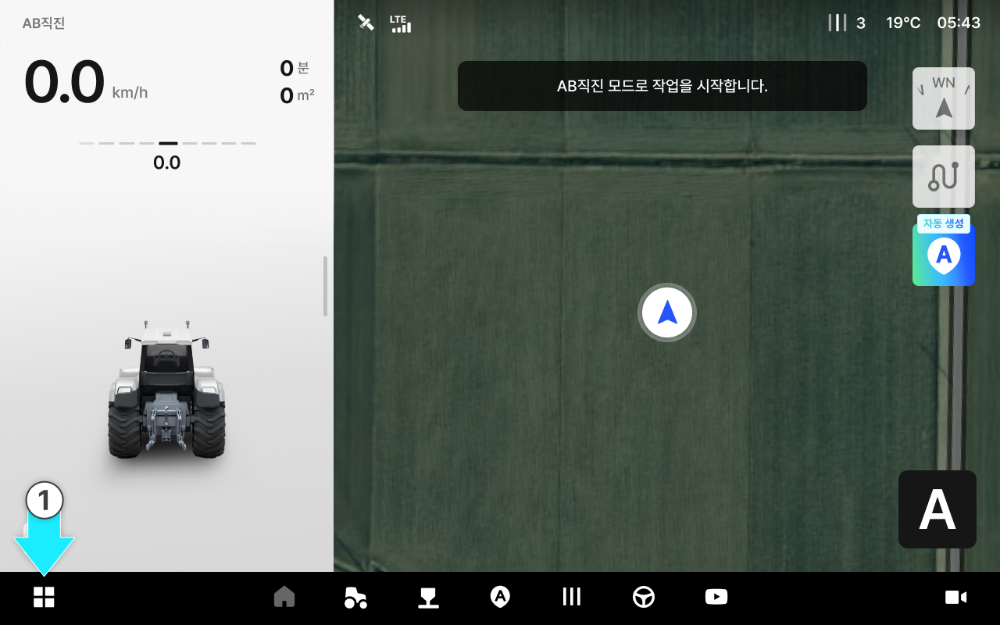
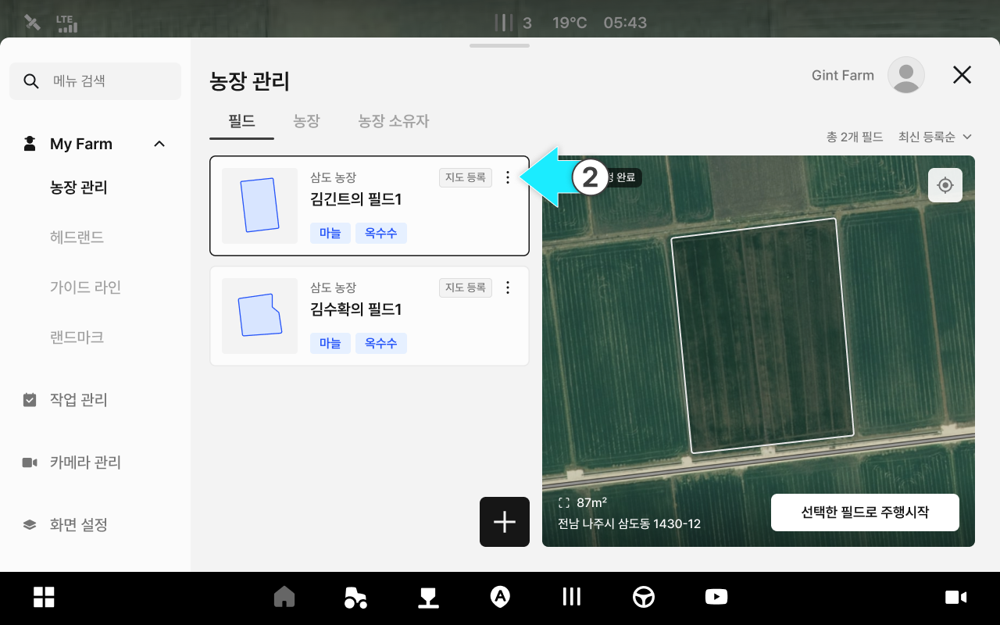
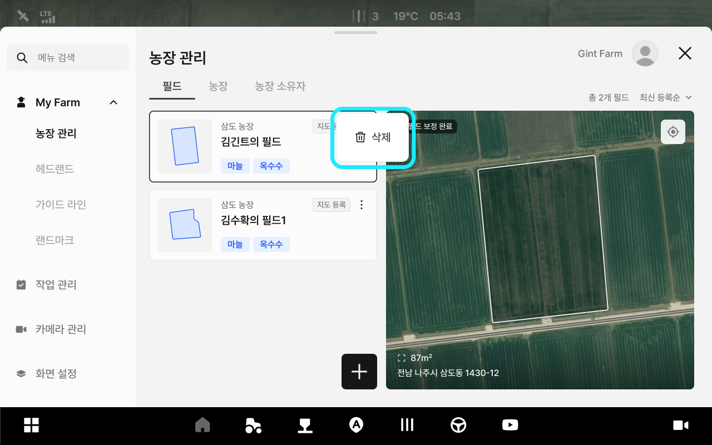
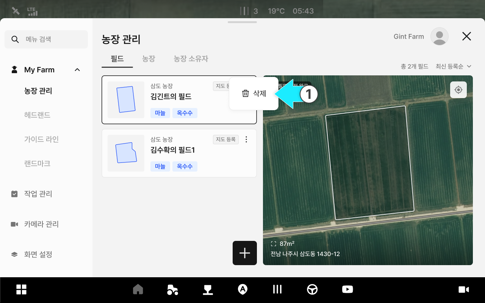
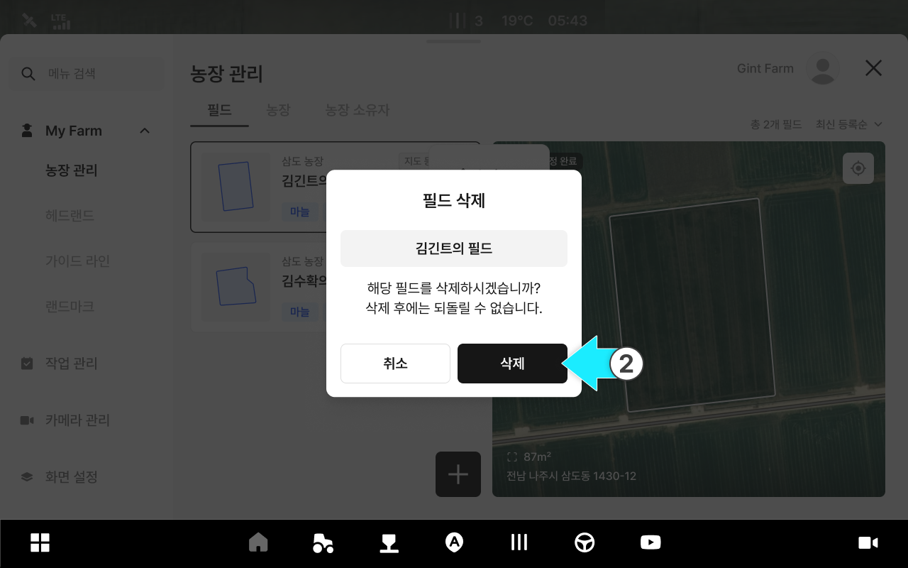
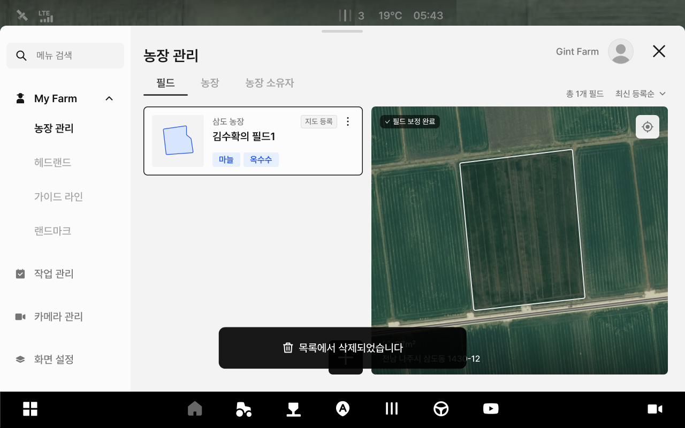

---
layout:
  width: default
  title:
    visible: true
  description:
    visible: false
  tableOfContents:
    visible: true
  outline:
    visible: true
  pagination:
    visible: true
  metadata:
    visible: true
  tags:
    visible: true
metaLinks:
  alternates:
    - >-
      https://app.gitbook.com/s/psfU8QKJyLNerdA8z35d/ion/my-farm/managing-field-information
---

# 필드 정보 관리

필드 이름, 농장 등의 정보를 수정하고 삭제할 수 있는 기능입니다.

***

#### 필드 정보 관리 기능 진입



 전체 메뉴 아이콘을 누릅니다.

<figure><figcaption></figcaption></figure>



원하는 필드 항목의  아이콘을 누릅니다.

<figure><figcaption></figcaption></figure>



팝업창에서 원하는 관리 기능을 선택합니다.

<figure><figcaption></figcaption></figure>



***

#### 필드 정보 삭제



\[삭제]옵션을 누릅니다.

<figure><figcaption></figcaption></figure>



\[삭제]를 누릅니다.

<figure><figcaption></figcaption></figure>



삭제가 완료됩니다.

<figure><figcaption></figcaption></figure>


