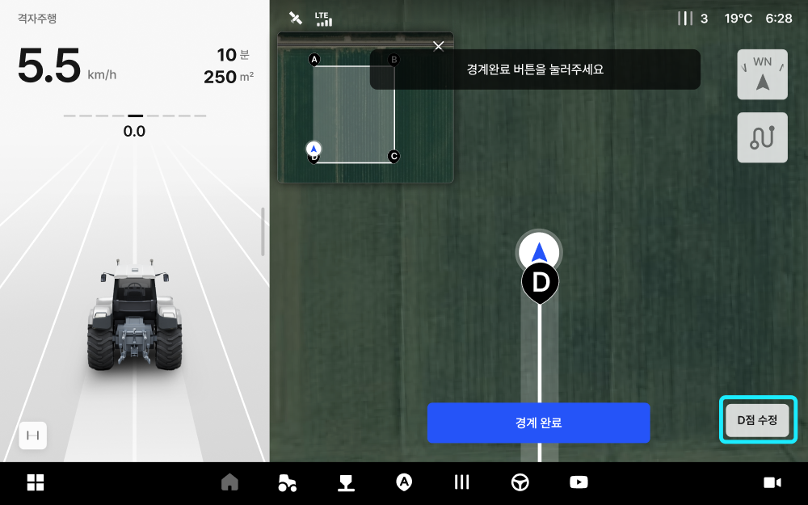
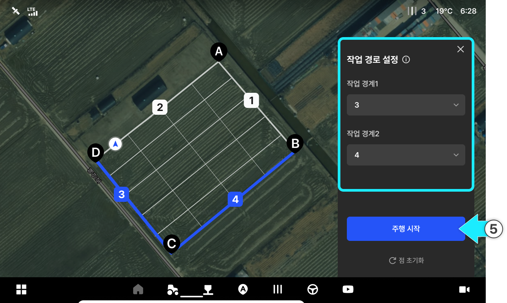

---
metaLinks:
  alternates:
    - https://app.gitbook.com/s/4rNrDNCqOFVCh006UOXy/ion/driving/cross-path
---

# 格子走行

格子走行は、境界を設定してから2つの基準辺を選択することで、2方向の格子型経路を自動生成する走行モードです。縦・横の方向を自在に切り替え、交差方向の作業をスムーズに行うことができます。

<figure><figcaption></figcaption></figure>

### 主な作業例

| 作業         | 内容                           |
| ---------- | ---------------------------- |
| 耕うん＋代掻き    | 土を掘り起こした後、交差方向で整地を行います。      |
| ロータリー＋整地   | 砕土後に交差方向で整地を行います。            |
| 元肥散布＋ロータリー | 肥料散布後に交差方向で攪拌します。            |
| 除草＋防除      | 交差方向に防除することで、被覆率を高めることができます。 |

***

### 使い方



走行モードから「格子走行」を選択します。

<figure><figcaption></figcaption></figure>



車両を移動させ、A・B・C・D点を順番に登録します。


A・B・C・D点の登録は、作業エリアの境界を指定する作業です。これらの点を結ぶ多角形エリアが境界となり、その内側に格子状の経路が自動的に生成されます。


<figure><figcaption></figcaption></figure>



\[境界の登録完了]を選択します。


**最小設定ポイント数**

経路生成のためには、少なくとも4点（A～D）を登録する必要があります。


<figure><figcaption></figcaption></figure>


**最大追加ポイント数**\
最大4点まで追加できます。



**ポイントの修正**\
ポイントを登録すると、そのポイントの**修正**ボタンが表示されます。位置を正確に調整したい場合は、修正ボタンで再登録できます。





格子ラインが自動で生成されます。

<figure><figcaption></figcaption></figure>



格子ラインが生成されると、作業経路を設定し\[走行開始]を選択します。

<figure><figcaption></figcaption></figure>


格子走行経路は、指定した基準辺と平行に生成されます。



**作業経路の基準辺のステータス**

以下の表示形式に従って基準辺のステータスが区分されます。

* **選択可能：** 
* **選択不可能：** 
* **選択済み：** 



**作業経路の基準辺を選択するための条件**\
二つの基準辺は、以下の条件を全て満たしてこそ選択できます。条件を満たさない辺は選択項目として表示されません。

* 選択した作業の境界と角度が近似している場合
* 長さが短い場合（作業機の幅×4未満）




作業経路が設定されました。\[自動操舵の開始]を押すと、選択した方向の経路に沿って自動操舵が始まります。

<figure><figcaption></figcaption></figure>


**事前に設定できる項目**\
走行開始前までに、以下の項目を自由に調整できます。走行開始後には変更できません。 

* 作業機の幅：作業機の作業幅
* 畝間：作業ライン間隔の設定（縦・横両方のライン間隔に共通して適用されます。）



格子走行は、**直線区間で自動操舵**ができ、**ライン間の移動（ターン）に関しては、ドライバーが直接運転**する必要があります。次の走行ラインは、画面から自由に選択でき、縦・横方向を自在に行き来しながら作業できます。



