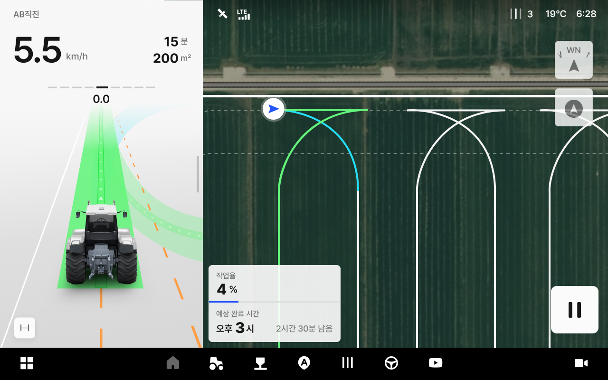
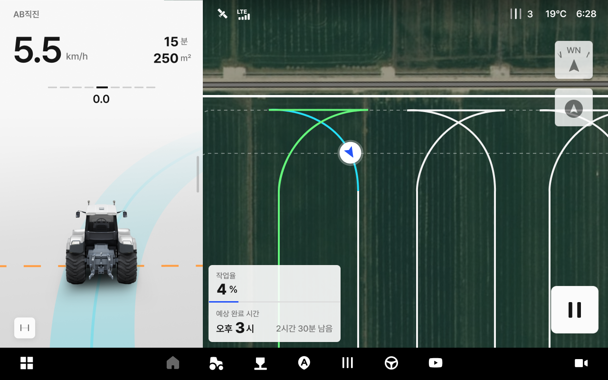

---
metaLinks:
  alternates:
    - https://app.gitbook.com/s/4rNrDNCqOFVCh006UOXy/ion/uturn-mode/kturn
---

# Kターン

Kターンは、狭い枕地で「前進 → 後進 → 前進」の3段階操作を通して方向を切り替え、次の作業ラインへ入る方法です。

***

### 使い方



ターンの形態から「Kターン」を選択します。

<figure><figcaption></figcaption></figure>



\[自動操舵の開始]を選択して作業を開始します。Kターン地点に近づくと作業機を上げてください。

<figure><figcaption></figcaption></figure>



ギアを前進に維持してください。自動で車両の方向が切り替わります。

<figure><figcaption></figcaption></figure>



方向が切り替わると、次の作業進入ラインに向けて車両が後進します。

<figure><figcaption></figcaption></figure>


**後進の案内通知が表示されると、必ずギアを後進に切り替えてください。**

後進の案内通知が表示されると、ドライバーが直接ギアを後進に変更する必要があります。案内通知前に変更したり、ギアを切り替えない場合はKターンが正しく行われません。




後進が終わってからギアを前進に切り替えてください。次の作業ラインに入ります。\
なお、次の作業ラインに入る前に、作業機を下ろして下さい。

<figure><figcaption></figcaption></figure>


**前進の案内通知が表示されると、必ずギアを前進に切り替えてください。**

前進の案内通知が表示されると、ドライバーが直接ギアを前進に変更する必要があります。案内通知前に変更したり、ギアを切り替えない場合はKターンが正しく行われません。




新しい作業ラインから自動操舵が再開されます。

<figure><figcaption></figcaption></figure>




**車両が経路から離脱した場合**

* **原因**
  * 傾斜地、滑りやすい路面、タイヤの空回りなどにより経路の追従ができない場合には、自動操舵が中断されます。
* **対応方法**
  * 手動操作によりターンを完了してください。作業ラインに進入してから\[自動操舵の開始]を再度押すと、自動操舵が再開されます。

