---
layout:
  width: default
  title:
    visible: true
  description:
    visible: false
  tableOfContents:
    visible: true
  outline:
    visible: true
  pagination:
    visible: true
  metadata:
    visible: true
  tags:
    visible: true
metaLinks:
  alternates:
    - >-
      https://app.gitbook.com/s/psfU8QKJyLNerdA8z35d/ion/network-settings/rtk-setting
---

# 위치 보정 설정

위치 보정은 RTK 등의 보정 신호를 연결해 위치 정확도를 높이는 설정입니다. 현장 환경에 맞는 방식을 선택해 연결 상태를 구성합니다.

#### 위치 보정은 무엇인가요?

위성 신호가 계산한 “기본 위치”에서 오차를 줄이는 보정 정보를 받아 정밀도를 올리는 작업입니다.\
네트워크 상태가 불안정하면 정밀도가 떨어지거나 끊길 수 있습니다.

***

#### 위치 보정 설정 접근 방법



 전체 메뉴 아이콘을 누릅니다.

<figure>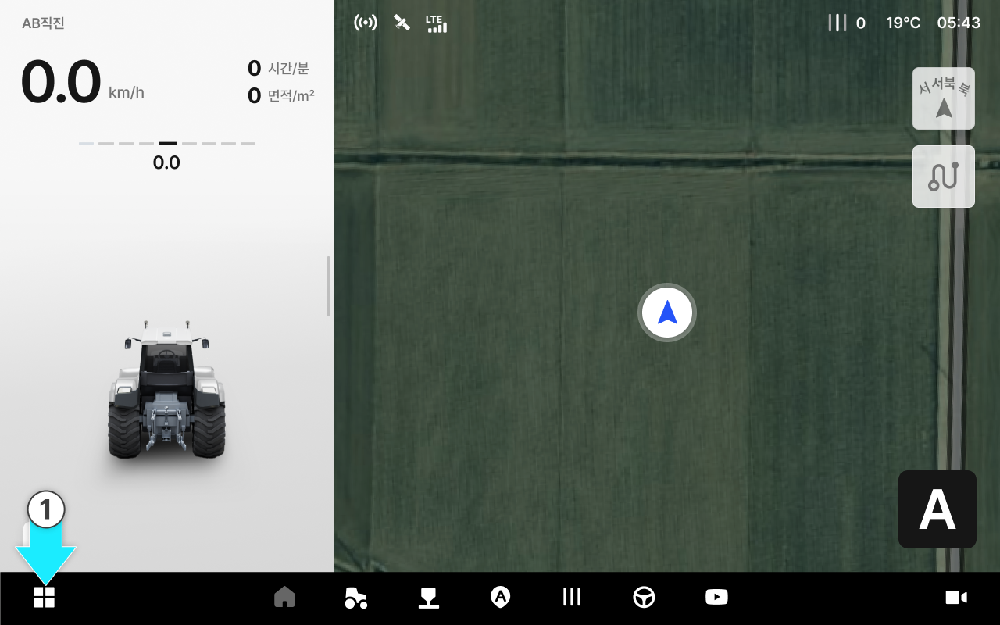<figcaption></figcaption></figure>



\[네트워크 설정]을 누릅니다.

<figure>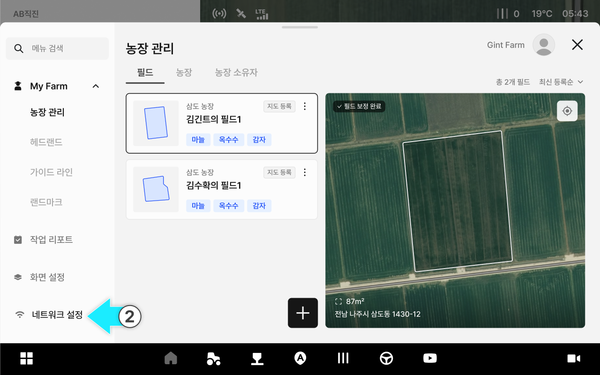<figcaption></figcaption></figure>



\[위치 보정]을 누릅니다.

<figure>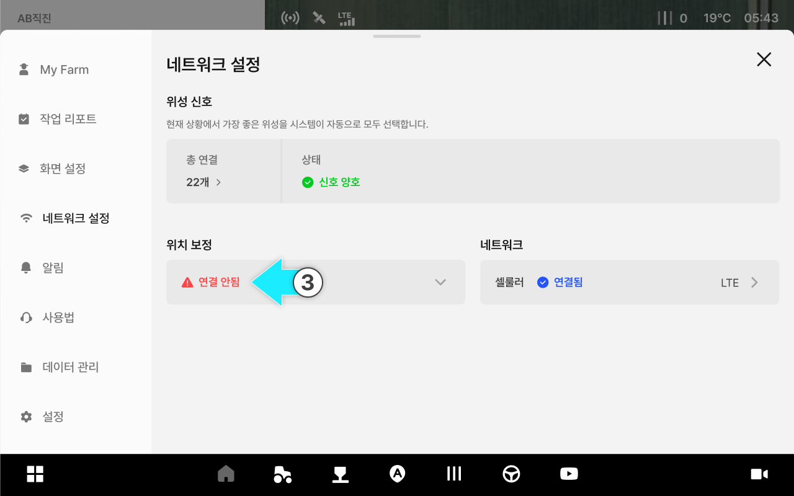<figcaption></figcaption></figure>



원하는 보정 방식을 선택해 설정합니다.

<figure>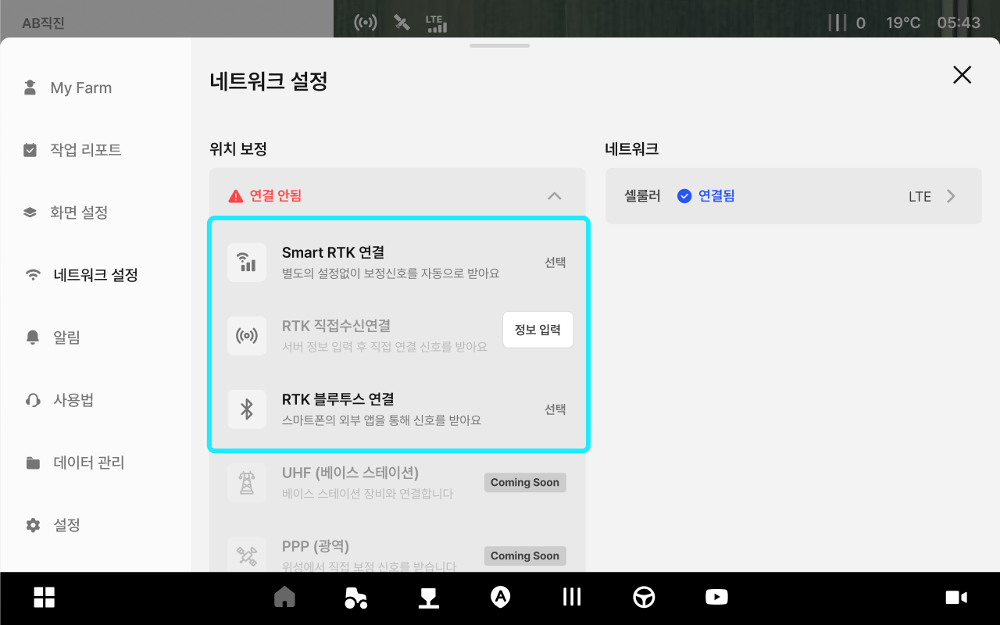<figcaption></figcaption></figure>



***

#### 위치 보정 설정 화면 설명

<figure>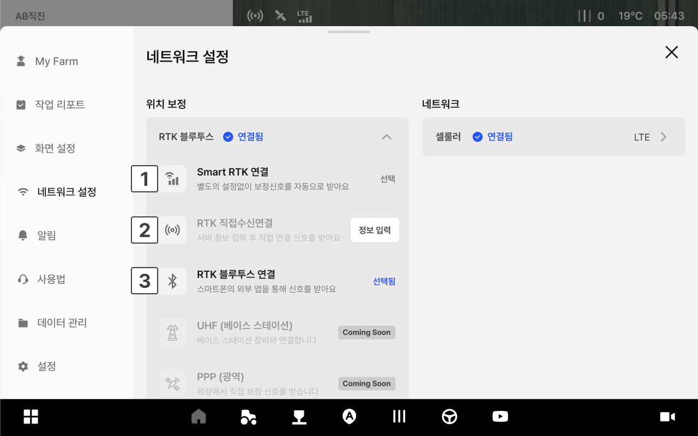<figcaption></figcaption></figure>

 **Smart RTK 연결**

* Smart RTK는 별도 서버 정보 입력 없이 보정 신호를 자동으로 받는 방식입니다.

 **RTK 직접 수신 연결**

* 서버 정보를 입력해 보정 신호를 직접 수신합니다.

 **RTK 블루투스 연결**

* 스마트폰의 외부 앱을 통해 보정 신호를 받은 뒤, 블루투스로 연결합니다.\
  외부 앱이 꺼지면 보정 신호가 끊길 수 있습니다.

 **UHF (베이스 스테이션)**

* 별도의 서버 정보 입력 없이 베이스 스테이션 장비와 UHF 무선 신호로 자동 연결하여 보정 신호를 수신하는 방식입니다.
* 네트워크 없이도 사용 가능하며, 최대 2~3km 범위까지 신호를 수신할 수 있습니다.

***

#### Smart RTK 연결

Smart RTK는 추가 설정 없이 바로 RTK 보정 신호에 연결하는 방식입니다.



위치 보정 화면에서 **Smart RTK**를 선택합니다

<figure>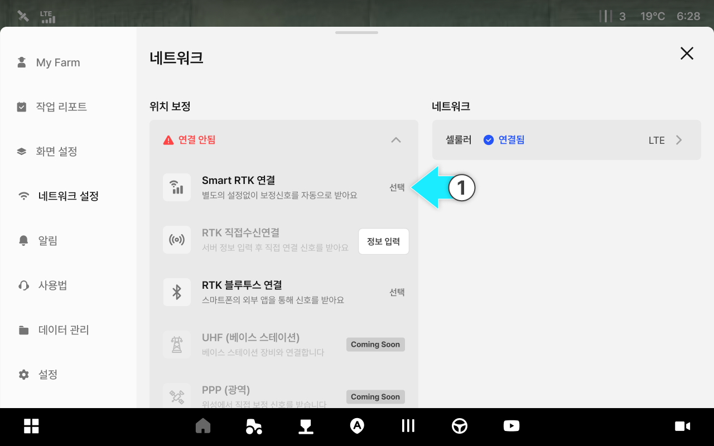<figcaption></figcaption></figure>



자동으로 연결이 진행됩니다. 잠시 기다려주세요.

<figure>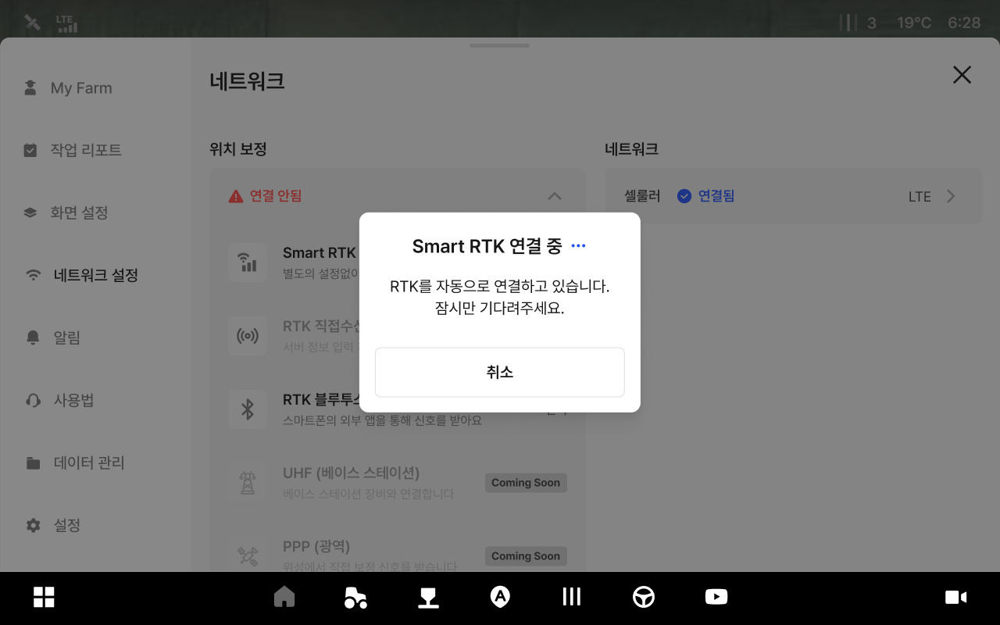<figcaption></figcaption></figure>



Smart RTK 연결이 완료됩니다.

<figure>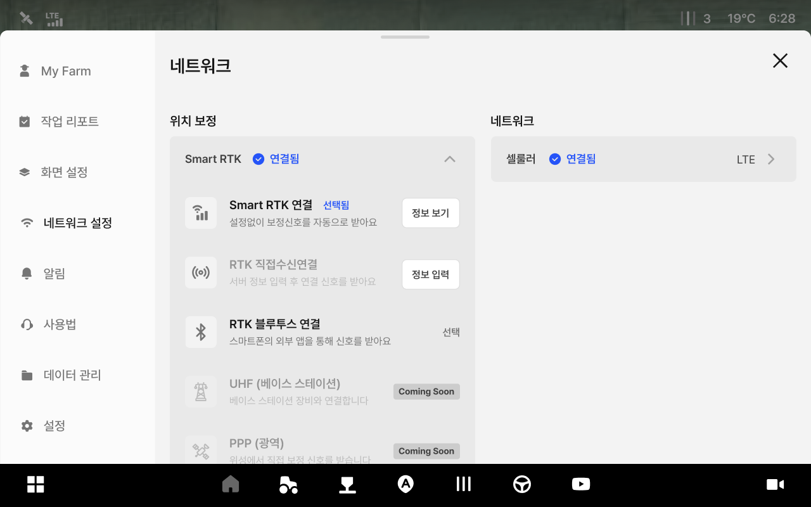<figcaption></figcaption></figure>



***

#### RTK 직접 수신 연결

RTK 직접 수신은 태블릿이 RTK 서비스에 직접 연결하여 보정 신호를 수신하는 방식입니다.



\[RTK 직접 수신 연결]에서 \[정보 입력]을 누릅니다.

<figure>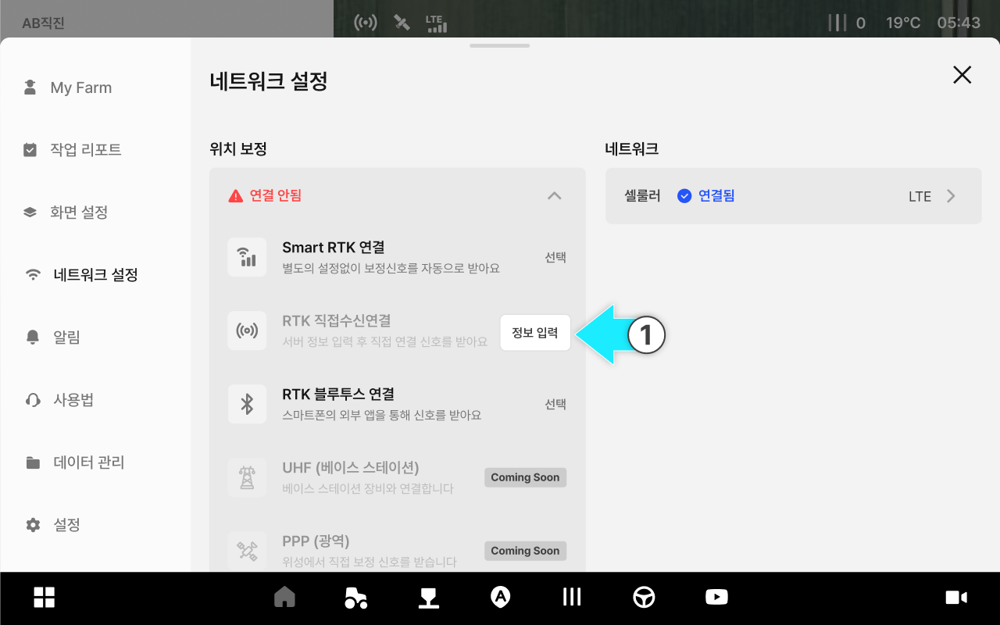<figcaption></figcaption></figure>



기지국/서버 정보를 입력한 뒤 \[연결]을 누릅니다.

<figure>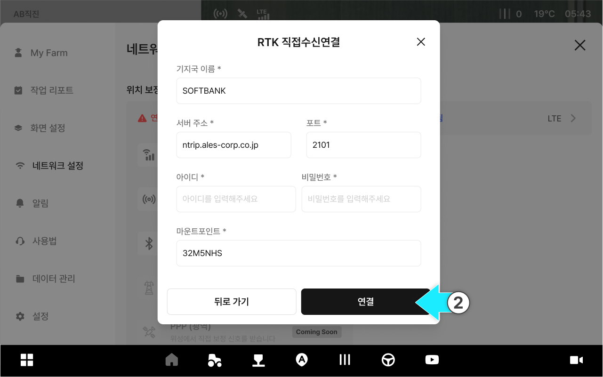<figcaption></figcaption></figure>


Smart RTK 연결에 사용 중인 서버의 경우 연결이 어려울 수 있습니다. 다른 서버 정보를 입력해주세요.

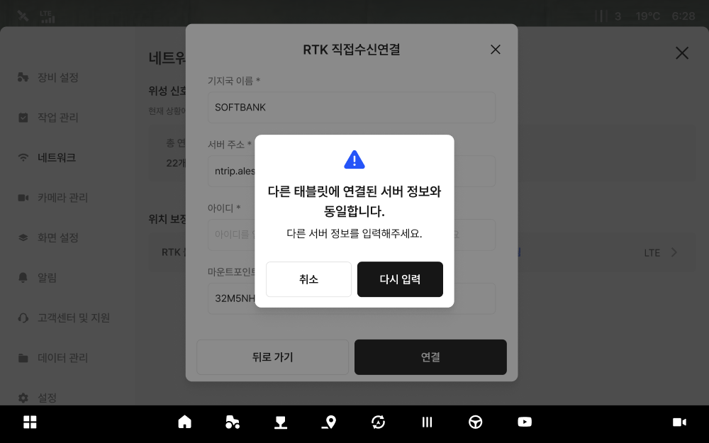




RTK 직접 수신 연결이 완료됩니다.

<figure>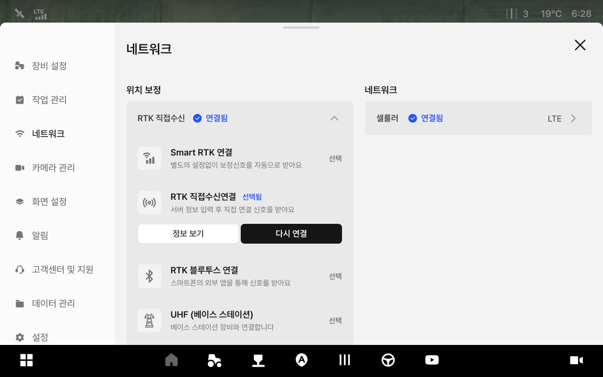<figcaption></figcaption></figure>


연결이 되지 않거나 자주 끊기는 경우 네트워크 상태와 입력 정보(주소/포트/계정/마운트포인트)를 먼저 확인합니다. 영어 대소문자를 정확히 입력하고 불필요한 띄어쓰기를 하지 않아야 서비스를 정상적으로 이용할 수 있다.




***

#### RTK 블루투스 연결

RTK 블루투스 연결은 스마트폰의 RTK 앱과 블루투스로 페어링하여, 기지국(RTK) 보정 신호를 GNSS 수신기로 전달하는 설정입니다.



RTK 블루투스 연결의 \[선택]을 누릅니다.

<figure>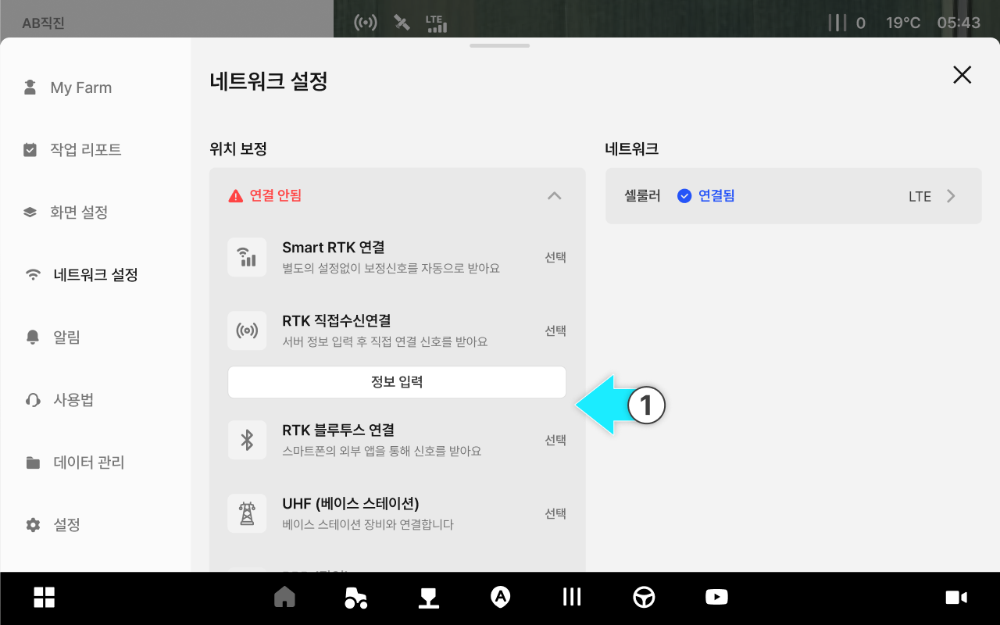<figcaption></figcaption></figure>



아래 절차에 따라 외부 블루투스 앱(RTK-GPS 등)에서 RTK 블루투스 연결 설정을 진행합니다.

1. RTK-GPS 앱이 설치된 스마트폰에서 블루투스(Bluetooth)를 켭니다.
2. 스마트폰/태블릿에서 RTK-GPS 앱을 실행합니다.
3. 앱 설정에서 기지국 신호 입력 방식을 Bluetooth(블루투스)로 선택합니다.
4. 플루바 아이온을 사용 가능한 디바이스 목록에서 선택합니다.
5. 비밀번호를 입력해 페어링을 완료합니다.
6. 앱 또는 스마트폰/태블릿의 블루투스 화면에서 연결됨 상태인지 확인합니다.



블루투스 연결이 진행됩니다.

<figure>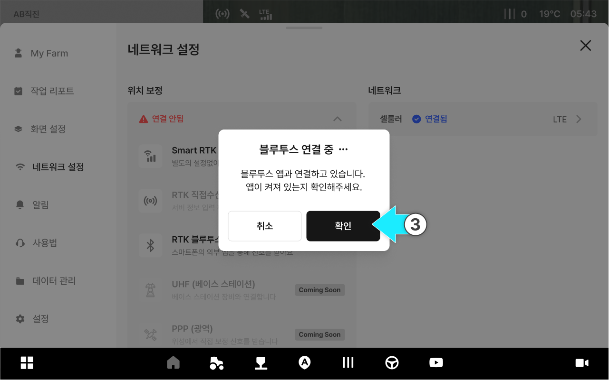<figcaption></figcaption></figure>



연결이 완료되면 \[확인]을 누릅니다.

<figure>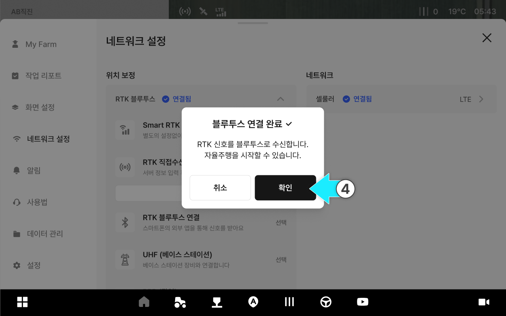<figcaption></figcaption></figure>


연결을 실패할 경우 확인사항을 체크한 후 \[다시시도]를 누릅니다.

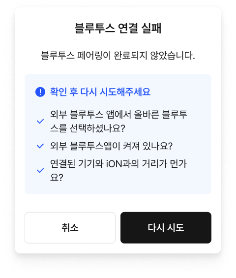



***

#### UHF (베이스 스테이션) 연결

UHF 연결은 별도의 서버 정보 없이 베이스 스테이션 장비와 UHF 무선 신호로 자동 연결하여 보정 신호를 수신하는 방식입니다. 최대 2~3km 범위 내에서 사용할 수 있으며, 네트워크 없이도 동작합니다.



위치 보정 화면에서 UHF (베이스 스테이션)을 선택합니다.

<figure>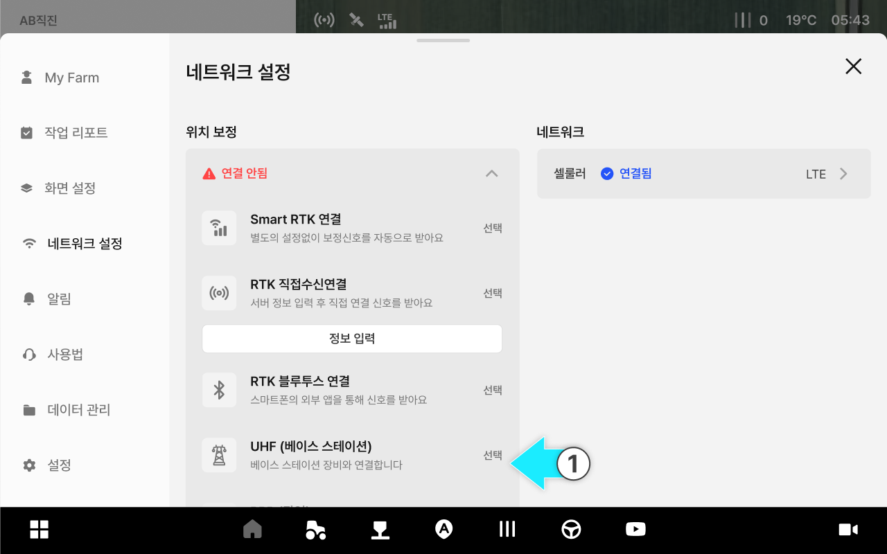<figcaption></figcaption></figure>



자동으로 베이스 스테이션 신호를 탐색합니다. 잠시 기다려주세요.

<figure>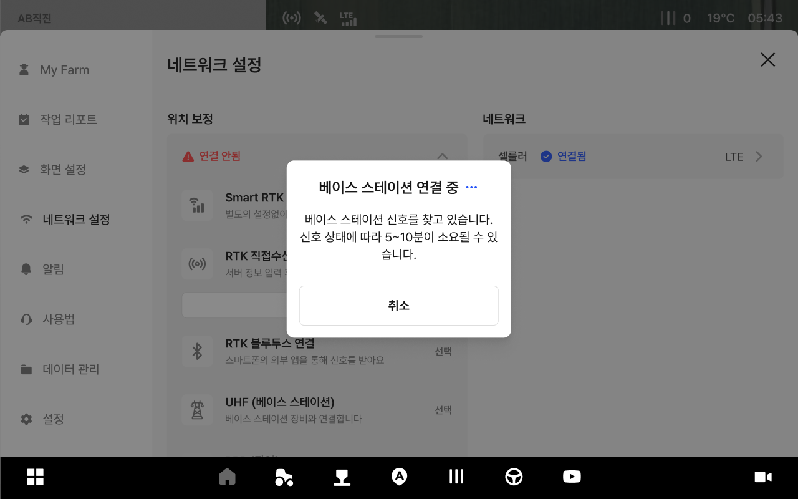<figcaption></figcaption></figure>



연결이 완료되면 \[확인]을 누릅니다.

<figure>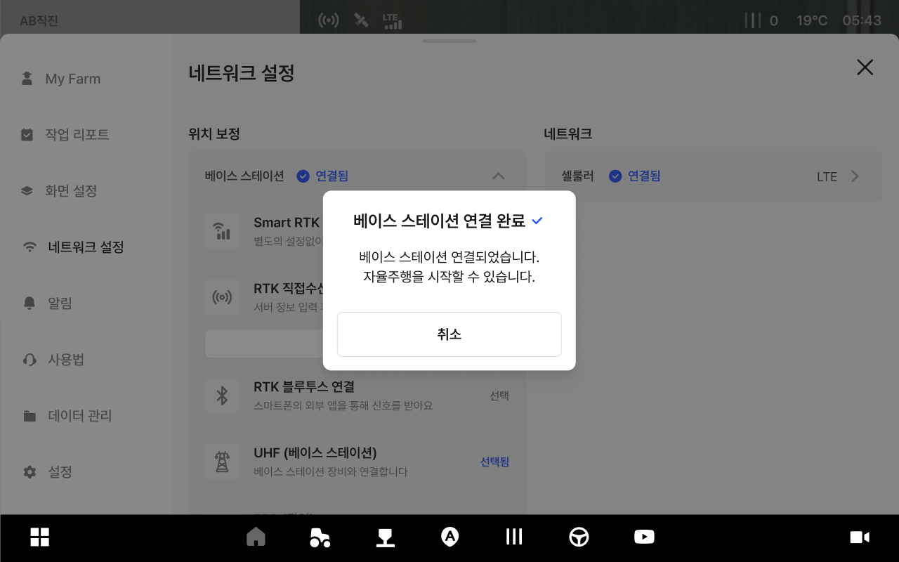<figcaption></figcaption></figure>


연결에 실패할 경우 아래 사항을 확인한 후 \[다시 시도]를 누릅니다.

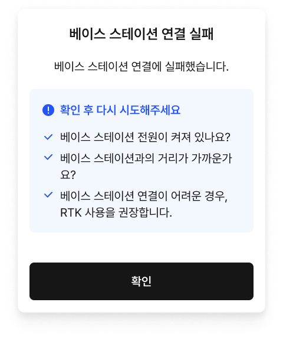


