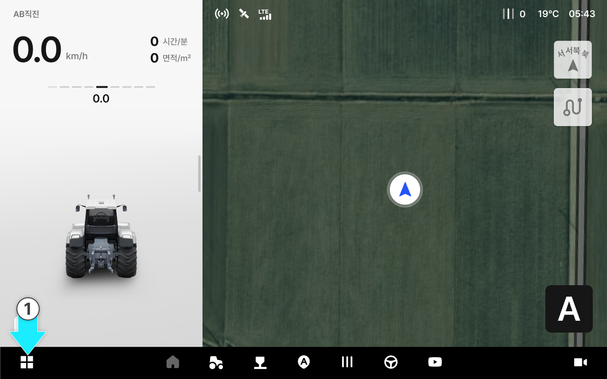
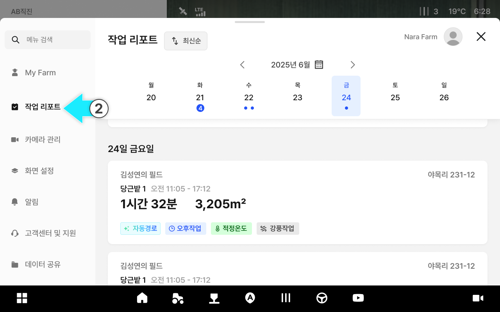
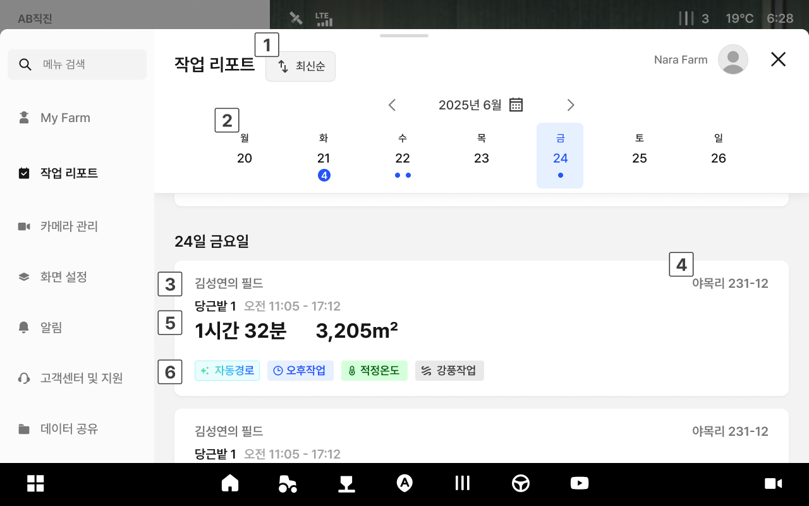
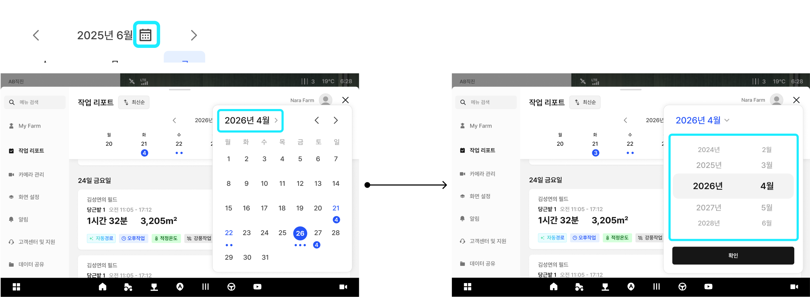
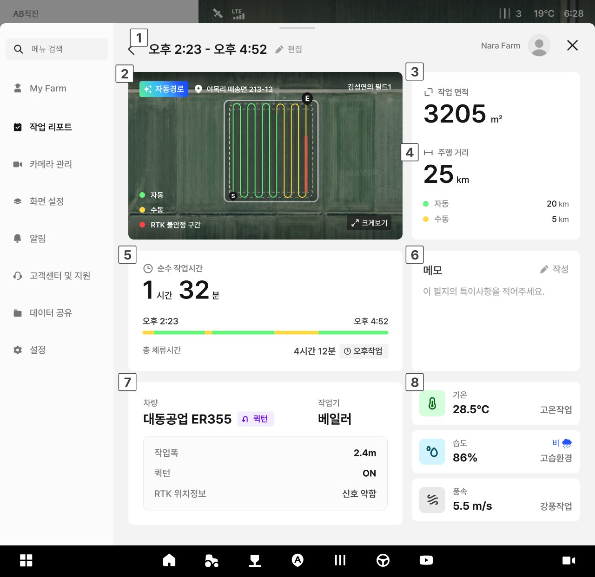

# 작업 리포트

작업 이력에서는 완료된 작업 기록을 날짜별로 확인하고, 작업 궤적·효율·환경 정보를 한눈에 파악할 수 있습니다.\
단순한 기록 보관을 넘어, 작업 당시의 날씨·장비 상태와 결과를 연결하여 다음 작업의 효율을 높이는 근거 데이터로 활용할 수 있습니다.

***

### 진입 방법



홈 화면에서  버튼을 누릅니다.

<figure><figcaption></figcaption></figure>



\[작업 리포트]를 누르면 작업 리포트 목록으로 진입합니다.

<figure><figcaption></figcaption></figure>




작업 완료 직후에는 완료 화면의 \[작업 기록 보기]를 누르면 바로 진입할 수 있습니다.


***

### 목록 화면

작업 이력 목록은 날짜별로 묶인 카드 형태로 표시됩니다.

<figure><figcaption></figcaption></figure>

 **정렬**

* 최신순·오래된순으로 목록을 정렬합니다.

 **날짜 선택**

* 주간 달력에서 원하는 날짜를 선택하면 해당 날짜의 작업 기록을 확인할 수 있습니다.
* 상단의 년/월 또는 달력 아이콘을 탭하면 년/월을 변경할 수 있습니다.

<figure><figcaption></figcaption></figure>

 **필드 정보**

* 작업이 이루어진 필드 이름을 표시합니다.

 **작업 주소**

* 작업이 이루어진 필지의 주소를 표시합니다.

 **작업 정보**

* 작업 이름, 시작·종료 시각, 순수 작업시간, 작업 면적을 표시합니다.

 **작업 상태 태그**

* 해당 작업의 주요 상태를 태그로 표시합니다. 경로 유형(자동경로), 작업 시간대(오전·오후작업), 기온·습도·풍속 상태 등이 표시됩니다.

***

### 상세 화면

목록에서 카드를 누르면 해당 작업의 상세 정보를 확인할 수 있습니다.

<figure><figcaption></figcaption></figure>

 **작업 시간**

* 작업 시작·종료 시각입니다.

 **작업 지도**

* 작업 경로와 작업 완료 구간을 지도 위에 시각화하여 보여줍니다.
* 경로는 주행 방식에 따라 색상으로 구분됩니다.
* 지도 상단에는 작업 필지의 주소와 필드 이름이 표시됩니다.
* 자동경로로 작업한 경우 지도 좌측 상단에 자동경로 태그가 표시됩니다.


* **자동**: 자율주행으로 작업한 구간
* **수동**: 수동으로 작업한 구간
* **RTK 불안정 구간**: RTK 신호가 불안정했던 구간



크게보기 버튼을 탭하면 지도를 전체 화면으로 확인할 수 있습니다.


 **작업 면적**

* 실제 작업이 완료된 총 면적입니다.

 **주행 거리**

* 자동 및 수동 주행을 합산한 총 주행 거리입니다.

 **작업 시간 정보**

* 순수 작업시간은 자율주행 또는 수동으로 실제 작업을 수행한 총 시간입니다.
* 총 체류시간은 작업 시작부터 종료까지 필드 내에 머문 전체 시간으로, 대기·이동 시간이 포함됩니다.
* 작업이 이루어진 시간대(오전작업 / 오후작업)가 함께 표시됩니다.

 **메모**

* 작업 시 입력한 메모를 확인합니다.

 **장비 정보**

* 해당 작업에 사용된 차량 및 작업기 정보입니다.

 **날씨 정보**

* 작업 당시의 기온, 습도, 풍속입니다. 고온·고습·강풍 등 작업 환경 상태가 함께 표시됩니다.
